<h1 style="text-align: center;">定投改变命运</h1>

 <strong>李笑来（著）</strong> &copy;2019

    

## 警告

金融领域是认知变现的最佳场所，可与此同时，也从来没有任何一个其他领域像金融领域那样，毫不留情地严厉惩罚缺乏正确独立思考能力的人。

> 投资有风险！决策需谨慎！
>

2017 年的时候，福布斯杂志将著名投资人[霍华德·斯坦利·马克思](https://en.wikipedia.org/wiki/Howard_Marks_(investor))列为全美第 374 位最富有的人，他说过一句非常有趣的话：

> 市场上有很多很老的投资人，也有很多很猛的投资人…… 可是，市场上压根就没有哪怕一个既老又猛的投资人……

千万不要误以为自己刚刚学到了一些新知识就可以马上变身超人 —— 消化知识所需要的时间远远超出大多数人的想象 —— 请您务必悠着点，千万不要急；最好别太猛，因为若是用力过猛，动作肯定会变形。

## 前言

2009 年 6 月，《把时间当作朋友》正式出版，至今十年有余，依然畅销。我在写书的时候有个自我审查原则：

> **这个内容在十年后是否会依然对读者有用呢？**

我写的书，通常除了是畅销书之外，还是**长销书**，而这就是我写长销书的 “秘密” —— 这个秘密，不仅简单直接，而且粗暴有效。

正因为长期使用这类简单直接粗暴有效的原则的经验，所以我深深了解一个事实：

> 解决最重要的问题会直接避免无数他人长期不断面临的问题。

事实上，绝大多数生活中的问题，都是因为最初的时候没有解决最根本的问题而造成的。在最初的时候，如果能够做到认真对待最重要问题的话，那么，后面虽然依然困难重重，但所面对的肯定不是绝大多数人遇到的那种 “永恒的困境”。

在人生中少有的几个重大的选择上，人们也一贯如此。比如，在选择婚姻对象的时候，很少有人把 “**对方是否是一个讲道理的人**” 这个最重要的问题放在第一位。他们纠结的是相貌、学历、出身等等，从未想过对未来影响最大的因素 —— 当然，这也跟他们自己就不是一个讲道理的人有关；又，的确，绝大多数人并不是讲道理的人。因为最重要的问题从未被认真对待，于是这个问题就像种子发芽一样，地上长成了大树，地下盘结着根，衍生出无数的 “新” 问题…… 于是，我们能看到的情况是一模一样的，人们在地面上围着这盘根错节的 “问题之树”，想出了无数 “解决方案”，每天花大量的时间和精力做着徒劳无益的事情。

另外一个普遍而又令人震惊的例子是人们对所谓 “成功” 的态度。**绝大多数人误以为成功是终点** —— 这个起初的时候就存在的问题，会引发无数若是早已解决就不可能存在的 “新” 问题。以成功为终点的人，首先很难达到 “终点”，因为 “终点” 太重要了，所以这些人会不由自主地为这个 “终极目标” 赋予太多不切实际的幻想和期待，乃至于永远做不到。更为惋惜的是，就算少数以成功为终点的人运气超常真的到达了 “终点”，也会直接引发他们的失常。成功后的疯狂，以及疯狂的结果，其实是很多年前误以为成功是终点的结果。眼看他起高楼，眼看他宴宾客，眼看他楼塌了，这只是一种描述，并没有给出任何解决方案。事实上，成功只是一个新的起点。你创业了，这是个新的起点不是终点；你的企业融资了，A 轮、B 轮、C 轮…… 都分别是新的起点不是终点；哪怕你的企业上市了，那还是一个新的起点不是终点，因为你要带着企业持续成长…… 人生最惨烈的失败，就是获得了新的起点却误以为是终点而导致的失败。

投资，也许是人生中少有的几个重大选择中最重要的一个 —— 重要到它是绝大多数人竟然从来没有认真想过，更别提做过的选择。投资领域是两极分化最为严重的领域，它就好像是个二进制世界，要么你是 1，要么你是 0 —— 在这个领域里，要么你极端成功，要么你并非极端成功，即，和所有人一样平庸且失败 —— 反正都约等于零。在我看来，这种现象的存在，同样与大多数人做不到从一开始就解决了最重要的问题有关。在投资领域里，最重要的概念是什么呢？只有一个：**长期**。投资领域比任何其他领域都有更多的歪门邪道，为什么？因为那些从未认真深入了解长期这个重要概念的人们同样面对着一颗问题之树，这棵树上的每片树叶，都是他们要解决的问题，每个枝节都是他们苦思冥想的对象，除了地上的参天大树还有地下的盘根错节，是他们永远无法理解的神秘现象的根源 —— 可事实上，这棵树原本不应该存在的。

知道与做到之间好像有着一道鸿沟， 长期实践是跨越这道鸿沟的唯一方式。定投策略是实践起来最简单的，你只需要长期购买既定投资标的即可 —— 然而，简单并不意味着容易。

希腊神话中有一个海岛上群居着美丽的海妖塞壬，她们那天籁般的歌喉和无以伦比美貌会使所有过往的水手失去魂魄，进而使航船就会触礁沉没。历史上只有两位英雄驾驶航船安全渡过。一位是俄耳浦斯，因为他会弹琴，他弹奏竖琴优美到竟然使海妖们为之倾倒的地步。另外一位是奥德修斯，他用白蜡封住了船员们的耳朵，并且命令船员把自己绑在了桅杆上，因为他也想听听传说中那海妖的迷人歌声，可他同时也知道自己无法抵御诱惑。

《定投改变命运》不仅仅是一本开源书籍，与之相配的是由李笑来设计的，区块链世界里第一个〇管理费〇开润的数字资产 ETF —— [BOX](https://b.watch)。采用定投策略进行投资，很简单，却不一定容易，因为我们就好像是要驾船驶过海妖塞壬居住的海峡一样。BOX 就好像是一条船，与我一起定投 BOX 的人就好像是那些水手，需要用白蜡封住耳朵，所以我会在践行群里不断讲课；而我，就好像是奥德修斯一样，把自己绑在了桅杆上 —— 因为〇管理费、〇开润，所以，我赚钱的方法很简单，和大家一样，在同样一条船上，自己也大量定投 BOX…… 

定投策略本身是正确的，而定投标的，则应该是读者自己的选择 —— 并且，事实上这个选择并不是很难。另外，只要你稍加思索，就会发现定投策略不仅可以应用在投资领域之中，事实上，几乎所有人生中最重要的领域，无论是学习、工作、生活，都可以采用定投策略，也最好从一开始就采用定投策略。

从一开始就要解决最重要的问题，不要让它生根发芽，不要让它长成问题之树，而后对之愈发地束手无策 —— 这也许是人生最重要的智慧。君子以思患而豫防之（易·既济），极是。

又，我之所以写这本书，是因为我认为十年、廿年，甚至卅年之后，这本书的内容依然会对很多人有用。

## 第一部分 定投策略

投资不容易，成功投资更不容易。然而，不容易并不意味着说没有简单直接粗暴有效的可行策略。定投策略，就是一个如此简单直接粗暴的有效策略，乃至于几乎人人都可以正确掌握进而正确践行。

### 1.1 定投策略及其效果展示

定投策略很简单：

> **针对某个投资标的在很长的时间内定期投资一定的金额。**

例如，在未来的 **5 到 10 年之中**（很长的时间，即长期），**每周**（定期）投资 **[BOX](https://b.watch)** 这个无管理费的区块链数字资产 ETF 产品（投资标的）**150 美元或者 1000 元人民币**（一定的金额）…… 当然，你可以把 [BOX](https://b.watch) 替换为任何值得长期投资并持有的标的，比如[苹果公司股票](https://finance.yahoo.com/quote/AAPL/)、[贵州茅台股票](https://hk.finance.yahoo.com/quote/600519.SS/)，[可口可乐股票](https://finance.yahoo.com/quote/KO)，或者[标准普尔指数](https://en.wikipedia.org/wiki/S%26P_500_Index)基金（S&P 500）。

如此简单的策略是否真的有效？用数据说话最靠谱。

假设你在 2007 年 10 月 8 日进入市场，开始定投标准普尔指数基金（S&P 500）—— 当然，我们现在都知道，那可是最坏的 “时机” —— 那天基本上是后面被称为 “2008 年全球金融危机” 的起点，从那天开始，标准普尔指数 “一路狂泻”。如果你竟然从那时开始每周定投标准普尔指数基金 1000 美元，并持续拥有……

结果如何呢？如果我们现在正站在 2007 年的 10 月 8 日，那么就很难清楚地想象结果究竟如何；可是，从十多年后的今天回头望过去，答案就很 “明显” —— 结果当然非常好。虽然经历了一段从 1,561 美元暴跌的过程，最低至 2009 年 3 月 2 日的 683 美元（所谓的腰斩），但毕竟最终收复了暴跌前的价格，不仅如此，此后价格持续上涨，虽然中间有所起伏，现在（2019 年 10 月）已经是 2,960 美元以上了……

然而，很可能有一个非常重要的细节你并没有意识到。下图是你的累计投资额和你手中的资产净值曲线：

在图二中，红线（你手中的资产净值）在相当长一段时间里持续落后于蓝线（你的累计投资金额）；然而，大约在 2009 年年底的时候，红线穿过蓝线，此后几乎就一直处于超越蓝线的状态，并且相对于蓝线的增长是越来越快……

> 注：以上历史数据来自于 [Yahoo Finance (^GSPC)](https://finance.yahoo.com/quote/%5EGSPC/history?p=%5EGSPC)，上图使用 Google Spreadsheet 制作，你可以在[这里](https://docs.google.com/spreadsheets/d/1QE3itAH_TwUv4Gp9EVwwIz3Xb8taT5N-etfJCkYEvrg/edit?usp=sharing)在线浏览数据和图表。

重点在于，你是在**最差的时机**进入市场的，2007 年 10 月 8 日。那时的标准普尔指数价格是 1,561 美元；而这个价格要到 2013 年 3 月 25 日才终于收复。

然而，你再看看图二，那根红线是在 2009 年年底的时候第一次穿过蓝线的！也就是说，虽然标准普尔指数价格从你开始投资的时候算起，总计耗费了 **286** 周才重新超过 1,561 美元；可是采取定投策略的你竟然在 *111* 周之后就开始稳定持续盈利了！当你的投资开始盈利的时候，标准普尔指数还需要 **30%** 的空间才能收复旧高，而最终，286 周之后， 等到标准普尔指数终于收复旧高的时候，你的盈利竟然早已是 *32.64%*！

让我们再看另外一个更为震撼的例子。假设你从 2017 年 12 月开始定投比特币，那时的比特币创造了当前的历史最高价格，19,800 美元左右，而后价格一路 “狂跌”，至今尚未收复历史最高价格。以下图表是假设你从 2017 年 12 月 11 日连续定投比特币 87 周之后的情况。

> 注：以上历史数据来自于 [Yahoo Finance (Bitcoin USD)](https://finance.yahoo.com/quote/BTC-USD/history/)，上图使用 Google Spreadsheet 制作，你可以在[这里](https://docs.google.com/spreadsheets/d/1pzc6p4UhyAMtqaKis2_uU3hbi8Um34ArTiUQr1tZpc0/edit?usp=sharing)在线浏览数据和图表。

虽然你的入场时机是最差的 —— 2017 年 12 月 11 日你开始定投的时候，价格就处于当前历史最高点，比特币价格迄今为止（2019 年 10 月）也尚未收复这个历史最高点。可是，你的投资竟然还是提前盈利的，因为从 2019 年 5 月 6 日开始，红线（你手中比特币的净值）穿越了橙线（你的累计投资金额）…… 假设你每周定投 100 美元，到了第 87 周，你已经累计投资了 8,700 美元，可是你手中的比特币净值竟然是 16,417 美元，累计盈利 **88.71%** —— 虽然这个时候的比特币价格依然远未恢复，只不过是 11,982 美元，仅为历史最高价格的 *62.85%*。

这就实在是在令人目瞪口呆了：

> 定投策略采用者即便是在最差的时机入场也总是可以**提前盈利**。

很多定投策略的拥趸，总是在宣扬一个仅为部分正确的事实，他们说采用定投策略可以 “有效地降低均价” —— 可硬币的另外一面是，定投策略本身也可能 “有效地抬高均价”，很明显，不是吗？也就是说，这些拥趸其实是使用了错误的依据幸运地选择了正确的策略，可是，一个底层就出错了的操作系统，能够持续运行多久呢？

定投策略之所以有效，核心机理在于**这个策略符合现实世界的真实状况**：

> **熊市就是比牛市长**，并且长很多很多……

例如，在过去的 *1,000* 天之中，区块链数字资产交易市场里，所谓的牛市连 *150* 天都不到…… 同样的模式随处可见，无论你观察哪一个价格曲线变化都会发现同样的模式，无论是标准普尔指数基金（S&P 500）价格，还是可口可乐，苹果，谷歌，亚马逊，网飞，脸书，腾讯，阿里巴巴，抑或贵州茅台…… 熊市总是很长很长，牛市很短很短；牛市短到什么地步呢？人们甚至把那个时段的价格叫做泡沫 —— 比如，上个世纪九十年代末的互联网泡沫。

理解了这个关键之后，你就明白了：

> 通过践行定投策略，你的未来利润本质上全部来自于你所经历的熊市！

绝大多数交易市场中的投资者并不了解这个本质，这也是他们之中的绝大多数注定投资失败的最本质原因 —— 他们希望自己在能转瞬即逝的牛市里快速地赚到钱。一个令人沮丧的现象是，大多数在牛市里被吸引进市场的 “投资者” 注定会折戟而归，因为还没等他们反应过来，短暂的牛市已经结束了，漫长的熊市已经开始了…… 与他们截然相反的是，定投策略采用者恰恰是在熊市里慢慢积聚能量的。

事实上，定投策略不仅仅适用于在交易市场里投资，它几乎适用于生活中任何一个重要的领域，无论是学习、工作还是家庭。所谓的终生学习或者终生成长，本质上就是采用定投策略 —— 你想想是不是如此？现实世界运转发展的本质都是类似的，如果能为一个人的学习与成长画一个“价格曲线”，你就会发现它和标准普尔指数的价格曲线差不多，虽然最终大幅上扬，但，在此之前很长很长的时间里，由总体涨幅并不大的各种形状的起起伏伏构成 —— 反正是同样的模式。也就是说，很多的时候，学习的结果显得还不如不学习呢！“熊市”总是很长，不是吗？这就解释了为什么最终只有少数人能够真正做到终生学习或者终生成长—— 道理是一模一样的，因为人们总是想在牛市里入场，快速赚钱，而后离开。

有一次[杰弗里·贝索斯](https://en.wikipedia.org/wiki/Jeff_Bezos)问[沃伦·巴菲特](https://en.wikipedia.org/wiki/Warren_Buffett)，为什么你的投资策略这么简单，但却很少有人采用，甚至只有你一个人真正使用呢？沃伦·巴菲特的[回答](https://www.beingguru.com/2019/05/warren-buffett-nobody-wants-to-get-rich-slow/)简单却又令人震惊：

> …… 因为没有人喜欢慢慢变富。

沃伦·巴菲特的投资策略之中最重要的一个关键就是 “长期持有”，他的原话是，“我们最喜欢的长期是永远”。定投策略之所以有效，本质上来看，是因为它是 “长期持有策略” 的最有效改良。沃伦·巴菲特大多数情况下也并不是一次性购入，他同样也会多次分批买入，而后长期持有；同样定投策略采用者不过是**在相当长一段时间里持续分次买入的同时坚决不卖一直持有**。

### 1.2 所谓长期它究竟是多久

定投策略的核心本质之一是**长期持有** —— 持有期限越长越能保证盈利，这是公认的事实。可是，有个前提非常重要，若是不能清晰定义它，那么就根本无法继续任何深入的讨论：

> 长期究竟是多久？

在这个问题没有准确答案之前，“长期” 这个必要的概念基本上是 “没办法使用的” —— 任何概念，都必须清晰准确，否则就无法使用。又，由于概念必须与其它概念组合使用，大量含混的概念放在一起，就会造成精度上的巨大损失，这就好像 80% 的 5 次方会变成 32% 不到一样。在以下的阅读过程中，你会遇到若干个因为必须组合使用所以必须清晰准确才足够有效的概念。

与绝大多数人不一样的是，李笑来对长期这个概念有一个相对清晰准确可用的定义：

> 所谓长期，指的是两个**大周期**以上。

“长期” 这个概念的清晰准确定义又依赖于对另外一个概念的清晰准确定义 —— “大周期”。什么是大周期呢？让我们用比特币的历史价格趋势图作为例子说明**大周期**的定义和划分。

一个大周期由一个下降的 **B 阶段**和上涨的 **A 阶段**构成。在当前这张图表中，我们可以直观地看到的一个完整的大周期，是 2013 年 12 月份开始下跌的 B 阶段和后来逐步上涨至 2017 年 12 月份的 A 阶段。

如何判断一个大周期的起点呢？关于一个**大周期**的起点究竟是什么时候，我们只能做**滞后判断** —— 通常的情况下，我们只能在事实已经发生的很久之后才能确定地知道 ”当前历史最高点“ 究竟在哪里，因为价格总是高低起伏地波动着上涨，所以，短时间的 “跌落” 总是不一定能够证明价格会继续跌落，同样的道理，短时间 “上涨”总是不一定能够证明价格会继续上涨。这个 “滞后” 的程度总是很长的，虽然说具体有多长难以确定，但，有一点是确定的，它的滞后程度肯定会使得你无法使用这个滞后判断做出对短期交易有帮助的决策。

在同样的图表中，我标注了我自己在区块链世界里经历的三个完整的大周期，其中第一个大周期是大约在 2011 年 6 月 8 日的 32 美元开始，到 2013 年的 4 月 11 日 266 美元结束；第二个大周期从这一时间点开始到 2013 年 12 月 19 日 1280 美元左右结束；第三个大周期从这一时间点开始到 2017 年 12 月 17 日 19,800 美元左右结束…… 事实上，我经历的大周期大于三个，在 2011 年 6 月 比特币价格到达当时历史最高点 32 美元之前的两个月我就入市了，在 2017 年 12 月比特币价格达到当前历史最高点 19,800 美元之后的今天（2019 年 10 月）我依然持有并将持续持有比特币……

这张图有很多细节值得深入思考，比如，从这张图中你可以清晰地理解上一节中我们所说的 “熊市就是很长，牛市就是很短；熊市就是比牛市长很多很多……”

为什么要强调 “两个” 大周期以上呢？很多人误解了**趋势**，他们看到昨天价格比前天高，今天价格比昨天高，然后就以为看到了 “上涨趋势”，误以为明天的价格就会比今天的更高…… 事实上，趋势这个东西，短期之内是根本无法判断的 —— 甚至，在一个周期之内也是难以判断的：

> 只有经过了**两个大周期**之后，我们才可能**确切地**知道这到底更可能是个上涨趋势呢还是更可能是个下降趋势呢？

再进一步，请注意上文中使用了两次的 “更可能”。即便是在两个大周期之后，我们依然没办法 100% 确切地根据历史数据认定趋势。站在当前的时间点（2019 年 10 月），比特币尚未收复历史最高价格的情况下，我们其实并不能百分之百确认比特币的价格走势会再一次超越历史最高点，而后还能不断创造历史新高…… 到底是不是这样，我们只能靠滞后判断 —— 滞后很久的判断。最终，站在任何一个时间点上，能够作为我们投资依据的，是个无法百分之百精确的判断，因为未来充满了风险与未知，我们只能用 “更可能” 和 “在多大程度上更可能”作为判断依据 —— 事实上，这也恰恰是投资的有趣之处。

在上图之中，2011 年 6 月那次的当时历史最高点几乎完全看不到了 —— 可事实上，如果把每一次历史最高点前后的图表放大之后，你会看到惊人的相似：

它们都和当前的总体的历史价格走势图长得差不多…… 也就是说，即便我现在身处在第 4 个大周期之中，即便类似的 “基于更可能” 的判断已经做了 3 次，这一次依然无法完全确定，依然用且只能用 “更可能” 作为判断依据。只不过颇为庆幸的是前 3 次的基于 “更可能” 的判断已经被证明为真而已。

现在我们可以稍加总结整理了：

> * 一个阶段性的上涨不叫趋势，一个阶段性的下跌也不叫趋势 —— **短期之内根本无法判断趋势**；
> * 一个阶段的下跌（B 阶段）加上一个阶段的上涨（A 阶段）才构成一个完整的**大周期**；
> * 我们可以把每一次**历史最高点**当作一个大周期的 B 阶段的起点；
> * 每一次历史新高只能靠**滞后判断**认清；
> * 判断趋势需要**至少两个大周期**才有意义；
> * 关于趋势的判断最多做到 “**更可能**”；
> * 上涨趋势的结果通常是 “**再创历史新高**” —— 至于究竟有多高依然只能靠滞后判断
> * 所谓的长期持有，指的是**持有两个大周期以上**；换句话讲，“穿越至少两次牛熊”……

用如此 “升级” 过后的认知，把这些清晰准确的概念组合起来，再去看其它所有的价格走势就会得到与之前并不相同的思考结果。以下是标准普尔指数 1956 - 2019 的价格走势：

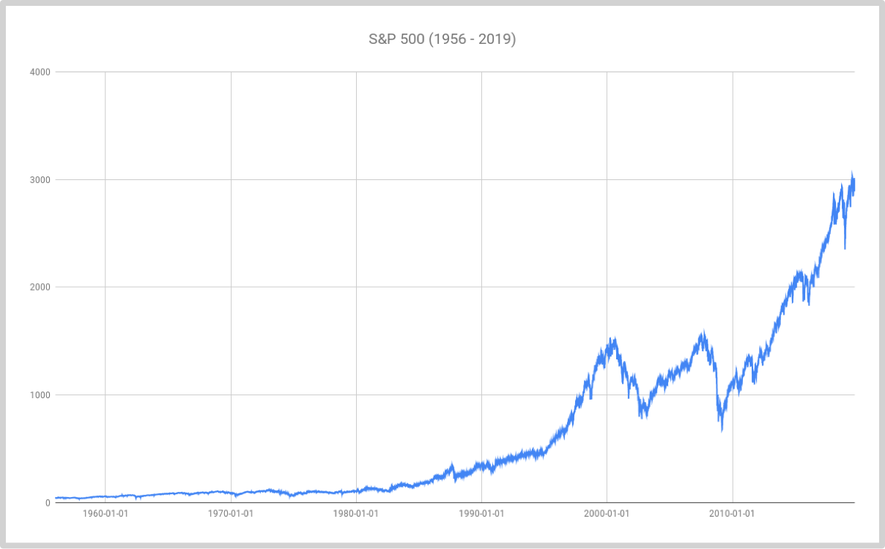

> 注：以上历史数据来自于 [Yahoo Finance (^GSPC)](https://finance.yahoo.com/quote/%5EGSPC/history?p=%5EGSPC)，上图使用 Google Spreadsheet 制作，你可以在[这里](https://docs.google.com/spreadsheets/d/1RsmiifuZajR_POx1zO_--qUcOgwb7tABNQpT-O69Ryk/edit?usp=sharing)在线浏览数据和图表。

对于经济周期的形成，有一个很容易理解的角度：

> **经济周期的形成，本质上是参与经济的多方协作时而协调、时而不协调造成的。**

当多方之间 —— 这个多方，指的是很多很多方，多到很多节点完全没办法知道另外一些节点存在的地步 —— 的沟通效率越来越高的时候，周期的时长就会随之变得越来越短，虽然波动也许永远不能消除 —— 即，多方之间偶尔的不协调无法消除。

如果从这个角度看的话，我们就很容易理解为什么上个世纪三十年代的美国大萧条要那么长时间才能恢复（那就是一个大周期的完成），而上个世纪九十年代的亚洲金融危机修复却只用了短短几年？进而，到了这个世纪，为什么美国次贷危机引发的全球经济衰退修复的时间更快？

理由很简单很直白，谁都能明白：

> 信息的高速流动使得全球化协作更为连贯更为容易，因此，虽然危机依然会不断产生，但修复速度正在变得越来越快。

这也是为什么区块链数字资产的波动周期相对更短的主要原因。过去的八年里，我总是能听到很多人用比特币的挖矿数量减半时间，即，四年，作为周期判断的依据。也许最早的时候，这还有一点点的道理。可当比特币市值已经不再是区块链数字资产总市值的全部之时，这种判断正在逐步失去意义。

我认为，区块链数字资产交易市场的波动周期，总体上比股市的周期更短，并且将来会越来越短的核心原因在于，区块链交易市场的多方协调效率显然更高。从一点上看就明白了：地球上有影响力的股市总计就那么几个，区块链交易市场呢？你去 coinmarketcap 看看就知道了，不是几个，而是好几千个，每年 365 天，每天 24 小时地不间断交易，你说市场协调效率是不是远远超出传统证券交易市场？

这是真正的好消息：

> **大周期正在变得越来越短……**

股票市场里的大周期从几十年早已经缩短到十年之内，并且依然有着越来越短的趋势；而区块链数字资产交易市场里的大周期，不仅更短，并且同样在不断缩短…… 

在李笑来眼里，所谓的长期并不是虚无缥缈的 “永远”，而是一个非常清晰准确可用的概念。在股票市场，未来的两个大周期大约是 10～15 年；在区块链数字交易市场，未来的两个大周期大约是 6～8 年 —— 无论是哪一个，都属于可期待的未来了罢？

### 1.3 为什么一定用钱去赚钱

对大多数人来说，钱只有一个用处：消费 —— 很遗憾，这也是为什么绝大多数人无法财务独立或者说财富自由的最根本原因，因为他们几乎从未认真思考过钱的第二个，远比第一个更为重要的用途：**投资**。

只会消费不懂投资的人，很难摆脱原有的命运，因为他们只能靠出售自己的时间赚钱。可是，一个人能出售的时间是极为有限的，比人们一贯以为的少很多很多。有一组数据可以帮助我们理解一个人可出售的时间究竟少到什么地步。如果按照我们每个人的平均寿命为 **78** 年计算的话，

> * 睡觉时间加起来大概是 28.3 年；
> * 工作时间只有 10.5 年 —— 这是大多数人可出售全部时间；
> * 花在各种各样社交媒体上的时间有 9 年；
> * 花在做家务的时间有 6 年；
> * 花在吃喝上的时间有 4 年；
> * 花在真正接受教育的时间只有 3.5 年；
> * 花在梳妆打扮上的时间有 3 年；
> * 花在购物上的时间有 2.5 年；
> * 花在照顾小孩的时间有 1.5 年；
> * 花在路上的时间有 1.3 年；
>
> ……

如此计算下来，供你自由支配的时间只剩下了 9 年，仅仅 9 年！你能够用来出售的时间，即，你的所有工作时间，其实只有 10.5 年。什么叫拼？如此看来，所谓的拼，无非就是 10.5 年全部用来售出之外，另外把可用用来自由支配的时间也尽量甚至全都卖掉…… 可就算你把可供你自由支配的那 9 年全部用来出售，加起来也只不过是 19.5 年，根本做不到 “翻倍”。并且，比较一下你的工作时间和睡觉时间，一个是 10.5 年，另一个是 28.3 年，是不是觉得睡觉太贵了？

年轻的时候，我和其他年轻人一样，是非常拼的。

刚从学校毕业出来做销售的时候，我曾经一周内六个晚上睡在火车上，早上下车找个洗澡的地方换衣服，然后做一天的培训工作，而后晚上踏上火车睡上一觉，醒来后就在另外一个城市里继续工作……

认识我很多年的人都知道，李笑来是不过节假日的。这是为什么呢？因为在 1995 年大学快毕业的时候，有一天我突然想，怎么节假日这么多？一年 **365** 天里竟然有 *115* 个 法定节假日！ 也就是说，一年的 ⅓ 被 “休息” 掉了！我就觉得有什么地方不对。后来注意到 “法定” 两个字，于是恍然大悟 —— 哦，这个法定节假日是用来限制用工企业的，到了法定节假日，企业不让人休息，那企业就违法了…… 也就是说，这个法定节假日之中的 “法定” 限制的并不是个人 —— 没有任何法律可以说：“今天是法定节假日，你不休息，所以你违法了！”于是，我就决定，从此之后，法定节假日与李笑来无关！于是，从 1995 年开始到 2019 年，24 年过去了 —— 我就是没有周六周日、没有元旦春节，每天该干嘛就干嘛地走过来的。我出版过的很多书，几乎都是在别人过春节的时候我把自己关在家里动手整理出来的。你说，我是不是真的很拼？

大约十年前，我突然发现 “在意自己的发型” 的时间成本非常高。每个月都要花上一两个小时去理发，动不动还要在理发店等很久…… 于是，我决定以后自己理发。一把飞利浦电动理发器真的很便宜，300 多块钱，能用好几年。于是你就看到了我随后十几年里的固定发型，3 毫米圆头板寸。这很简单，基本上就是在某次淋浴之前，用推子在镜子前自己三五分钟搞定。你看，在节省时间方面，我是不是真的很拼？

可是呢？数据是令人无比沮丧的。你看看我，24 年没有节假日，我给自己多拼出来多少可出售时间呢？就算我不把节假日当作休息日，每天平均下来，有效工作时间 4 小时就很了不起了 —— 你真的为自己工作过，不磨洋工的话就能理解，一天努力下来，真正有效的工作时间其实是非常少的。那么，这 24 年我的有效工作时间是多少呢？

> 24 × 115 × 4 = 11,040 

一万多个小时。那么这相当于多少年呢？

> 11,040 ÷ (365 × 24) = 1.26

你看，我对自己下手这么狠，那么结果如何呢？结果不过是相对于 “其他真的很拼的人们” 多拼了 *14%* 而已…… 我 10 年前决定自己理发，总计自己省了多少时间呢？每月 1 次，每次平均 1.5 小时，那么一年下来就是 18 个小时，10 年下来，就是 180 个小时…… 你看，我用实际行动精打细算，真的够狠了吧？结果只不过是多了 7.5 天可供售出而已，用了这么大的力气，只不过是比所有人增加了 *2.28‰* 而已啊！

被认为是二十世纪最有影响力的经济学家之一的富兰克·奈特（[Frank H Knight](https://en.wikipedia.org/wiki/Frank_Knight)）有个著名的观点：

> “决定一个人富有的三个条件，一是**出身**，二是**运气**，三是**努力**；
>
> —— 而这三者之中，**努力是最微不足道的。**”

当然，这并不是说努力就不重要了，因为相对成功可以靠努力，巨大成功只能靠运气 —— 谁都知道运气是任何人都无法左右的；而出身（或者联姻）么 —— 更不是绝大多数人可以仰仗的因素。你看，你能出售的时间，或称 “有效时间” 是那么有限 —— 这也就深刻地解释了为什么努力最为微不足道。

然而，用钱去赚钱就很不一样。**投资的本质就是用你的钱去帮你赚钱 —— 而钱这个东西，它是不休息的，它一年 365 天，每天 24 小时，在投资正确的前提下，它都在为你工作**…… 请问，你的汗水和努力怎么跟它比拼？我们之所以很羡慕沃伦·巴菲特就是因为以下的事实：

> 沃伦·巴菲特 1930 年出生，11 岁买了他人生第一支股票，到现在 2019 年，已经 78 年了！
>
> 78 年！—— 别人平均寿命 78 岁，其中只有 10.5  年时间可供出售仅仅一次；可是沃伦·巴菲特呢？他的钱已经帮着他 78 年每年 365 天、每天 24 小时地拼着…… 

这其中的天壤之别不难想象罢？真的非常很惊人！

### 1.4 我们到底在用什么定投

这是不可否认的事实：绝大多数人不做投资。为什么他们不做投资呢？他们有个共同的答案：

> 我根本就没有多少钱可以拿去做投资啊！

这是个过份普遍的误区，因为可用来投资的除了钱之外，还有另外一个重要资源，**时间**。别说那些根本不做投资的人了，已经算是人群中极少数的那些在做投资的人，他们之中的绝大多数也都没有意识到自己用来投资的资源，除了钱之外还有时间，他们也从未想过时间有多么重要，而时间又有着多么深远的影响。

地球上被研究最多最普遍的著名投资者当然是沃伦·巴菲特。在几乎所有的投资书籍里你都会看到他的名字 —— 毫不意外地，你在当前这本书里也当然会时不时看到他的名字，因为真的没办法，他说的都对…… 更重要的是，他那么成功，所以，他说的总应该是对的 —— 这是绝大多数人不由自主的认同。

沃伦·巴菲特不仅成功，更为难能可贵的是他总是开诚布公。可问题在于，他什么都告诉你了，为什么你就是做不到呢？虽然知道与做到之间有着猴子与人类的距离，但有一个更为重要的原因：

> 沃伦·巴菲特的巨额资金竟然是零成本的！

[伯克希尔·哈撒韦公司](https://finance.yahoo.com/quote/BRK-A/)早期最关键的转折点是它在 1967 年借助收购国民产险公司（NICO）进入保险行业。要知道，伯克希尔·哈撒韦公司本来是沃伦·巴菲特一赌气买下来的上市公司，事实上是个令他懊恼不已的回忆 —— 直到 1985 年，他才终于认输，彻底终结了伯克希尔·哈撒韦公司的纺织事业运营 —— 这时距离他赌气收购伯克希尔·哈撒韦公司（1964）已经过去了将近二十多年。

然而，从 1967 年开始进军保险业，伯克希尔·哈撒韦公司变成了一艘投资航母，原因也非常简单：从此刻开始，可供沃伦·巴菲特调遣的资金，不仅金额巨大，关键在于，成本竟然为零，并且几乎没有使用期限 —— 这成了全球所有投资者望尘莫及的相对优势。

遍阅市面上所有关于沃伦·巴菲特的书籍之后，我们会意识到，普遍来看，人们只看到了他神一般的业绩，进而把他的投资理念奉为圣经一般的存在，哪怕只言片语都被拿来当作金科玉律。可是，99.99% 的投资者永生永世都不可能拥有没有使用期限的且成本为零的巨额资本。这就解释了为什么你总是觉得 “他那么帅，他说的都对，但就是对我没用……” 不得不说，你的感觉是百分之百正确无误的。

定投策略采用者不一样。他们虽然当前手中并没有太多的钱，但，他们用来投资的不仅仅是他们手中当下那一点点钱，更为重要的是，因为他们长期持续定期投资，所以，本质上来看，除了钱之外：

> **他们还用时间进行投资。**

这些年我能够做到长期持有比特币以及其它区块链数字资产的的根本原因并不在于人们以为的信仰。他们经常说，“李笑来你是个有信仰的人”。事实上，无论在哪个领域，信仰都是不需要逻辑的，甚至，信仰是不可能依赖逻辑的，若是依赖逻辑，信仰终将动摇。

最核心的原因，其实只不过是我有长期持续增长的场外赚钱能力，因为我是个把个人商业模式升级过的人：

> 绝大多数人终生都只能把自己的一份时间出售一次，而升级过后的李笑来有能力把自己的同一份时间出售很多很多次，比如通过写书或者在线授课。

虽然这样的商业模式终归有个天花板存在，但，它使得我早就摆脱了日常生活成本的束缚，并且总是有金额虽然并不巨大，但成本肯定为零，又肯定没有使用期限，并且可以源源不断地产生的资金，可用来投资…… 没有这个关键，我在投资领域的一切业绩就都不可能存在。所以，我用来定投区块链数字资产的，不仅仅是钱，还有从开始之后到现在的所有有效工作时间，以及这些有效工作时间被我多次销售之后产生的可持续增长的收入。

所以说，定投策略是那种 “人穷志不短” 的人做的事情，也是只有这种人才能做的事情。沃伦·巴菲特赌气买下伯克希尔·哈撒韦公司的时候，早已不再是 “穷人”；而在他收购国民产险公司（NICO）进入保险行业之后，他的几乎所有成功投资都是 “一口气买入” 而后 “长期持有”，沃伦·巴菲特不需要定投策略，或者准确地讲，他不需要对长期持有策略进行任何改良，天下最朴素的方法，对他来说已经足够。

而其他的基金管理者呢？他们更不可能使用定投策略。最核心的原因在于 99.99% 的基金管理者（或者说，除了沃伦·巴菲特之外的所有基金管理者）手中所管理的资金都是有时间期限限制的，长则十年，短则三五年 —— 不管长短，只要有期限，就意味着无穷大的风险。投资领域很少有 “中间状态”，要么是 1 要么是 0，资金有期限，风险就是 1，资金无期限，风险就是 0，根本就没有 0.2 或者 0.8。很多人并不理解这一点，所以才会有那么多人前仆后继地铤而走险不得善终 —— 全世界风险最高的职业就是韩国总统，紧随其后的就是给自己设置了刚兑责任的资金管理者。

换句话讲，绝大多数 “职业投资人” 是压根就不具备定投能力的，因为他们所管理的钱不是自己的，所以有清算期限 —— 到了清算时间，哪管当时是牛市还是熊市，无论如何反正都要清算…… 这又如何保证盈利呢？所以，绝大多数人根本未曾想过的是，一个基金的成功与否，完全不取决于管理者的智商和策略，事实上只取决于基金成立的时机。在 B 阶段结束 A 阶段开始的那一段时间里成立的基金 100% 有很大胜算，因为那时候投什么都更可能赚到很多钱。可问题在于那时候投资人是最恐慌最谨慎的，所以，事实上很难募资成功。募资最容易的时候是 A 阶段快结束，牛市之中所有人都疯狂的时候，可问题在于，这时候成立的基金，因为他们募集到的资金都是有使用期限的，所以胜算事实上少之又少…… 

把自己的一份时间出售一次以上，是一次个人商业模式的升级 —— 它是如此重要，乃至于没有这个升级的话，任何个体都难以摆脱日益增长的生活成本的束缚。你最初只需要照顾好自己，后来就要照顾好自己的配偶，再后来还要照顾好自己的子女甚至父母…… 绝大多数人最终都是被这些生活基本成本打败的。一个人所能赚到的钱，要超过这个日益增长直至平稳最终才有所下滑的成本线，剩下的钱才是能够用来践行定投策略的部分。不升级个人商业模式，很难有什么钱剩下。

总之，在李笑来看来，采用定投策略，是个人商业模式的三连胜（trifecta）式的升级：

> * 从一份时间只能出售一次升级到一份时间能出售很多次；
> * 从只会用钱消费升级到会用钱赚钱 —— 也就是开始投资；
>
> * 从只会用钱投资升级到不仅会用钱投资还会用时间投资……

更为关键的是，定投策略本身系统化地降低了风险。

### 1.5 定投策略无需再次改良

对于任何策略，我们都有无穷无尽的改良欲望 —— 谁不希望自己手里的工具更精良一些呢？有趣的是，

> **任何对定投策略的改良都是徒劳。**

在 [Mixin Messenger](https://mixin.one/messenger) 上的 [BOX](https://b.watch) 定投践行群从 2019 年 7 月底成立开始到 2019 年 10 月 9 日，群内已经有 3261 名成员。大家在认真了解定投策略的本质之后，明白了 “定投者未来的利润几乎全部来自于漫长的熊市”，于是，因为思考的不同，所以对同样的世界竟然产生了截然相反的感受 —— 每次价格下跌的时候，他们体会到的不是沮丧与恐惧，反倒是高兴甚至是亢奋，因为 “又可以拿到更便宜的筹码了”…… 所以，他们的决策也与外界截然相反。

以下是过去一段时间里 BOX 的历史价格走势：

下图之中叠加了每日的 BOX 新增流通量 —— 也就是在那一天人们总计又投资了多少 BOX。为了能够让图示更为直观，图表中的每日新增流通量被除以了 100,000：

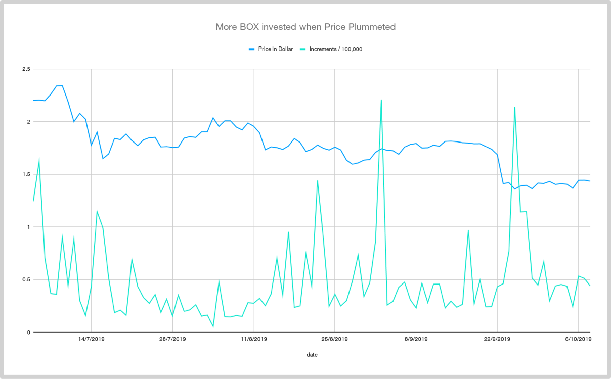

> 注1：上图使用 Google Spreadsheet 制作，你可以在[这里](https://docs.google.com/spreadsheets/d/1caNGqbFZKEjSPr9kf1gJhB2j8pLrHje0PsPZJKJdGIM/edit?usp=sharing)在线浏览数据和图表。
>
> 注2：2019 年 9 月 2 日那天的新增量高达 221,010 BOX，但并不应该算数，因为仅我一个人当天的购买量就有 180,621 BOX…… 我是老手，我当然不关注眼前价格和眼前涨跌。
>

可以看到的是，每一次价格 “大幅度” 下跌的时候，BOX 的新增量都会有极大幅度的提高。最为夸张的一次发生在 2019 年 9 月 25～27 这 3 天，新增量分别是 214,048、114,240，和 114,505 —— 其中 9 月 25 日的新增量基本上是平时的 5 倍左右！并且，从这段时间的数据，你可以看出人们的反应是滞后的，因为那 “价格暴跌” 是两天前发生的，在 9 月 22 日夜里从 1.68 美元突然跌倒 1.41 美元…… 事实上，每次价格下跌时购买量大增的时间段都有相当长一段时间的滞后。

并且呢，虽然践行群里的成员们都听过课，我也在课上反复强调：

> **对定投策略的任何改良都是徒劳。**

但还是有相当一部分人依然忍不住被自己的一个天真想法所驱动 —— 每次下跌的时候多买一点岂不是更好？首先，每次根据当前价格作出的决策，事实上依赖的是滞后判断；更为重要的是，他们忽略了更重要的事实：每次决策之后的价格走势究竟是上升还是下降抑或持平，依然是随机的独立事件，不受之前的数据影响。

所以，在 7 月份里，因为遇到价格下跌就不由自主增加了投资量的人，到了 9 月份就会 “发现” 自己的改良是完全无效的，并且，事实上吃了亏 —— 因为两个月前的 “加大投入” 事实上抬高了自己原本可以更低一点的成本。

对统计概率知识能否深刻把握，是最影响投资者决策正确性的 —— 可惜，有太多的人对这样的基础知识重视程度实在不够，并且在自己反复因此吃亏的情况下，全然不知道无知的代价竟然如此惨烈。

对知识完整的人来说，看到这种现象会忍不住笑出声来：

> 有些并不真正了解统计概率常识的人竟然会想尽一切办法去证明周一到周日之间究竟哪一天价格最便宜？

有人动手制作数据表，甚至同时动用 Python 编程，得到了可以支持他的结论的依据：

> 从 2010 年 7 月 17 日到 2013 年 1 月 2 日，一共 900 天，统计了每一天开始定投 350 天后的收益情况；合计 900 个“350 日定投” 后，得到结论：
>
> > 如果选择周一定投，最终持有的 BTC 数量，比周二到周日的平均值高 1.2%……
>
> 另外，最好避开周日定投，或许是因为，周日大家都有时间买币，或者是周日心态比较乐观，所以，周日平均可以买到的 BTC 数量，比平均少 0.8%……

这种结论有意义吗？我们基本上不可能用逻辑说服那些不懂随机事件独立性的人。不过，沃伦·巴菲特在 [1984 年的一篇文章](https://g.co/kgs/kwb7vc)中讲过一个特别好玩、特别生动，且有特别深刻的例子，可以拿来作为教育辅助工具：

> 想象一下从明天早上开始我们让 2 亿 2 千 5 百万美国人都在早上抛一次硬币，猜对的人就可以从猜错的人那里赢的一块钱。此后，每一天都有猜错的人出局，留下来的胜利者将继续游戏，但都必须把之前所赢来的钱全部用来下注。如此这般，10 天之后，大约会有 22 万人竟然连续猜对了10 次，而这些人每人差不多都赢了 1000 美元多一点点…… 
>
> 这时候，这一票人多少会有些飘飘然，他们也许会故作谦虚，同时也很可能会向异性炫耀自己的本领，甚至私下很乐于分享一些他们对抛硬币的超凡且又应该保密的见识。
>
> 让这个游戏继续，再过 10 天，我们仍会有大约 215 位优胜者，他们竟然连续猜中了 20 次！并且，在这整个过程中，赌注从最初的 1 美元翻倍到了 1 百万美元！
>
> 这时，这一票人已经被胜利冲昏了头脑，他们也许会开始出书，书名大抵上应该是《我如何在 20 天之内用 1 美元赚到了 100 万美元》，并且开始做全国性巡回演讲，教导人们猜硬币的技巧。面对那些对他们的能力有所怀疑的学者们，他们会反驳说，“如果不是因为我们懂得技巧，怎么会有这么多个成功的实例？” —— 毕竟，215 不是一个很小的数字！

“最好在周一投资而不是周日投资” 的这种策略事实上很难奏效除了不符合统计概率常识之外，还有另外一个原因：

> 如果它真的有效，那么 “所有人都会转而如此操作”；这样的结果是，这个曾经有效的策略只能失效了……

对定投策略的进一步改良注定无效的最重要原因在于，定投策略的核心是依然是**长期持有**；只不过是分批买入而已，剩下的依然是谨慎选择，依然是买入后长期持有 —— 这么做的结果，对我们这种对长期有着清楚认知（两个大周期以上）的人更是显而易见：

> 在两个大周期之后回头再看，两个大周期之前的价格无论如何都是极低的，哪怕真的能在极低的价格上再降低千分之几，事实上的意义并不大 —— 更何况事实上并不一定能够做到呢！

如果你仔细观察一下那些对 “事实上无效的技巧” 充满兴趣、充满好奇，并且总是忍不住去尝试各种 “雕虫小技” 的人，你就会发现，他们的出发点都是一样的，他们只能看到眼前，他们也恰恰因此不具备高瞻远瞩的能力。

切记：

> 一切与长期无关的细节都是鸡毛蒜皮。

请认真思考并揣摩以下一句名言的深刻含义，它是投资教父，沃伦·巴菲特的老师[本杰明·格雷厄姆](https://en.wikipedia.org/wiki/Benjamin_Graham)说的：

> 短期来看市场是**投票机**，长期来看它是**称重机**。

-----

## 第二部分 定投标的的选择

定投策略的确非常简单直接粗暴有效，然而，除了关键在于践行者的场外赚钱能力之外，更为关键的前提是，优质定投标的的选择 —— 定投标的的选择错了，那么越是长期，结果越是可怕。

需要注意的是，我们在这里所讨论的是 “定投策略采用者应该如何选择定投标的”，而不是 “投资者应该如何选择正确的投资标的”，前者是仅仅是后者的一个子集，前者的选择标准比后者仅仅多一条而已：

> 它到底是否值得长期持有？

在投资领域，人们用第一个希腊字母 **α** 指称因为跑赢市场而获得的收益。而定投策略采用者在选择定投标的时所做的，就是创造 α 的工作 —— 因为定投一旦开始，不经过至少两个大周期就不会结束，因为提前结束就是前功尽弃；而定投者在此期间所做的动作只有一个，就是买；至于 α 到底是多少？到底是正是负？只能经过很久之后才会知道。

### 2.1 可以盲从的投资建议

刚刚进入市场的人所面临的最棘手问题都一样：

> 究竟应该选哪一个呢？

连选择依据究竟应该有哪些都不知道的人，怎么可能选对呢？只能看到表象无法看到本质的人又怎么可能选择正确并在此之后长期坚定持有且毫不动摇呢？然而，有个非常简单直接粗暴有效的策略：

> **盲从**那些已经展现**长期**成功业绩的真正成功投资者的建议。

“盲从” 听起来是非常可怕的，可问题在于，我们确实可以盲从那些已经展现**长期**成功业绩的真正成功投资者的建议 —— 请注意这里的限定词汇，“长期”。因为在投资领域，有一个非常神奇的现象：

> 越是拥有长期成功经验的投资者越是开诚布公。

沃伦·巴菲特很早就开始坚持每年给投资人写公开信，后来在电视崛起的时代也同样热衷于通过新的媒体手段毫不保留地汇报自己的投资行为、投资理念以及决策过程。自从 1965 年开始，巴菲特每年给投资人的公开信从未间断过，截至 2018 年，已经坚持了 53 年！从 1973 年开始，他和[查理·芒格](https://en.wikipedia.org/wiki/Charlie_Munger)每年举办投资人大会，耐心回答投资人的各种刁钻提问，到 2019 年，也就是在 46 年之后，参加伯克希尔·哈撒韦投资人大会的人数创造了 16,200 人的新高 —— 这当然还不算全球无法统计的在线观众。

> 在以下链接可以查看 1977-2018 的历次伯克希尔·哈撒韦投资人公开信：
>
> > http://www.berkshirehathaway.com/letters/letters.html
>
> CNBC 的网站上有一个专区，叫 Warren Buffett Archive：
>
> > https://buffett.cnbc.com/warren-buffett-archive/

沃伦·巴菲特的老师[本杰明·格雷厄姆](https://en.wikipedia.org/wiki/Benjamin_Graham)也同样是乐于分享且毫无保留的人。他不仅在课堂上传授投资知识，还写了很多本书，其中传播最广的就是 [Security Analysis](https://www.amazon.com/Security-Analysis-Foreword-Buffett-Editions-ebook-dp-B0037JO5J8/dp/B0037JO5J8/)（中译《证券分析》，1934）和 [The Intelligent Investor](https://www.amazon.com/Intelligent-Investor-Definitive-Investing-Essentials/dp/0060555661/)（中译《聪明投资者》，1949）—— 而当年 19 岁的巴菲特正是因为 *The Intelligent Investor* 这本书才成为本杰明·格雷厄姆的粉丝。1951 年的某个周六，他在哥伦比亚大学商学院的图书馆获知本杰明·格雷厄姆是政府雇员保险公司（GEICO）的主席，于是马上就跑去访问该公司…… 许多年后，沃伦·巴菲特接受[福布斯杂志采访](https://www.forbes.com/100-greatest-business-minds/person/warren-buffett)的时候说，20 岁的时候我投资 GEICO 是回头看我自己最得意的投资之一。

[乔尔·格林布莱特](https://en.wikipedia.org/wiki/Joel_Greenblatt)的投资业绩甚至比沃伦·巴菲特还要惊人 —— 在 1985 年到 2006 年之间超过 20 年的时间里，他创造了竟然略超 40% 的年化复合回报率！这样一个真正做到长期持续成功的投资者还是同样乐于分享，并且开诚布公。他前后出版了三本书，分别是 [You Can Be a Stock Market Genius](https://www.amazon.com/You-Can-Stock-Market-Genius/dp/0684840073/) (中译《股市天才》，1999），[The Little Book That Still Beats the Markets](https://www.amazon.com/Little-Book-Still-Beats-Market/dp/0470624159/)（中译《股市稳赚》，2010）以及 [The Big Secret for the Small Investor](https://www.amazon.com/Big-Secret-Small-Investor-Investment-ebook/dp/B004J4WKHE/)（2011）…… 你知道乔尔·格林布莱特写书接地气到什么地步吗？他写书的自我检验标准是 “自己的十几岁的孩子能不能读懂？” —— 与中国古代诗人的 “老妪能解” 有得一拼。不仅如此，乔尔·格林布莱特觉得公开的还不够，于是，干  脆做了个网站：https://www.magicformulainvesting.com —— 在这个网站上，用户甚至无需注册，只要按要求输入几个参数就可以获得一个基于他的 “神奇公式” 而定制的投资组合！你拿去用就是了……

大家现在已经相当熟知的桥水基金创始人[瑞·达里奥](https://en.wikipedia.org/wiki/Ray_Dalio)亦是如此。[Principles](https://www.amazon.com/Principles-Life-Work-Ray-Dalio/dp/1501124021/)（中译《原则》，2017）在正式出版之前，早在 2011 年就开始网上 [“开源” 发布](https://archive.org/stream/BridgewaterRayDalioPrinciples/Bridgewater%20-%20Ray%20Dalio%20-%20Principles_djvu.txt)。到了 2019 年，瑞·达里奥甚至专门雇了一个团队制作了一个移动 APP，[Principles in Action](https://apps.apple.com/us/app/principles-in-action/id1211294305)，以便读者能够更为方便地践行书中的原则……

在投资领域，必须用金钱、时间和行动才能产生实际业绩，所以，这里的人要么是 1 要么是 0 —— 只有那些获得了长期成功业绩的投资者才是 1，剩下的全是 0，而那些在各种媒体上天天忙着喊话却只不过是纸上谈兵拿不出业绩的各种所谓专家，同样是 0 —— 他们发出的，事实上全部都是噪音而已。甚至，那些真正长期持续成功的投资者，因为他们自己的讲演和著作都已经表达得再清楚不过了，对他们的见解以及行为进行任何解读都没有太大的意义。

事实上，新手所能选择的最简单直接粗暴有效的策略就是沃伦·巴菲特买什么，他们就跟着买什么。根本无需妄想 “超越沃伦·巴菲特”，只要花钱买他的公司股票，就相当于能够 “跟上沃伦·巴菲特”了 —— 这不已经是最好的结果了吗？跟投沃伦·巴菲特太容易了，直接买伯克希尔·哈撒韦公司的股票就就行…… 如果新手觉得伯克希尔·哈撒韦公司的股票太贵 —— 2019 年 10 月份，伯克希尔·哈撒韦公司的股票市价约为每股 31 万美元 —— 那么可以去看看沃伦·巴菲特的持仓列表，在他持有的股票列表中选择自己想要的就好了！

> CNBC 有个专门的页面展示伯克希尔·哈撒韦公司所持有的股票列表：
>
> > https://www.cnbc.com/berkshire-hathaway-portfolio/

当然，若是你真的这么做了，那么，最终成功的前提是，沃伦·巴菲特持有多久，你也要持有多久 —— 你看，相对于选择，是否真的能够做到长期持有才是绝大多数人真正面临的最大问题。

再或者，干脆去乔尔·格林布莱特的[神奇公式网站](https://www.magicformulainvesting.com/)，根据自己的情况输入几个参数，获得一个投资组合，然后照做就是了…… 不过，需要提醒的是，乔尔·格林布莱特的神奇公式并不适合定投策者采用，因为乔尔·格林布莱特的做法是 “每年选一批股票，第二年再换一批” —— 你看，定投策略并不是唯一有效的策略，只不过，定投策略对大多数人来说简单到了极致而已。

为什么这些已经展现了长期成功业绩的投资者的建议可以盲从呢？首先是因为他们就是他们所采用的投资策略的长期使用者，并且，事实证明他们的策略禁得起长期的检验。他们是最擅长基于长期视角思考的，否则他们也没办法长期践行他们当初所选择的策略。在他们眼里，一个策略的长期有效性，与策略本身的复杂程度全无关系，恰恰相反，只有简单的策略才可能真正长期践行；并且，一个策略的长期有效性，与使用者的聪明才智也没有任何因果关联 —— 决定一个投资策略最终长期有效的核心前提是，这个策略是否在很长一段时间里被不折不扣地长期执行？

**事实上，成功并没有秘密；就算有，那也应该叫 “公开的秘密”。**一切通往成功的路径都是公开的，这个过程中所需的一切技巧和智慧也都是公开的，只不过，耐心地走很久，老实地对待每一个知识与见解，并彻头彻尾的执行，就是很少有人能做到的事情，少到什么地步呢？万众之中罕见其一。

这些人是人群当中极为罕见的真正做到**知行合一**的人 —— 事实上，针对历史上各个领域之中所有知行合一的人提出的建议，我们都可以直接接受，并且也值得认真执行；从一开始就理解，那很好，照做就是，若是刚开始无法理解怎么办？**盲从。**

关键在于，来自最成功的投资人的最具价值的投资建议竟然是免费的！你甚至不用担心这些建议因为被所有人采用而失效，因为，现实已经证明绝大多数人就是不会采用这些价值连城的建议。也许是因为绝大多数人有简单恐惧症，他们认为成功太难了，所以必须掌握非常复杂的秘密，否则不可能成功。还有另外一个重要因素，即，普遍的恐惧，在阻止大家盲从这些无价的建议：直接用自己的钱执行自己尚未搞懂的别人制定的策略，实在是太可怕了！

当然，还有另外一个更为正当的理由：

> 人们都喜欢通过自己的聪明才智与自己的努力获得回报……

买沃伦·巴菲特买过的股票，就算成功了也太没有成就感了！这应该是绝大多数人隐秘而又实际想法罢？

### 2.2 价值投资与趋势投资

人们在讨论**价值投资**与**趋势投资**的时候，往往误以为它们俩是一组反义词。然而，只有从短期视角出发的时候，它们俩才是反义关系。

事实上，对于定投策略采用者来说，它俩并不是反义关系，因为定投者的视角总是从长期出发的。在长期之后，也就是至少两个大周期之后，之前有价值的投资标的必然呈现出复利式增长的趋势。你看，仅仅因为由于出发点的不同，两个词汇之间的关系竟然截然相反！

我经常布道说：

> 不要盲目相信价值投资。

也经常会换个说法：

> 不要片面理解价值投资。

为什么我总是觉得有必要提醒这一点呢？因为我最经常看到的是：

> 大多数人明明是（短期）趋势投资者，因为他们显然是是被牛市吸引进市场的！可是，一旦他们被随后熊市里下跌的价格套牢之后，他们就 “变” 成了价值投资者！

也就是说，在绝大多数情况下，跟你提起 “价值投资” 这个概念的人，十有八九是因为被套牢了所以才从趋势投资者突变为价值投资者的；并且，我可以向你保证，只要环境发生变化，他们注定还会突变成他们所理解的趋势投资者的…… 

这真是个特别有趣的现象，因为这些人全都一样，完全不知道他们所面临的巨大损失和随之面临的窘迫竟然仅仅来自于他们的出发点不一样。更为可悲的是，一切都基于**短期**作为判断依据的他们，同样完全不知道他们事实上根本无法理解那些市场上既免费、又正确，且可以盲从的来自最成功投资者的建议 —— 仅因为出发点不一样！因为那些 “已经展现**长期**成功业绩的真正成功投资者” 所说所做的一切，出发点都是基于长期的。

再进一步，站在两个大周期之后再往回看的话，得到的结论可能会令一些人震惊：

> **在基于长期视角的情况下，趋势投资优于价值投资。**

虽然本杰明·格雷厄姆价值投资理论显然是正确的，然而，很少有人注意到这个价值投资理论有个隐秘的局限：

> 按照他的理论，你必须总是关注且只能关注当下的价格。

这一个隐秘的局限背后还有另外一个更隐秘的因素：

> 虽然判断当前的价格是否低于价值是很有可能的，可判断未来的价格是不可能的，尤其是至少两个大周期之后的价格…… 

既要紧密关注当下的一切细节，又要认真思考极远的未来的一切，是几乎不可能的技艺。这也是为什么真正成功的价值投资者凤毛麟角的根本原因罢。有个好玩的类比，说，当你戴一块表的时候，哪怕它快几分钟或者慢几分钟，你还是能够大概知道时间的，可是，若是你同时戴着两块表，那你肯定就傻了……

根据价值投资理论，你拼尽全力找到的当前价格远远低于实际价值的投资标的之后，你要在什么时候卖掉它呢？根据价值投资理论，什么时候它的实际价格远远超出你以为的价值 —— 不管是十天后，还是十年后？都一样 —— 你都应该马上卖出。

在这样的理论指导下，即便是沃伦·巴菲特，也一样是会出错的。他最著名的失误应该是对迪斯尼的投资，因为在迪士尼股票上，他不仅错过，并且还错过两次！1966 年，36 岁的沃伦·巴菲特与迪士尼的创始人瓦特·迪士尼在加利福尼亚见面，随即沃伦·巴菲特用 400 万美元拿下了 5% 的迪士尼（[NYSE:DIS](https://www.google.com/search?q=NYSE:+DIS)）股份，每股价格为 31 美分。

> 注：以上历史数据来自于 [Yahoo Finance (DIS)](https://finance.yahoo.com/quote/dis)，上图使用 Google Spreadsheet 制作，你可以在[这里](https://docs.google.com/spreadsheets/d/1Vni-yvkOk7FPixEzQjGa4T7qLa-DzpaQuwlO0xTzrwI/edit?usp=sharing)在线浏览数据和图表。

[在 1995 年的投资人公开信](https://www.berkshirehathaway.com/letters/1995.html)当中，沃伦·巴菲特提起这个投资故事，他在 1966 年以 31 美分的价格买入迪士尼股票，然后在 1967 年，也就是不到一年之后，他就以 48 美分的价格将迪士尼股票卖了出去，当年斩获了差不多年化 50% 的盈利…… 而后的三十来年时间里，他就只能那样眼睁睁地看着迪士尼股票价格一路上涨到 1995 年的 65 美元。到了 2019 年 10 月，迪士尼股票的价格大约为 129 美元，相当于在 1995 年价格的基础上又翻了一倍…… 

故事并未结束。到了 1995 年，巴菲特帮助迪士尼收购了自己持股的资本城 ABC（Capital Cities/ABC），再一次间接获得了 3.6% 的迪士尼股份！可是呢，不到三年之后，他再一次卖掉了所有迪士尼股份…… [有人算过](https://markets.businessinsider.com/news/stocks/warren-buffett-made-20-billion-mistake-by-selling-disney-twice-2019-8-1028484967)，如果巴菲特至今（2019）依然持有这总计 8.6% 的迪士尼股份的话，那么这些股份约值 210 亿美金，并且会因此获得另外 15 亿美金的分红。

当然，沃伦·巴菲特的这个故事并不能证明他真的就失败了。毕竟，两次卖出迪士尼股票之后，他并没有把那些钱消费掉，而是继续践行他自己的投资策略，所以，沃伦·巴菲特事实上并没有真的损失 225 亿美金，因为他最终用 55 年累计获得了 25% 多一点的年化复合回报。过去 53 年里，在不计拆分和分红的情况下，迪士尼股票给投资人带来的年化复合回报率也超过 19%，若是算上所有拆分、算上全部分红，迪斯尼股票的年化复合回报率的确超过了沃伦·巴菲特的 25%· —— 虽然如此算下来，沃伦·巴菲特也许确实有损失，但实际上并没有人们想象得那么多。

这个故事真正能够说明的是，那 “不得不总是聚焦短期价格” 的价值投资策略，在两个大周期之后再回头看的时候，往往并不见得优于基于长期的趋势投资策略。

于是，**定投策略采用者更看重趋势**，虽然他们同样是价值投资者，只不过区别在于，他们的出发点**只基于长期视角**。虽然多少令人难以舒适，但推论却是合理的：

> 如果趋势选择正确了，那么，眼前的价值和价格之间的差异虽然不是不重要，但肯定并没有人们以为的那么重要。

既然更看重长期的趋势，再加上原本就应该也只能以长期作为出发点，那么定投标的选择就只能采用不一样的办法。定投策略采用者相对于其它投资者多出了一个筛选标准：

> **长期持续成长**

绝对不要小瞧 “仅仅多出一个筛选标准” 的作用。

亚马逊（Amazon, [NASDAQ: AMZN](https://finance.yahoo.com/quote/AMZN/)）是一家伟大的公司，它也是当今世界上市值最大的电子商务平台。[根据晨星（Morning Star）的统计](http://performance.morningstar.com/stock/performance-return.action?t=AMZN)，截至 2019 年，它在近 5 年的时间段里为投资者带来了  40.42% 的年化复合回报率；在近 15 年的时间段里，它为投资者创造了 28.51% 的年化复合回报率。

你有没有想过亚马逊为什么最开始的时候，在那么多种可选商品品类中只选择了书籍销售作为起点呢？除了人们熟知的、经常讨论的 “书籍属于刚需高频大市场” 之外仅仅多出了一个人们没想到的筛选依据：卖书几乎不需要提供售后服务 —— 仅仅多出这一条筛选依据就直接剔除了 99% 的其它选择！

定投策略者**只能**选择**长期持续成长**的标的（当然增长越大越快越好）—— 仅仅这么一个看似简单的筛选标准，剔除了 99% 的可选项，因为，在这个标准下，严格意义上来讲，竟然没有任何一个单独的投资标的可以那么令人放心地入选 —— 无论它们现在看起来有多棒…… 仅仅因为所有的企业和项目都跟人一样：

> “长期来看，我们都会死掉。” —— 约翰·梅纳德·凯恩斯。
>
> *In the long run, we are all dead.* --  John Maynard Keynes

那我们这些定投策略采用者究竟应该何去何从？

### 2.3 长期视角与宏观观察

谁都能理解，在众多标的当中选择最棒的那一个事实上很难，尤其还要在价格动态变化之中进行选择 —— 其难度和射箭冠军站在波浪中颠簸的小船上射中岸上远处的靶心别无二致。

只投资某一个标的还有另外一个隐蔽的风险，叫做机会风险。人们更为熟悉的是涵义基本相同但名字却不同的另外一个概念，“机会成本”。因为钱和时间都是排他性资源，你把它们投给了某个标的，那么就无法把它们同时投给另外一个标的…… 于是，如果你所投资的标的 A 比另外一个投资标的 B 成长少很多，那么你在持有 A 的过程中就一直在面临着一个特定的最终可计算的机会风险。

幸运的是，我们有另外一个特别简单直接粗暴有效的解决方案：

> 投资**所有的**标的。

这听起来不仅有点疯狂，还有点傻…… 先别说傻不傻，果真能做到投资全部吗？答案竟然是肯定的，能！有一个指数，叫做摩根斯坦利资本国际世界指数（[MSCI World Index](https://en.wikipedia.org/wiki/MSCI_World)），追踪全球 23 个发达国家的总计 1650 支中大市值股票的价格。如果我们竟然这么做了，最终的回报率究竟如何呢？

> 注：市场上有一些可投资的 ETF 是追踪 MSCI World Index 的，比如 iShares MSCI World ETF (NYSEARCA: [URTH](https://www.investopedia.com/markets/etfs/urth/))， the iShares MSCI ACWI ETF (NASDAQ: [ACWI](https://www.investopedia.com/markets/etfs/acwi/))，以及 Vanguard Total World Stock ETF (NYSEARCA: [VT](https://www.investopedia.com/markets/etfs/vt/))。

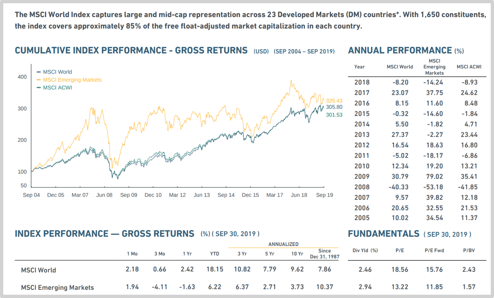

摩根斯坦利资本国际除了世界指数之外，还有一些其它的指数，比如，MSCI 新兴市场指数。据[官方统计](https://www.msci.com/documents/10199/178e6643-6ae6-47b9-82be-e1fc565ededb)，从 1987 年 12 月 31 日开始计算，截至 2019 年 9 月 30 日，MSCI World 的年化复合回报率是 7.86%，MSCI Emerging Markets 的年化复合回报率是 10.37 —— 这也很自然，显然新兴市场成长更快一些，更高一些。

用一种形象的说法，投资 [MSCI World Index](https://en.wikipedia.org/wiki/MSCI_World) 就相当于是赌球运 —— 押注全球经济的总体发展；而投资 [S&P 500](https://en.wikipedia.org/wiki/S%26P_500_Index) 就相当于是押注美国的经济发展，是赌国运，即，“美国的运气” 或者 “美国的命运”。再重新看看标准普尔指数的过往若干年的历史价格走势图罢，它也能提供大约为 9% 的年化复合回报！

> 注：以上历史数据来自于 [Yahoo Finance (^GSPC)](https://finance.yahoo.com/quote/%5EGSPC/history?p=%5EGSPC)，上图使用 Google Spreadsheet 制作，你可以在[这里](https://docs.google.com/spreadsheets/d/1RsmiifuZajR_POx1zO_--qUcOgwb7tABNQpT-O69Ryk/edit?usp=sharing)在线浏览数据和图表。

投资 S&P 500（ACGR, Average Compound Growth Rate: *9%*）可能要比投资 MSCI World（ACGR: *7.86%*）强，但是，投资 MSCI Emerging Markets（ACGR: *10.37%*）好像比投资 S&P 500 更好，最简单的解释是什么呢？

> * 美国发展相对于全球更快；
> * 新兴市场发展相对于美国竟然更快。

现在我们看到了，选择投资标的的时候，在 “一个”（很危险）和 “所有”（很平庸）之间，还有另外一个选项：“选择局部”，那么，哪一部分最值得选择呢？相对于 “赌球运” 这种类比，我更喜欢另外一个类比：

> 投资就好像是选择交通工具 —— 不使用交通工具也不是不能到达目的地，就是多花很多很多时间罢了，只不过有些人很有可能至死也走不到目的地。有自行车的时候不应该选择步行；有机动车的时候不应该选择自行车，有飞机的时候不应该选择机动车…… 总之，选择那个最快的交通工具就对了。

我们已经看到新兴市场发展更快，所以，选择 “新兴的局部” 就好了，很简单，不是吗？进而，不选择 “全球的局部”，即某个国家的整个市场，而是再进一步选择 “局部的局部”，即，只选择那个国家的某些行业或者某个行业行不行呢？行！同样的道理，选择一个发展更快的或者最快的行业，就相当于选择了更快或者最快的交通工具。

在成千上万个标的中选择最好的那一个很难，在十来个地区选择一个发展最快的一两个地区，就很简单。谁都知道，地球上发展最快的两个地区是美国和中国。若是我去设计一个 ETF，我一定会只在这两个 “局部” 寻找可投资标的，那么，这个 ETF 最终有很大概率能够跑赢 MSCI World 吧？再进一步，在这一两个地区中还可以做进一步的局部选择，在几十个行业中选择一两个发展最快的行业，相对来看，貌似依然不难…… 至少传奇投资人[孙正义](https://en.wikipedia.org/wiki/Masayoshi_Son)觉得很简单，他说，

> 赚大钱很简单，只要在二十年前你投资了互联网就可以了 —— 因为站在那个时间点，互联网就是世界的未来。所以，现在要投资人工智能，因为人工智能就是未来。

事实上，我已经设计了一个〇管理费、〇开润的 ETF 开放基金，暂定名称为 “奥德赛”（**ODYSSEY**），计划于 2020 年10 月左右在美国公开发行。它由 *30* 个左右标的构成；全部来自两个地区，美国和中国的上市公司；主要的筛选标准最重要的只有一个：

> “谁的手里有不断增长的用户数据？”

我个人非常认同孙正义的见解，在未来的相当长一段时间里，人工智能就很可能是发展最快的行业。只不过，我也有一些稍微不一样的看法，比如，我认定另外一件事情：

> 算法再好，也需要数据喂养。现在手中掌握大量持续增长的用户数据的上市公司，都已经有足够的盈利能力。如果将来算法是大树的话，那么他们手中正在不断增长的数据就是最肥沃的土壤。没有土壤的话，大树是长不出来的。绝大多数算法公司到最后都会为拥有数据的大公司所用……

2011 年我开始大量购买比特币的时候，很多人认为李笑来疯了，他们的评价通常是一样的，这东西风险太大了吧？“风险太大了” 是他们的感受，我的感受截然相反：

> 不投资比特币的风险太大了吧？

让我有如此感受的众多逻辑推理中有这样一方面：

> 历史上我们已经看到并且经历了互联网使得信息以几近于零成本的方式快速流动给这世界带来的惊人变化；那么，现在若是资产可以像信息一样以几近于零成本的方式快速流动在未来会给这个世界带来怎样惊人的变化呢？
>
> 正如我们在十年之后看到的，互联网带来的巨大变化已然发生 —— 虽然并不是以我们当初所想象的方式，但那变化就是如此惊人；那么，十年后，金融互联网极可能同样给这个世界带来惊人的变化，虽然我们事实上没办法提前知道那巨大的变化究竟是以什么样的方式发生的……

所以，在那时的李笑来眼里，区块链是未来，区块链是趋势，区块链也很可能是发展最快的行业 —— 8 年后的今天再回头看，它的确成了发展最快的行业，而我的投资就那样一路搭着快车走到今天这个之前无法想象的距离之外。

你看，“选择发展最快的行业”  —— 这方法最简单直接粗暴有效。这也是基于宏观观察能够最直接得出的结论。在那些无法基于长期思考的人眼里，这样的一句话不仅根本无法被理解为有效建议，甚至在他们眼里这干脆就是一句废话，你可以想象他们会忍不住拂袖而起的冲动，口中大喊，“这谁不知道啊？！” 是呢，大家都知道，但大家都不是基于长期思考的人，所以都不习惯于宏观观察，当然也就无法领会基于长期的宏观观察有怎样神奇的力量。

那能不能再进一步，去探寻 “我能不能在这个我觉得发展会最快的行业里再进一步选择一个发展最快的企业呢”？我觉得还是算了吧，因为那样的话，你就相当于直接退回到了最初那个最危险的状态 —— 这就是所谓的物极必反。宏观观察的核心技巧之一非常简单，就是 “不要走到极限”，理由只不过是我们不仅讨厌风险，我们更讨厌系统性风险。正确的方法永远是 “局部的局部”：

> * 在全球范围内寻找某个或某几个局部地区；
> * 在某个或某几个地区选择某个或某几个行业；
> * 在某个行业里寻找某些个优秀企业……

但，无论如何都不应该 “只选择某一个” —— 不管是地区、行业，还是企业，抑或项目。所以，即便是在 “只能全球化” 的行业里 —— 区块链行业就是这样的 —— 只要时机成熟，李笑来的选择就不再是某个单一标的，而是一个组合，[BOX](https://b.watch) —— 里面的成份分别是 **BTC**、**EOS** 和 **XIN**，总计 *3* 个标的。

看看示意图，也许更容易理解一些。

最外面的大圆圈代表整个世界，而你站在中央，手里拿着弓箭……

> 你环顾四周，想要找到一个最值得举箭射中的点 —— 这很难办，因为整个一圈看下来，其实有无数的点可以选择，而你要在这无数个点中选出最正确的那个，并且还要在那么远的距离之外一次射中，完全无法做到…… 
>
> 于是，你想了想，选择了全部 —— 也就是说，你不用弓箭了，你换了个工具，改用一张网…… 这样倒挺好，简单、容易，虽然效果一般，总是比你用弓箭射了半天一次都没有射中更好……
>
> 但你希望效果更好一些，于是，你先选择了一个大致的方向 —— 事实上，你也不是乱来，你也的确有合理的选择依据：未来哪个地区发展最快，就往那个方向射箭么！这样做终归射中的概率更高一些罢？了不起，不用箭，往那个方向撒网么！
>
> 而后你发现还可以用几乎同样的根据再调整一下大概的方向。既然未来有些地区比另外一些地区发展更快，那么同样的道理，在那些更快的地区里，未来也会有一些行业比另外一些行业发展更快 —— 同样的逻辑依然成立。
>
> 你已经做了三次猜测了，1) 广撒网可能更划算一些；2) 局部地区未来可能发展更快；3）在那些未来可能发展更快的局部地区里，某些行业未来发展可能更快…… 再继续 “猜” 下去，精度肯定受损得太厉害了…… 那怎么办？不用弓箭了，换个散弹枪罢！这样的话，虽然瞄得不够精准，但终归射中的概率会更高，甚至很高罢？再说，别说我瞄不准，既然那么远 ，所以事实上所有的人都瞄不准；既然所有人都瞄不准，那么，如此这般经过多次的调整，我的胜算应该更高罢？
>
> 到最后，你还有另外一个发现，那就是：无论在什么情况下，用箭都是最不划算的……

由多个而非只有一个标的构成的投资组合有神奇的效果。最著名的例子还是来自沃伦·巴菲特。2017 年 4 月，美国联合航空公司爆出[丑闻](https://en.wikipedia.org/wiki/United_Express_Flight_3411_incident)，因为超卖航班座位，竟然用暴力手段将 69 岁亚裔乘客陶大卫强行拖下飞机，全球哗然。随即出现的大量[报道](https://fortune.com/2017/04/11/united-airlines-stock-passenger-dragged-off-plane-warren-buffett/)当中有相当一部分是关于沃伦·巴菲特的，因为他手中持有很多美国联合航空公司的母公司联合大陆控股公司的股票。这些报道说，事件曝光当日，该公司的股价一度暴跌 4%，市值损失 10 亿美元以上，连累沃伦·巴菲特一度损失超过 9000 万美元，当日收盘，该股跌幅略超过 1%，如此推算，他的当日账面浮亏差不多 2400 万美元。

然而，沃伦·巴菲特真的被连累了吗？并没有 —— 因为他持有的不仅仅是这一家航空公司的股票。除了联合大陆控股公司之外，他还持有更多比例的美国航空公司的股票，也有达美航空公司和西南航空公司的股票…… 就在同一天，美国航空公司的股票上涨差不多 4%，给巴菲特贡献了 7300 万美元的账面收益；达美航空上涨 1%，贡献了 1900 万美元；西南航空上涨 1.6%，又是 3600 万美元…… 总体算下来，沃伦·巴菲特当日账面盈利竟然约为 1.04 亿美元！你可以想象一下，如果沃伦·巴菲特的策略竟然是在航空板块中只选择某一个标的的话，那就肯定是另外的结果了。

### 2.4 大势所趋都会有泡沫

曾经与 “泡沫” 这个词最常搭配的有 “郁金香” 和 “互联网”，2019 年的时候，多了另外一个搭配，“人工智能”（Artificial Intelligence）。人们开始担心全球人工智能（Artificial Intelligence）创业公司是否正处于 “泡沫破裂” 的状态。哪怕仅仅一年前，这个行业里的创业公司还极为火爆 —— 根据[福布斯 2018 年 10 月 5 日的一篇报道](https://www.forbes.com/sites/ninaxiang/2018/10/05/chinas-ai-industry-has-given-birth-to-14-unicorns-is-it-a-bubble-waiting-to-pop/#7a4d9c5f46c3)，仅在中国地区，就有至少 14 家人工智能创业公司已然成为独角兽 —— 所谓独角兽，是指那些估值超过 10 亿美金以上且尚未上市的创业公司。这些公司加起来大约值 405 亿美元。再往前一年，人工智能创业公司更是炙手可热，清华大学的一份报告称，中国地区的人工智能创业公司在 369 次交易中累计获得了高达 277 亿美元的投资。

可为什么突然之间人们开始担心人工智能泡沫了呢？因为这个行业近期出现了大量的丑闻，在训练算法的过程中违规使用用户数据，比如 [Facebook](https://observer.com/2019/08/facebook-audio-transcription-scandal-ai-dilemma/) 因为训练语音识别相关的人工智能算法被爆侵犯用户隐私，再比如 [IBM](https://www.technologyreview.com/f/613131/ibms-photo-scraping-scandal-shows-what-a-weird-bubble-ai-researchers-live-in/) 因为训练人脸识别相关的人工智能算法而同样被爆侵权…… 人工智能甚至被用来做恶，比如 [Cambridge Analytica](https://www.theguardian.com/technology/2018/apr/16/cambridge-analytica-scandal-highlights-need-for-ai-regulation) 操纵选举结果，比如 [Amazon](https://futurism.com/amazon-ai-fire-workers) 使用算法自动开除不符合条件的工人…… 

最搞笑的[传闻](https://www.sfchronicle.com/business/article/Kiwibots-win-fans-at-UC-Berkeley-as-they-deliver-13895867.php)来自之前很火的 Kiwi Campus。这是一家 2017 于伯克利大学成立的人工智能明星创业公司 ，其产品是一个名为 Kiwibot 的送餐机器人，并已获得多轮融资。2018 年 11 月，该公司 CEO Chávez 还获得了 MIT 颁发的杰出企业家奖…… 结果 2019 年夏天，有人爆料说，Kiwibot 根本没有用什么人工智能，这些机器人是创始人在他的家乡哥伦比亚用每小时 2 美元的工资雇佣的大量廉价工人远程操控的。

人工智能行业看起来太火爆，创业企业融资总额太高，估值方法太含混，落地应用频繁出问题，这些都使人们不由自主地想起不久前经历过的互联网泡沫，于是，人们就只好开始担心人工智能是不是也同样要泡沫破裂了……

可是，泡沫破裂了又如何呢？

让我们重新看看标准普尔指数的过往若干年的历史价格走势图，只不过，这一次多了两个标记，一个是 2000 年的互联网泡沫，另外一个是 2008 年的全球金融危机。如若我们身处在 2000 年到 2003 年之间的话，那个时候我们正身处寒冬，大量的互联网公司破产、解散…… 可我们现在已经身处 2019 年年底，现在回头看的话，从 2000 年到 2019 年，是互联网真正从 “一小部分人的世界” 发展到 “所有人的世界” 的过程。根据世界银行的统计，2000 年中国网民数量只占中国总人口数量的 1.8%；到了 2019 年一季度，仅[微信用户数量就高达 11 亿](https://new.qq.com/omn/20190516/20190516A0AY8B.html)…… 这就是互联网在中国的情况，从 1.8% 到 70% 用了接近 20 年的时间 —— 大势么，总是需要很长时间才能全然展现。

对于定投策略采用者来说，即便他们在 2000 年 ”喝着泡沫” 入场，到了两个大周期之后，也就是 2015 年再回头看，两个周期之前的价格无论如何都最终 “变成” 了 “低价” —— 原来，**低买高卖**的秘诀不过如此：

> 买入**很久很久之后**再卖出。

所以，人工智能泡沫破裂是好事呢，还是坏事呢？不知道对其他人是好是坏，但，对定投策略采用者来说，泡沫破裂总是好事儿，弄不好，**泡沫破裂的时候，很可能恰恰是定投者入场的最好时机。**

回顾历史，在任何一个领域都一样，一切最终的大势所趋在早期的时候都会经历至少一次的泡沫产生、泡沫放大，直至泡沫破裂的过程。郁金香泡沫和互联网泡沫不一样的地方在于，郁金香虽然不是完全没价值，但它不可能有可持续增长的价值；而互联网的价值是可持续增长的，互联网在经历早期泡沫破裂之后的二十年里，一直在持续增长，一直在创造价值，一直在改变世界。

为什么大势所趋在早期的时候必然经历泡沫呢？最佳的解释来自于约翰·费舍的[变革曲线](https://www.ucd.ie/t4cms/Transition%20Curve%20Cranfield%20Article.pdf)（Transition Curve）：

人们在接受变化的时候，在最早期的焦虑过后，很快就会进入一个比较亢奋的状态，因为他们觉得 “这一次终于能改变点什么了！” …… 然而，紧随其后的是很长的充满负面情绪的过程。在这里，人们会分化，有的人突然变得心比天高，随后遭遇更大的挫折；有些人会持续更久的彷徨之后产生幻觉，进而去做很多不现实的事情；还有的人不仅害怕，还会产生负罪感，甚至出现抑郁症状，最终干脆放弃…… 而另外一部分人会逐步接受，直至完全适应 —— 可这已经是很长很长时间之后了。

多年之后展现出来的大势所趋，在最初的时候，就是需要大众经历以上接受过程的。上图中的第一个波峰就是泡沫产生的最根本原因，随后的波谷就是泡沫破裂的理由。这一点在交易市场上展示得最为清楚，因为市场上每时每刻的价格，本质上来看就是在那个时刻市场上所有人对这个标的价值整体认知的体现 —— 绝大多数人因为无知无畏而极为兴奋的时候，价格就会产生泡沫；绝大多数人因为事与愿违而极度沮丧的时候，泡沫就会破裂。

所以，与很多人以为的恰恰相反，**事实上，哪里有泡沫，哪里就可能有机会** —— 至于是否真的有机会，要看那个产生泡沫的事物有没有长期可持续的价值与增长。如果没有，那就是单纯的泡沫；如果有，那么，那就是机会 —— 并且，按照惯例，后面可能还会有若干次泡沫，直至价值终于全然展现。

2017 年 12 月，比特币价格在创造历史新高 19,800 美元之后，遭遇了漫长的熊市，迄今为止（2019 年 10 月）依然处于熊市之中，价格仅为当前历史最高点的 43% 不到…… 可是，这一次的 “泡沫破裂” 和之前的许多次 “泡沫破裂” 有什么不同呢？从世界上第一个区块链应用比特币诞生至今（2019 年 10 月 11 日），[比特币总计被宣告死亡 337 次](https://99bitcoins.com/bitcoin-obituaries/)。每一次短暂的牛市，都被称为泡沫，当然都随即破裂…… 可是，2017 年这次比特币价格泡沫破裂与之前的那么多次都不一样的地方在于：

> **再也没有人否认区块链的价值了。**

这是非常关键的微妙区别。我在判断一个趋势是否 “已然成立” 有个非常简单直接粗暴有效的分辨方式：

> 不是看大多数人是否都已经接受，而是看是否大多数人都无法否认。

“**皆难否**” 是一个趋势已然确立的重要标志。理解不理解并不重要，接受不接受也不重要，重要的是，全部都无法否认，那么，这个趋势已然 “基本上挤干了泡沫” —— 这是定投者最佳入场时机的最佳判断依据。虽然我关于区块链数字资产的 ETF 产品设计与思考最早始于 2015 年，然而，直到 2019 年 7 月，我才推出了自己设计的〇管理费〇开润的区块链数字资产 ETF 产品，BOX ——  也是基于这种判断做出的时机选择。

需要提醒的是，绝大多数新手会掉进 “寻找下一个……” 的陷阱。事实上，虽然通过谨慎选择而后长期持有而后获得成功的人少之又少 —— 不管是不是像定投策略采用者那样定期分批投入；与此同时，绝大多数人也从未认真地从长期视角出发进行深入的宏观观察，但是，所有人都羡慕那些极少数已经成功的人…… 于是他们不由自主地想到：

> 我要是那么早就选对就好了……

而这个想法会再进一步不由自主地转换成另外一个想法：

> 我也要找到一个投资标的而后早期进入然后同样获得成功！

这个想法真的非常危险！尤其是对那些新手来说更是极度危险。可微妙的是，越是新手这个想法越是强烈。你只要问问你自己就知道了，你自己有没有过这个想法？再深入问一问自己，是不是一入场你就不由自主地有了这个想法？这个想法是否总是让你不由自主地很焦虑？

这些即将掉入陷阱的人所不知道的是很多很多的细节：比如，真正能够改变世界的 “大势” 实际上少之又少，正所谓凤毛麟角；再比如，若是真有下一个大势真正浮现，那也应该是很多年以后而不是现在或者最近；更为关键的是：对一个已经被确认的大势来说，它自身的发展以及它的影响发挥，会持续很久很久；不仅很久很久，并且越往后越猛烈，事实上，这一个比下一个更为现实。

其实啊，一生若是能够抓住一个大势，那已经是天大的幸运。

### 2.5 在趋势之中符合趋势

选择最重要，在投资领域当中尤为如此。回顾一下之前的内容，我们已然经历了很多次选择：

> * 一个还是全部（全球）
> * 最佳的局部（区域）
> * 最佳局部之中的最佳局部（行业）
> * 最佳局部之中的最佳局部之中再选择若干个标的构成组合……

然而，概括起来却很简单，这些全都是关于**趋势**的选择。不选择 “只投资某一个标的”，而是退而求其次 “选择所有” —— 这是为了在避险的同时**跟上整个世界的趋势**，此时  α 为零；从全部之中 “选择最佳的局部”，这是以退为进，意图找到发展最快的局部，进而有可能创造正的 α；再一次 “选择局部的局部”，这也是为了通过趋势的支撑获得更高的 α —— 最终，在局部的局部之中做个组合，本质上依然是一样的做法：首先要降低风险，而后再看能否创造更多的 α？

为自己的投资组合选择标的，最简单直接粗暴有效的原则是：

> **符合行业发展的趋势**

以下将以 BOX 为例，因为它就是经过这样的选择过程而产生的投资组合。

> **风险警告**
>
> 定投策略本身是客观正确的，而定投标的的选择无论如何都没有办法剔除主观判断 —— 所以，定投标的选择是投资者自己的事情，是要用自己今后长期的钱和时间去负责的事情。请务必慎重。
>
> 这一节的内容重点在于李笑来为什么要选择 BTC、EOS、XIN，即，BOX，作为一个定投的组合 —— 这里必然掺杂着李笑来的一些主观判断；至于你选择怎样的投资组合，要靠你自己对客观世界的客观理解。
>
> **作者利益关联公示**
>
> * 李笑来是比特币的长期持有者（自 2011 年 5 月）
> * 李笑来是 EOS 发行公司 BlockOne 的天使投资人（2017 年 5 月）
> * 李笑来是 Mixin Network 项目的天使投资人（2017 年 10 月）

经过过去 8 年多的观察、思考与实践，我认为区块链技术在改变世界的过程中有一个已经慢慢展现出来的发展路线：

> 可信账簿（BTC）→ 可信代码平台（ETH/EOS）→ 可信执行环境（Mixin）→ 可信硬件（？）……

[比特币](https://bitcoin.org)是世界上第一个区块链技术的应用，它的核心是一个公开透明的、不可篡改、分布式可信账簿。而后来发展起来的[以太坊](https://www.ethereum.org/)和 [EOS](https://www.eos.io/) 的目标都是成为一个区块链应用平台，也就是说，程序代码要被写入并运行在公开透明的、不可篡改的分布式区块链平台上。把账簿放在区块链上，就有了可信账簿；把程序代码放在区块链上，就有了可信代码。[Mixin Network](https://mixin.one) 通过结合 TEE（可信执行环境）和 DAG（有向无环图）创建了新型的公开透明、不可篡改的分布式数字资产储值网络，也就有了可信执行环境。也许在不久的将来，我们还会看到可信硬件？

之所以没有选择以太坊是出于技术原因，它目前所采用的共识机制是 [PoW](https://en.wikipedia.org/wiki/Proof_of_work) —— 这种以分钟为单位确认一次的共识机制，根本不可能成为可用的应用程序平台。事实上，以太坊过去三年左右的实际运行历史早已证明了这个缺陷在 PoW 机制下根本无法被解决。尽管以太坊计划未来会转移到 [dPoS](https://en.wikipedia.org/wiki/Proof_of_stake) 共识机制上，但那就意味着必然产生再一次分叉 —— 2017 年以太坊已经因为之前考虑不周而被迫分叉出一个今天不知道可以用来干什么的 ETC —— 也就是说，以太坊投资者所要面对的风险不可想象。

最终如此选择的理由还有一个，这是几乎所有技术从诞生到被广泛接受的过程中必然经历的从未变过的步骤：

> 诞生 →  先被企业采用（2B）→ 再被个体采用（2C）

EOS 从这个角度望过去，就是个面向区块链企业的平台。而 Mixin Network 的第一个 dApp，Mixin Messenger，就是个面向个体的平台 —— 除了即时聊天之外，它的重要组成部分之一就是目前行业里对新用户最为友好最为方便的分布式多币种钱包（这是底层 Mixin Network 公链的功能）。

另外，在我看来，这三个标的都到了 “皆难否” 的阶段，它们当然还没有被所有人接受；然而，所有的人都没办法否认它们的价值…… 这样的时候，定投策略采用者应该可以开始入场了。

再以计划将于 2020 年下半年公开发行的〇管理费、〇开润的股票 ETF 产品奥德赛（ODYSSEY，暂定名）为例 —— 之前的章节里我曾经提过：

> 我个人非常认同[孙正义](https://en.wikipedia.org/wiki/Masayoshi_Son)的见解，未来的相当长一段时间里，人工智能就是最好的行业。只不过，我也有一些稍微不一样的看法，比如，我认定另外一件事情：
>
> > 算法再好，也需要数据喂养。现在手中掌握大量持续增长的用户数据的上市公司，都已经有足够的盈利能力。如果将来算法是大树的话，那么数据就是土壤，没有土壤大树是长不出来的。绝大多数算法公司到最后都会为拥有数据的大公司所用……

这里的重点在于这句话：

> 绝大多数算法公司到最后都会为拥有数据的大公司所用……

这句话就是在一个显而易见的更优趋势里做出符合趋势的判断 —— 在这个行业里，这种事情必然发生；既然如此，我们最好在此之前就做好准备。

在投资领域中，对于 α（跑赢市场的那部分盈利）究竟是否存在一直争议不小 —— 即便沃伦·巴菲特，乔尔·格林布莱特，瑞·达里奥这种已然拥有长期惊艳业绩的人（尽管是凤毛麟角）存在的情况下。有一个教学段子可以用来说明那些 “市场有效性假说” 盲从者有多可笑：

> 一位学生看见地上有张一百美元的纸钞，就问身边的教授，“您看，那是不是一张一百美元钞票？” 教授都懒得看，说，“那不可能！因为如果那真的是一百美元钞票的话，早就被人捡走了……”

如果市场是百分之百有效的，那么 α 理论上是不可能存在的。可问题在于，如果我们把任何一个时刻的市场单独拿出来的话，它百分之百是无效的。价格和价值偶尔对等根本就不能说明任何问题，因为哪怕一只烂钟也无论如何都能在一整天的时间里对上两次！把每时每刻全都拼接起来，长期来看，市场理论上应该是有效的 —— 可问题是，这个长期究竟是多长呢？没有人知道。另外，如果按照定投策略采用者的观念来看，两个大周期之后，以当前价格作为比较基础的话，每时每刻的市场价格偏差就显得更大了，不是吗？

我个人当然相信 α 的存在，并且总是在想办法找到更好的策略去创造它。你做得好，α  就是正数；你做的差，α 甚至有可能是负数。作为定投策略采用者，你最终的成绩可以用以下公式描述：

> p = δ + α - γ

**p**，就是你的最终成绩（performance）。**δ**（第 4 个希腊字母，delta，大写为 Δ）用来代表的是市场整体的成绩。而 **γ**（第 3 个希腊字母，gamma，大写为 Γ），是借用晨星（[Morning Star, 2013](https://www.morningstar.com/content/dam/marketing/shared/research/foundational/831611-GammaEfficientPortfolio.pdf)）的一个同名概念 —— 只不过，我的定义方法与晨星不同 —— *γ* 在这里指的是因为你自己犯错而没有赚到的那些原本你应有的收益 —— 这是个极为关键极为有趣的概念，将是本书第三部分的核心之一。

> **β**（第 2 个希腊字母，beta，大写为 Β），指的是你的成绩与市场整体成绩的相关性，β 为 0 的时候，就是 “全然不相关” —— 比如，你 “定投人民币”（就是不断地把你的人民币存进银行），那么你的成绩将与市场整体成绩全无关系。当 β 为 1 的时候，你的成绩和市场整体成绩 100% 相符…… 在 **p = δ + α - γ** 这个公式中，*δ* 就是 *β* 等于 *1* 的情况。

对于定投策略采用者来说，一切的 α 都来自于开始行动之前的谨慎选择过程。定投策略采用者之所以幸福，最关键的地方就在于他们一旦开始就再也不用纠结选择了，当然也无需再去纠结是否调整、如何调整之类的恼人问题。

定投标的的选择，如你已经所见，本身并不需要太多的技巧，也不需要太多的聪明，甚至，它竟然是个 “只需要大概大概就已经很不错了” 的过程。然而，它真正的困难之处在于，作为定投策略采用者，你必须也只能在开始行动之前已经确认选择并且从此长期不变…… 也许这就是我能想到的 “简单并不容易” 这句话最好的例子了。

## 第三部分 定投策略执行过程

你的最终成绩，将符合以下公式：

> **p = δ + α - γ**

在这个公式之中，*γ* 总是为正 —— 只因为一个无法反驳的事实，只要是人就都会犯错…… 并且，还总是不厌其烦地犯同样的错误……

### 3.1 屡战屡败不战则胜

著名策略分析师[迈克尔·莫布森](https://en.wikipedia.org/wiki/Michael_J._Mauboussin)在他的书《[实力、运气与成功](https://www.amazon.com/dp/B00A07FR4W/)》之中曾给出一个图示：

最右侧，例如国际象棋，是百分之百靠技巧的，没有任何运气因素；最左侧，老虎机游戏，是百分之百靠运气的，没有任何技巧可以发挥的余地…… 剩下的绝大多数活动，或者更多依赖运气，或者更多依赖技巧。所以，在大多数情况下，想要获得巨大的成功，就必须在拥有过人技巧的同时还要有好运傍身。而投资是偏向左侧的，也就是说，在这里运气的权重比技巧的权重要高，不仅高，还高出很多 —— 这也是为什么很多聪明人在交易市场里最终事实上难以真正成功的关键。

不过，他的说法多少需要纠正，因为投资本身也有很多分类。比如，长期持有者和高频交易者之间显然有着天壤之别；与此同时，**谨慎选择并长期持有**是公认的有效策略 —— 如果有人不服，就拿[标准普尔指数过去几十年的历史价格走势图](https://docs.google.com/spreadsheets/d/1RsmiifuZajR_POx1zO_--qUcOgwb7tABNQpT-O69Ryk/edit?usp=sharing)给他们看看…… 定投策略本质上就是 “谨慎选择长期持有” 这个公认有效的投资策略的进一步改良，所以，它几乎不依赖任何运气，所以，这种类型的投资活动，事实上应该在上图靠近最右侧的地方。

定投策略采用者只有一招一式：

> 买；不断地买；只买不卖 —— 就是买买买！

因为定投策略看起来太简单了，乃至于绝大多数人会直接怀疑它的有效性 —— 赚钱太难了，所以一定有什么秘密，有什么高级的把式 —— 这么简单就能赚到钱？那绝对不可能…… 简单与复杂之间，人们总是倾向于选择复杂，因为复杂给人的感觉总是更高级，或者让人误以为更高级。

然而，请千万注意，**定投策略的最大威力恰恰就来自于它只有一招一式 。**因为只有一招一式的结果就是定投策略采用者完全没有任何其它选择可供出错，确保 *γ = 0*。你只要做就好了。并且，你以后就有体会了，其它的动作都是错的，都有可能无限放大 *γ* 值。

那些自以为有很多把式的人呢？纯逻辑分析一下你就知道他们的劣势在哪里了。

比如，在投资动作上，定投者只有一个动作，就是买。有很多把式的人呢？或者说非定投者呢？他们也想践行那个人人都知道的公开的秘密，“低买高卖”。所以，他们要在“该买的时候买”，随后还要“在该卖的时候卖”。问题在于，“**到底**什么时候该买什么时候该卖呢？” —— 他们往往实际上并不知道，每一次都只是**以为**自己知道而已。

再进一步，这些高频交易者忽视了另外一个关键：他们的策略想要成功，需要的是连续两次做对，仅仅做对一次是没有意义的 —— 他们应该在真正低的时候买入，随后还要在真正高的时候卖出，这两次交易组合起来才会产生他们所期望的结果。只做到其中的一步，而另外一步没做到，那么就事实上前功尽弃了。

如果，他们每次都能做对，该买的时候就真的买了，该卖的时候就真的卖了，并且竟然还能连续做对 —— 那该有多好啊！可事实上呢？除非每次都犹如神助，否则的话，基本上他们总是有一半的概率在该买的时候选择了卖，接下来同样也总是有一半的概率在该卖的时候选择了买…… 这样的结果是，他们只因为多了一招一式，就把自己的成功概率从 100% 降低至了 *25%*！

定投者不一样，他们什么时候买都是 “低买”，因为等到他们在两个大周期之后也许卖出的时候，当初买入的价格总是看起来便宜得不能更便宜了…… 你看，那个公开的秘密，低买高卖，对定投者就是百分之百适用的。

高频交易者们肯定都是不服气的。我怎么可能每次都有一半的概率出错？！行，就算你每次都有八成的把握，那实际上你能够做到连续成功两次的概率也只有 80% x 80% = 64% 的成功率…… 比 100% 低太多了！更何况，如果你真的肯用自己的钱不断试错，你的真实经历会让你获得确定的结论，别说八成把握了，六成把握都很难！甚至，做到六成把握都是相对的高手了！可若是六成把握的话，两次连续都成功的概率就跌到了可怜的 36% —— 这也就解释了为什么绝大多数投资者最终会感觉自己的一切操作全都是错的…… 事实上，如果你能理解短期价格变化完全就是[随机漫步](https://en.wikipedia.org/wiki/Random_walk_hypothesis)，也因此根本就无法正确预测的话，那你就会明白，他们的成功率就是 50% x 50% = 25%，不偏不倚。

还没完！有另外一个更为隐秘却更为严重的细节被漏掉了。高频交易者并不知道他们所仰仗的是**滞后判断**。等他们反应过来，“哦，应该是上涨趋势了”，先别说他们的这个判断正确概率有多少，关键在于，到了这个时候，已经有一段涨幅是他们无法捕捉的了，因为他们的判断是滞后判断；等他们反应过来，“哦，应该是下跌趋势了”，同样的道理，到了这个时候，已经有一段跌幅是他们无法逃脱的了，因为他们的判断是滞后判断……

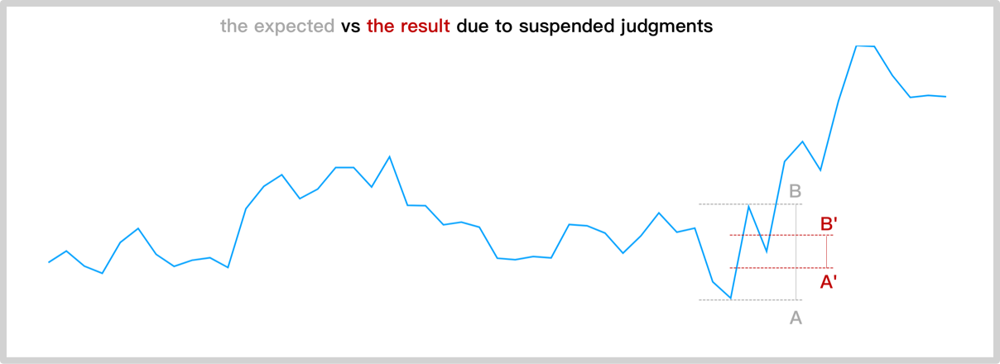

如上图所示，即便是在那可怜的仅占 25% 概率的 “连续两次成功交易” 之中，他们所能捕获的利润，充其量也只有他们以为的 ⅓ —— 他们预期自己能够捕获的利润是 AB 段，可是因为他们的判断依据是滞后判断，所以，⅓ 的涨幅错过了，⅓ 的跌幅逃不掉；所以他们最多能够真正捕获的部分事实上只有仅占 AB 段 ⅓ 的 A'B' 段而已。

> 顺带说，市面上很多人迷恋的[冲量投资策略](https://en.wikipedia.org/wiki/Momentum_investing)的核心缺陷也在于此：由于只能用滞后判断做依据，所以，就算操作结果正确（不管操作理由是否正确），所获盈利也比那些拥趸想象的少很多……

还没有完！还有个必须考虑的细节：每次猜对的概率其实远远低于 ½ —— 因为每时每刻，未来的价格走势，除了**上涨**和**下跌**之外还有另外一种可能性：**持平**。所以，每次猜对的概率应该更接近于 ⅓ 而不是 ½…… 如此来看，之前的结论更为惊人，因为⅓ x ⅓ = 11.11%……

更为可怕的是，他们不仅仅比一招一式只多出来另外一招一式，他们的把式实在是太多了！比如，他们不仅在短期内频繁进行交易，他们还要在若干个标的之间频繁更换车道…… 保证每次都能正确地更换车道，这概率本来就没多少，他们还反复换！就算每次有 80% 的成功概率，前后连续换上四五次之后，那成功率就绝对掉到 40% 以下了…… 

而那些不断研究各种技术的投资者更惨，他们何止两招两式啊，他们的把式太多了！随便读本什么投资宝典就是恍然大悟，随便听个什么大师讲座就是醍醐灌顶 —— 忍不住马上把新学到的把式演练一遍…… 在其他领域，这种心急火燎地寻找并应用新把式，绝对是好习惯，可偏偏在投资领域，这个习惯会害死人 —— 事实上，绝大多数普通投资者都是这样被自己害死的，在投资领域试错是以流血位代价的啊！

这就解释了为什么绝大多数投资者在入场一段时间之后，若是竟然有勇气反思的话，都会沮丧地发现同一个事实：

> 一切的操作竟然全是错的……

他们的感觉一点儿都没错，因为折算下来出错的概率总是更高 —— 最可怕的是一切的错误都都发生在不知不觉之间。他们不知道因为是短期交易所以自己的全部技巧都被运气因素稀释，他们也不知道自己的技巧到底是否真的有效；他们还不知道自己需要至少连续两次成功才算数，他们更不知道自己只能靠滞后判断所以有三分之二的利润其实是压根无法捕捉的，他们也绝对不会知道即便是正确的知识转化为行动的时候事实上需要很多成本…… 无知无畏。—— 说实话，在这些因素面前，沃伦·巴菲特所提醒的高频交易者所面临的那像吸血鬼一样的手续费竟然显得那么微不足道。

行为经济学家[米尔·斯达特曼](https://www.scu.edu/business/finance/faculty/statman/)曾经引述瑞典的一项调查研究，对全球范围内总计 19 个股票交易所的统计表明，哪儿都是一样的，频繁交易账户的损失大约在每年 1.9% ～ 4% 之间。行为金融学家特伦斯·欧登和布拉德·巴博的[研究](https://papers.ssrn.com/sol3/papers.cfm?abstract_id=219228)发现，男性相对于女性交易更为频繁，多出 45%，因此，男性的年化收益相对低 1.4%；而单身男性比单身女性多出 67%，因此，单身男性的年化收益相对低 2.3%…… 美国资产管理界的巨头[先锋集团](https://www.vanguard.com
)的一项调查发现，那些经常调整策略的账户成绩远远落后于从未做过任何调整过的账户。（参见 [The Behavioral Investor](https://www.amazon.com/dp/B07HH99WH8/), by *Daniel Crosby*，第二章）

粗略计算，频繁交易者的 *γ* 每年至少为 *2%*！如果买入之后什么都不做的话，*γ* 的值就是 *0*…… 不要小瞧这 *2%*，按照 *30* 年计算的话，每年 *2%* 的  *γ*，将使你的损失将累计高达 *45%*！由此看来，定投策略是最佳的**不战而胜**的策略。

### 3.2 走过路过不要错过

“[黑色星期一](https://en.wikipedia.org/wiki/Black_Monday)” 的说法缘起于 1987 年 10 月 19 日的突发股灾，当日，道·琼斯指数突然急转直下。从年初开始的十个月左右的时间里，道·琼斯指数一路上扬了 38%；不料，到了这一天，道·琼斯指数一日之间跌去了 **22.6%**! 全球民众在直播电视中陷入了恐慌，在此之前，历史上从来没有过这种 “全球所有人都在同时眼睁睁看着正发生在自己身上” 的灾难。

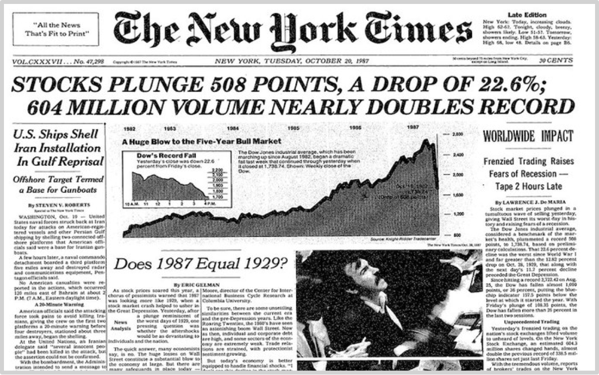

这场源自于香港随后很快蔓延全球的经济危机让人们不由自主地想起远在 1929 年的 10 月 28 日，同样也是星期一，股市开始崩盘…… 事实上，差不多二十年过后，到了 2008 年 9 月 29 日，随着美国房产泡沫的破裂，又是星期一，股市崩盘，引发了 2008 全球经济危机。2015 年 8 月 25 日，也是星期一，中国股灾爆发，上证指数一日暴跌 8.5% —— 要知道中国的股市是有涨停跌停保护的，整个市场暴跌 8.5% 的意思是说，一千多支股票同时跌停！

有天堂就有地狱，反过来，如若没有那么可怕的地狱存在，天堂恐怕也不会那么令人向往。

人们会不由自主地想，如果我居然成功地避开了股市里最糟糕的日子，那该有多好！那何止是好啊，那应该是再好不过了！有人在 2015 年做过统计，在此之前的 *2,600* 天里，如果你竟然可以避开 **10** 个最差的日子，那么，你的收益可能增加 *104%*！（参阅 IESE 商学院的教授[贾维·埃斯特拉达](https://www.iese.edu/faculty-research/faculty/javier-estrada/)的相关论文：[Black swans, market timing and the Dow](https://pdfs.semanticscholar.org/9c64/3d7ed23a1ecdb862a169ff8654e9d1fd15ef.pdf)）

当然，估计你也同时意识到了另外一个事实：那就是你根本无法做到如此精准地避开所有最差的日子…… 这就好像生活中无论如何你都会遇到很多次没带伞却遇到了大雨的情况一样 —— 除非你很小就夭折了。

即便你真的做到了，你还会遇到另外一个尴尬的事实：

> 最好的日子通常是紧挨着最差的日子的……

如果你真的避开了所有最坏的日子，那么你就会不可避免且又 “神奇地” 避开了很多最好的日子。[以下图示](https://theirrelevantinvestor.com/2019/02/08/miss-the-worst-days-miss-the-best-days/)中的红点是最差的日子，绿点是最好的日子：

来自 [JP 摩根的统计](https://www.businessinsider.com/cost-of-missing-10-best-days-in-sp-500-2015-3)告诉我们，**10** 个最好的日子中，竟然有 *6* 个发生在那些最差的日子之后的两周范围之内。如果你在 10 年时间里错过了 10 个最好的日子，你的收益会受到怎样的影响呢？

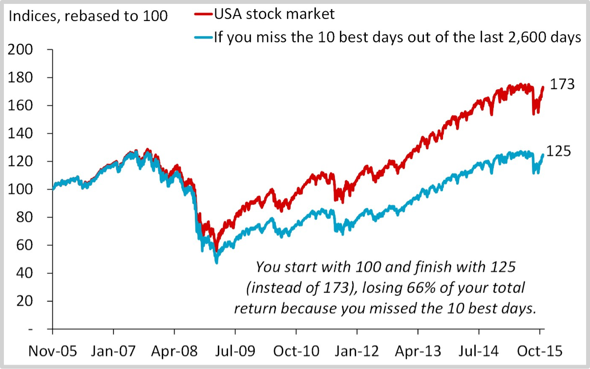

错过 10 年之中最好的 10 个日子的结果是，将有 *66%* 从你的收益当中消失不见，即，你的  *γ* 是 *66%* —— 如果你不犯错，这 66% 的收益原本应该是你的！错过最好日子的后果非常严重 —— 另外一项统计告诉我们，从 1990 开始算起，错过这期间 25 个最好日子的结果就是到最后你的投资还不如五年国债的收益呢 —— 如下图所示。

那么，对策是什么呢？对策就是不动，正所谓 “**无为而治**” —— 千万不要低估 “无为” 的力量，除了交易市场之外，真的很难再找出另外一个地方可以让我们如此直观地感受无为的力量了。

相对于价格大涨的时候，媒体总是在价格大跌的时候更为活跃，因为惊悚的标题和内容总是能够吸引更多的流量。媒体总是更倾向于报道坏消息而不是好消息。除了坏消息更容易吸引流量之外，还有另外一个原因在于，报道坏消息好像更符合媒体的自身形象，毕竟，媒体在报道他人好消息的时候总是有捧臭脚的嫌疑。2017 年 4 月的美联航事件（这是个坏消息）获得关注的期间，“沃伦·巴菲特的资产一日蒸发约两千万美元”（这也是坏消息）之类的消息铺天盖地，可是，“沃伦·巴菲特当天在航空板块的总体收益在市场恐慌中事实上超过一亿美元” 这样的标题和内容就完全缺席。

在市场中，频繁交易者们总是显得更容易大惊小怪。这也很容易理解，因为他们时时刻刻关注价格变化，所以他们的情绪波动相对于长期持有者自然更为激烈。每次价格下跌的时候，你就会在各种网络聊天室或者论坛上看见他们就大喊，“暴跌啦！” 可是，等价格上涨同等幅度的时候，你却完全看不到那些曾经四处大喊暴跌的人们…… 为什么呢？

行为心理学家的解释是这样的：人们厌恶损失，遭受一块钱损失的痛苦远远大于获得一块钱收益的快乐，所以，当同等幅度的上涨发生之时，那些人并不会像之前那么激动。这个解释当然有一定的道理，然而，李笑来有一个很可能更贴合实际的解释：

> 那些忍不住四处大喊 “暴涨了” 的人是挺不过去的，他们百分之百会因为极度的恐慌进而早就抛出了手中的筹码。所以，等 “暴涨” 的日子紧随其后来临的时候，他们手中的筹码早就输掉了，或者干脆早就已经退出了市场，所以，他们事实上喊不出来了。就好像鬼故事里发生的那样，他们在另外一个世界里就算大喊，这个世界的人们已经根本无法听到他们的声音……

绝大多数首次冲进市场的人不懂得定投策略 —— 事实上，他们没有任何策略，他们冲进市场的原因就是见到了别人的好日子。这也是他们之中的绝大多数注定会黯然离场的根本原因，因为好日子总是很少，坏日子总是相对更多 —— 可是，在这种情况下市场长期来看依然上涨的原因就是，虽然好日子相对较少，但好日子里的累计涨幅远远超过坏日子里的累计跌幅…… 可问题在于，基于当下的事实做判断是绝大多数人天然的倾向，而基于长期的视角做宏观观察是只有少数人受过良好教育之后还要长期践行才能真正获得的能力。

定投策略的最终成功，主要取决于以下要素：

> * 定投标的的谨慎选择
> * 定投计划的彻底执行

定投策略是一个相当优秀的策略，简单直接粗暴有效；可是，少见有人用它获得成功。其中一个重要的原因在于，新手刚刚入场的时候，往往并没有能力甄选最优定投标的，所以在十有八九的情况下，他们能做的只能是 “盲从那些已经展现**长期**成功业绩的真正成功投资者的建议”。他们自己也知道，只有这样做，他们才有可能获得更多的 α…… 但是，盲从者有另外一个天然缺陷，那就是他们会因为事实上的无知而无法做到坚定。就好像是人们开车在路上遇到的情况一样，总是感觉自己所处的车道比别的车道更慢，于是，总是忍不住想要换一个车道 —— 而后依然会发现自己所处的车道比别的车道更慢……

定投策略采用者，由于他们从进入市场开始就只有一个动作，买，所以他们肯定经历了所有的坏日子，当然包括那些最坏的日子，但，也恰恰因为如此，他们不会错过任何一个好日子 —— 再一次，定投策略之所以有效，就是因为它天然百分之百与现实的真相相符。

### 3.3 投资不是普通生意

绝大多数投资者即便是在很长时间过后也没有意识到，投资与他们平日里常见的生意有着巨大的不同。绝大多数投资者像普通生意人一样，格外喜欢用 “成本” 这个概念。他们会每日比较自己当前手中资产的 “净值” 与自己的 “成本”，然后得出一个收益或者收益率，随后放任自己的情绪随之放大和波动。

绝大多数我们日常所见的生意的确是这样计算收益的。做任何一个生意，比如开个餐馆，你都有最基本的成本，比如你的开办成本，你的日常成本；进而，你的收入要在一段时间里（比如两年内）分摊掉你的开办成本，然后，你的日常收入减去你的日常成本才是你的纯利…… 你生意越做越好，直到有一天，你积累的利润都可以再开一家同样的餐馆了，那你就开心了，因为如此这般，你就可以不断 “扩大再生产”。

投资与普通生意的微妙区别在于，它没有开办成本，它也没有日常成本 —— 如果你不是每天都做若干笔交易所以需要支付相当数量的手续费的话。

你用来做投资的钱，就不应该是 “有成本的钱”。借钱做生意也不是不行，但，借钱冲进交易市场做投资，百分之百是错误的。借钱进入交易市场做投资的人是在找死，并且还是提前找死 —— 因为这样的人其实在入场的时候就已经死了，只不过他们自己还不知道而已 —— 不要跟他们握手……

有成本的钱，会导致任何一个原本不错的投资变成坟墓。最普遍的例子是人们向银行贷款买房。很多的时候，房产本来是个比较不错的投资标的 —— 如果你已经有足够多的钱所以你不用向银行贷款的话。可问题在于 99% 的人都没有能力一下子购入那么大的一个资产，于是，银行的赚钱机会来了 —— 注意，房产实际上并不是民众的赚钱机会。他们雇佣最牛的精算师，设计了一个对他们百利而无一害的计划，让民众们花二三十年的时间用两套房子的价格买一套房子…… 为什么总是 “两倍”？为什么全球银行给出来的计划都差不多？因为那是精算的结果，反正，人们每买一套房银行就赚一套房（的钱）！房产是流动性非常差的资产 —— 主要原因来自于绝大多数人买来房子是用来住的，卖掉了就没地方住了 —— 所以，那房价看起来总是在上涨…… 可问题在于，房产的价格是不可能永远上涨的， 一旦房价暴跌（比如，未来 30 年中的某一年跌掉 25%），那么 “投资” 就成了 “上吊绳”。

整个 2018 年，是区块链数字资产的熊市。在漫长的熊市之中，有一个非常令人沮丧的现象：

> 越是认真做事的团队越早破产了……

一年半载只不过是短期，可在这个短期之内，那些认真做事的团队遭遇了网球场上 “戴维斯双杀” 一般的绝境。投机者们老早就以不错的价格卖掉了手中的筹码，而另外一些骗子们不仅如此，他们现如今正在花天酒地 —— 因为这个时候的骗子们完全没有日常成本…… 认真做事的团队不一样，首先因为他们以为自己应该是长期持有者，所以从未想过主动卖出手中的筹码；与此同时，正因为他们在认真做事，所以他们必须支出一个相对固定甚至可能不断扩张的日常成本。问题来了，熊市里的价格越来越低，到了 2018 年年底，在已经很低的价格基础上又遭遇了一次腰斩。可是日常成本却是固定的，所以，每次必需卖掉筹码支付日常成本的时候，所有正在认真做事的团队都是同样的感受，疲于奔命 —— 而他们当中的绝大多数，已经陆续不得不在弹药耗尽的情况下壮烈牺牲。

有成本的钱是很可怕的，可那只不过是小鬼而已，有使用期限的钱更可怕，干脆就是死神。在第一部分第四节中我们提到过：

> 全世界风险最高的职业就是韩国总统，紧随其后的就是给自己设置了刚兑责任的资金管理者。

刚兑的意思是说，到了某个时间点，**必须**有那么多钱**马上**拿出来 —— 这是会死人的。这里所说的**死**，并不是比喻、暗喻、隐喻之类的修辞手法，就是字面上的意思，真的会死人。拿已经失去生命了人做例子很残忍，所以在这里就不举任何实例了，不过，在任何一次市场剧烈波动之后，你一定会读到很多此类事件的新闻。

对定投策略采用者来说，投资与普通生意更为不同，若是非要在投资领域里计算成本的话，**他们真正的成本相对来看更重要的是时间，他们投入的时间远比他们投入的金钱更为重要。**在上一节内容中我们已经看到时间远比时机重要，你必须一直在场，每一天不能错过，坏日子无法避开，好日子更不能错失。

“更大更重要的成本是时间” —— 这个观念会改变投资者的感受，随后也会因此改变投资者的决策和结果。当你认为成本只有钱的时候，你很难抵御 “把成本拿出来” 的冲动。但是，一旦你知道你的主要成本是时间的时候，你就会很自然地明白，“已经投入的时间本来就是拿不回来的”！

更为关键的是，这个认知会打消掉你想要 “把一部分收益” 拿出来的冲动，因为你知道的是，你那么做的结果会让你的未来时间的意义削减很大一部分！定投策略者的主要成本是 “跨越至少两个大周期” 所需要的时间。在传统股票市场，这个时间大约是二三十年，在区块链数字资产交易市场里，这个时间大约是五到八年 —— 无论如何都是很长的时间。所以，作为定投者，在你明明知道这很长时间的意义取决于在此之前你的总计投入，所以，你的感受思考与市场上绝大多数人都不一样，削减未来时间的意义，从今天来看哪怕是一点点，到至少两个大周期之后就是很多很多 —— 你很难舍得如此残忍地对待自己。

还有一个重点需要提醒：

> 很多人对生活可能产生意外的可能性低估到干脆忽视的地步。

可事实上，生活总是充满了意外，于是，你的生活成本总是远高于你最坏的想象。你到底应该用多少钱去投资呢？人们经常会这样问：“我用 10% 的钱去投资是不是很安全？” 在这一点上用比例思考的方式通常不会得到有意义的结论。

你把你的钱想象成一个熟鸡蛋的结构：

> * 蛋黄的部分，就是你的日常必需开销；
>* 蛋白的部分，就是你为了抵御风险而准备的储蓄；
> * 蛋壳的部分，才是你可以用来投资的钱，它可以在未来两个大周期之内绝不离开市场……

很大一部分人的投资失败，并不是因为智商、信心、毅力之类的问题，而是因为早期彻底低估了生活中可能遇到的那些大意外的成本 —— 也就是说，没想到蛋白的部分竟然那么厚。比如，自己的牙突然坏了，某位重要的亲属得了绝症，自己不小心出了个车祸，孩子不小心惹了什么很贵的麻烦…… 例子举也举不完。反正，意外有很多很多面具，每张面具都有一张血盆大口。

这就解释了为什么用比例思考干脆无效。例如，你总计就有 10 万，你以为这 10 万是基数…… 可就算你小心翼翼只拿出 10% 去做投资，但一个大周期还没过去的时候你遇到了一个 20 万的意外，而这时候连那用来投资的 1 万也处于缩水状态，那你怎么办？

所有投资人都一样，进入市场一小段时间之后就会有深刻体会：

> 每次你想要卖出投资标的换取现金的时候市场价格就会下跌……

为什么会出现这么违背直觉的现象呢？首先当然是因为交易市场里熊市就是比牛市长很多；与此同时，每当你急需花钱的时候，基本上都是市场外赚钱比较难的时候，市场外赚钱比较难的时候，市场内的价格自然是处于下跌状态的。还有另外一个原因在起作用：当市场内价格上涨的时候，你出售投资标的的意愿更低 —— 在那样的时候，越是长期持有者越是没有消费欲望…… 于是，最大的损失总是自于 “不得不出售投资标的” 的情况。

回过头来，现在的你一定更深入理解了为什么这个你听过无数遍的建议那么重要：

> 投资只能用**闲钱**。

定投者用来投资的钱，不应该有成本，更不应该有期限；它必须是能够陪你穿越至少两次牛熊（或者说跨越两个大周期）的钱…… 不仅如此，还要有足够的备用金去应对可能的意外。

这种认知提升，是定投策略者相对于市场上的其他人  *γ* 更小甚至趋近于零的核心。用带有成本的钱， γ 自然会被提高，用竟然有使用期限的钱，γ 会被无限放大，并且，时间越久影响越厉害。若是没有做好应对意外的准备，那么 γ 不仅很大，并且那很大的 γ 还绝对不可逃脱。

### 3.4 场外持续赚钱能力

成功践行定投策略的核心之一在于践行者的场外赚钱能力。一个定投策略践行者必须做到长期持续地投入，即意味着说，他得有一个长期持续的场外赚钱能力。他在场外赚到的钱，必须能够足矣覆盖一切日常开销，并且还要足矣应对一切意外所产生的费用。在此基础上，能长期持续赚到的钱越多越好 —— 这才是真正的难点。定投策略本身太简单了，虽然它那么有效，它简单到三个字就可以总结的地步：买买买…… 

“把自己的同一份时间重复销售很多次”，是个人商业模式升级中最为关键的一次升级 —— 因为这是最基本的 “拥有睡后收入” 的有效方法。人们一生平均的 78 年人生过程中，只有大约平均 10.5 年的时间可供出售，并且每份时间还只能出售一次；可是，若是你竟然有 “睡后收入”，那么你的可供出售的时间就多出了不止所有人都用来睡觉的 28.3 年，在那所有人都可以自由支配的 9 年时间也同样在产生收入，并且还是有很多倍差异的收入；事实上是每时每刻都有可能有收入，无论你是在坐车通勤，还是在梳妆打扮或者陪伴儿女，都有收入 —— 事实差异会非常大，基数本身就有起码三倍的差异，再乘上若干的倍数差异，所谓天壤之别就是如此产生的。

然而，这样的一次升级是绝大多数人事实上做不到的，并且，现实中实现这种升级的途径相对比较罕见。除了出版著作或者在线授课之外，我自己也几乎找不到任何其它的可行方式。当然，在当前这个信息时代，写出一个大受欢迎的程序也是一种方法，并且还是显然更好的方法，当然与此同时它所需要的综合技能更多。然而，这几个有效途径也是竞争相当激烈的 —— 当然，有那么大效果的解决方案，竞争激烈也是非常自然的罢？

说实话，做不到最好，退而求其次也不是不行。有没有相对容易一点的方式呢？

答案是：**销售**。因为本质上来看，

> **销售就是购买他人的时间再卖出去很多次……**

这也是为什么普遍来看做销售的人收入普遍比其他领域的人更高的深层次原因。虽然他们无法用自己的时间和精力打造出广受欢迎的产品，所以，他们也没办法把自己的同一份时间重复出售很多次；但，他们能做到的是，把优秀的人做出来的产品拿来（本质上和买来没区别）出售很多很多次。并且。在互联网工具的帮助之下，销售过程甚至可以在他们睡觉的时候依然顺利进行顺利完成。这就是为什么马云能帮助那么多人实现财富自由的最根本原因罢？

事实上，只要你肯认真观察，你就会发现同样的结论：

> 在任何企业，销售部门的个体收入总是相对更高……

除了销售很重要之外，还有另外一个隐秘的原因：销售工作是最容易被量化的，所以它最可能附带绩效收入。

销售和定投策略的相似之处在于，标的选择是最关键的第一步。最佳的销售标的是什么呢？它必须是人们的刚需，且又需要持续沟通才能完成。所以你观察一下就知道了，销售群体中，以个体赚钱能力排序的话，最赚钱的通常是房产代理、汽车销售、课程销售、保险销售。为什么呢？首先它们都是人们生活的刚需，最为关键的是，反复沟通都是这类产品销售过程中的刚需。

事实上，人人都应该注重自己的销售能力。因为成功销售的核心就是生活中最为重要的一个关键：有效沟通。哪一次成功的销售不是有效的沟通呢？小时候，你能让同桌向老师保守秘密其实就是你的成功销售，长大之后，你能让一位异性对你信任有加还是成功销售，到了工作岗位你能升级加薪事实上又是成功销售…… 销售能力基本上是万能的。

大学毕业之后，我的第一份工作就是销售 —— 事实上，虽然此后我从事过许多看起来不一样的职业，到最后在我眼里这些职业的核心本质全部都是销售。比如，我当老师本质上来看还是做销售，学生不喜欢我，那么我讲的内容无论多么正确他们就是听不进去；我写书出版还是做销售，若是那标题不吸引人他们压根就不可能看第二眼；我做天使投资，我手里的钱和别的天使投资人手里的钱有什么区别吗？没有，可对方凭什么要我的钱而不要其他人的钱呢？因为我是个更好的销售……

销售的核心是什么？**信任**。

千万不要误以为销售是靠忽悠的 —— 这么想的人都是缺乏长期思考能力的人。短暂的信任也许可以通过欺骗获取，长期的信任只能靠时间慢慢积累。信任的价值之所以那么高，是因为它非常脆弱，稍有不慎就前功尽弃。沃伦·巴菲特的理解是这样的：

> 建立信用需要 20 年的时间，可摧毁它大约只需要 5 分钟。想到这些，你做事就不一样了……

客户肯买你卖的房子、你卖的车子、你卖的课程、你卖的保险，除了销售标的真的值得购买之外，还基于客户对你的信任。本质上来看，信任远比销售标的本身更为重要。没有信任作为前提，就干脆不会有任何销售产生。反过来，信任是如此重要，所以那些优秀的销售绝对不愿销售不好的标的 —— 他们会常常自问，我自己会买这个东西吗？我会把它卖给家人吗？我会把它卖给我那些交往了许多年的朋友吗？缺乏长期观念的人，看到这样的描述，是完全没办法相信的，他们总以为这是很虚伪的态度，可事实上，这几个小问题就是那些长期业绩优秀的销售非常认真对待的问题，他们也恰恰受益于这种基于长期思考的认真。

磨练自己的销售能力吧，因为它太重要了，在生活中的任何一个方面都有巨大的作用。并且，事实上人人都有机会把自己磨练成一个好的销售 —— 最为关键的是，这也是一次个人商业模式的重要升级。

可惜的是，销售依然不是所有人都能做好的事情…… 那么，再退而求其次的话，有没有什么办法呢？当然有 —— 提高你的**被合作性能** —— 很少有人认真对待，乃至于想要描述它就不得不需要杜撰一个新词汇的地步。做一个善于与他人合作的人，其实也是一次小型的商业模式升级，也不是很容易做到的事情，因为提高自己的 “被合作性能”，同样需要很好的沟通能力，同样需要很强的信任，同样需要非常优秀的能力。

很多人在这方面做得非常差，虽然他们也很苦恼，但总是把自己很难与他人合作的事实归结为错误的根源：个性太强 —— 或者换个说法 “脾气太差”。那是幻觉，被合作性能差的根本原因其实只有一个：那就是你没有能力把自己该做好的事情做到最好。个性太强脾气太差等等，根本就不是他人难以与你合作的原因。若是属于你应该做的那一部分你就是能够做到最好，那么，你脾气再差，你个性再强，人家也要硬着头皮与你合作 —— 合作的负担就这样转移到了对方身上。

你得拥有特定的能力，乃至于他人有与你合作的欲望。当你尝试着与他人合作，对方却没有合作意愿的时候，更可能的原因是因为你并没有什么足够的、特定的能力引发对方的合作欲望，而不是对方不识货。很多人要过了三十岁之后才发现自己其实一无所长，这就很可悲。在这个阶段什么最重要呢？最正确的答案再一次说出来都好像是废话：**老实**。一无是处的人都一样，哪儿哪儿都不老实。他们对别人不老实，总是在关键的时候使用伪装蒙混过关；他们对自己同样不够老实，所以他们的伪装甚至用来欺骗自己；他们对知识对学习不老实，所以总是并不完全相信知识的作用，也因此所以学习的时候总是错过无数细节浮皮潦草…… 所有这一切的不老实，直接造成了一个最严重的缺陷 —— 他们不可能具备长期视角和宏观观察能力，因为他们总是不由自主地把自己的全部注意力放到了眼前的得失和投机取巧之上。

另外一个提高被合作性能的重要因素是**不抱怨**。在任何情况下都不抱怨的人具备最佳的合作性能 —— 道理也很简单，因为抱怨彻底无用。被合作性能差的人抱怨一切，他们抱怨大环境不好，他们抱怨合作伙伴素质低下，他们抱怨运气实在太差，他们抱怨他人对自己不公平，他们抱怨家人没有提供足够的支持…… 他们就是习惯于有意无意地用这些抱怨掩盖一个显而易见的事实：他们就是没把自己应该做的事情做到足够好。若是一个人能够狠心彻底杜绝任何抱怨，这样的决绝会反过来促进自己把注意力放到应该做的事情上去，进而自然而然地提高自己的被合作性能。

人生本质上来看也是个交易市场，一切在交易市场上有效的道理在整个人生舞台上全部适用。

回顾我自己许多年前的选择，我所使用的选择策略，和第二章第三节中所说的定投标的的选择本质上来看一模一样。首先，我要去一个发展更快的地方，所以我从地处边疆的小城搬到了北京。什么行业可长期成长呢？老实说，我的眼光也没多好，因为我选择了教育而不是互联网 —— 如此这般之后，只剩下了一个选择，去新东方。只不过是选择了一次 “局部的局部” 而已。至于只剩下一个选择倒也没什么，因为打工么，反正只能在一个地方打工。然后再做的事情，和这一章节里说的一模一样。我在那里教了七年书，老老实实教书，老老实实与他人合作，老老实实地把自己手中的工作做好，虽然脾气依然很臭，虽然个性总是很强，可我还是能进一步磨练自己的销售能力，还是能进一步磨练自己的讲演能力，并且还是进一步获得了写作能力 —— 等我离开的时候，终于把自己的个人商业模式做了个重要的升级，彻底可以做到把自己的同一份时间销售很多次，并且越来越熟练。于是，在我把自己的那个鸡蛋的蛋清终于补得相当厚之后，我进入了投资领域。在那里老老实实地实施定投策略…… 后来在市场里的一切成功统统都来自于一个秘诀：**我一直老老实实地在场外拼命赚钱。**

### 3.5 定投执行各个阶段

市场里的交易者都遇到过一个魔咒：

> 我一买它就跌……

这其实不是人们以为的玩笑，或者是 “我太倒霉所以才遇到” 的情况 —— 它就是事实。原因其实也很简单，“连你这样一个外人都被吸引进来了，那说明这牛市也快到头了……” 绝大多数情况下，人们都是被上涨的价格吸引进市场的，所以，“我一买它就跌”，并不是魔咒，也不是某个人单独遇到的坏运气，而是所有人都会遭遇的普遍且又必然的现象。

所以，不管你是否采用定投策略，你冲进市场的第一个阶段，几乎必然是一个漫长的**低谷阶段**。

我喜欢看产品说明书。拿来一个陌生的东西，有个产品说明书就很幸福。你读着读着就知道了一个新的功能，一个新的用法…… 在很短的时间内你就能完整地掌握一个新东西的各种用法，那种感觉真的很棒。

可惜，投资没有说明书。事实上，我们这一生所遇到的最重要的东西都没有说明书，结婚的时候没有人能给我们一个清晰明了的婚姻说明书；生孩子的时候也没有人能给我们一个养儿育女说明书；当然，当初我们出生的时候，不仅我们的父母没有子女说明书，直到我们长大成人，父母和我们一样，依然没有人生说明书……

不过，人类之所以与其他动物不一样，最重要的方面就在于人类有语言和文字，所以人类在出生的时候事实上并不是从零开始 —— 因为只要习得了文字，只要开始阅读，那就相当于 “已经站在了巨人肩膀之上”。

但是，为什么明明大家都可以站到巨人肩膀之上，可最终绝大多数人都活在巨人脚趾之下呢？最佳解释就是，绝大多数人在起初的时候过早放弃了事实上是最佳的策略：**盲从** —— 这是我们在第二章第一节中曾经深入展开过的话题。过早独立思考虽然也许是好事，但更可能是坏事 —— 因为独立思考本身并没有多少价值，建立在见多识广上的独立思考才真正有效，可问题在于早期的时候就是见识少啊！在很局限的见识基础上再怎么独立思考依然是坐井观天。

盲从策略的实施，对成年人来说尤为不易，因为在此之前你已经为独立思考奋斗了很久，现在竟然要退回去，颇有些难堪。这里就需要一个很小的技巧，或者可以被称为 “花招”：

> 你可以独立思考，但你只能把随后的行动只落实在纸面上 —— 也就是说，你可以用一个专门的本子记录你的独立思考，但在行动上，依然保持盲从。

在投资领域之外，你不一定要这么做；但，在投资领域之内，你必须这么做！因为这不是你可以随便试错的领域，这里的每一次错误都是真金白银和更为宝贵的时间上的损失。你那很可能只不过是尚未被验证为愚蠢的新鲜想法，其实并不值得你用真金白银去和你自己宝贵的生命验证。

这个小花招还有另外一个小花招与之搭配才更加厉害：

> 认真观察他人的决策和结果，从他人的错误中及时汲取必要的经验和教训 —— 并且记录到纸面上。

看他人犯错，看他人付出真金白银的代价，看他人用他们自己宝贵的生命去做验证，虽然看起来颇有些讨巧，可它偏偏却是提高见识的最佳途径，没有任何一个其他途径可以使你变得更加 “见多识广”。很多年来，我最喜欢的消遣之一，就是在各种在线聊天室或者在线论坛上看那些陌生人发表见解，我会做很多笔记，时不时拿出来看，对我的进步有着不可或缺的巨大的帮助。

由于入场时机更可能是最差的时机，又因为低估阶段天然很长，进一步刺激了另外一个天然的倾向：人们在遭遇损失之时有强烈的改变欲望 —— 我们人类的大脑不是为了投资而设计的，是千百万年来为了挣扎着生存而设计的。所以，在这个阶段里，只有一个办法抵御那些来自于四面八方无谓挣扎的欲望：

> 磨练自己的长期视角。

有一则 2017 年的新闻故事。有两个英国老太太于 20 年前产生了激烈的纠纷。维拉瑞·薇薇安想要在自家大院里新盖个房子，可贝蒂·凯莉一家却联合邻居一起反对 —— 因为若是那房子建起来的话，凯莉家里那大窗子的视野就被挡住了。为此两家甚至闹上了法庭 —— 最终，薇薇安没有获得建新房的批准……

薇薇安从法庭回来做了什么事儿呢？默默地在两家大院交界的地方种了一排树苗…… 5 年后，2001 年，那已经是一排小树；15 年后，那可是薇薇安刻意挑出来长得速度最快的树种；那一排树墙已经高达二三十米！上图左上角是 20 年后两家再次对簿公堂，薇薇安胜诉而归的笑容。薇薇安怎么赢的？她在 20 年前就赢了 —— 只不过，贝蒂·凯莉一家需要等很久才知道他们早就输了，且输得相当彻底。诸葛亮决胜千里之外，薇薇安好像更厉害，决胜廿年前。这廿年之中，薇薇安每天有胜利相伴，一定比其他人更多那么一点点快乐和幸福。

虽然天气预报总是出错，但，对于未来，有一些事情是百分之百确定的 —— 比如，若是你种下一棵树，那么未来它一定能长高。定投策略采用者就是这样的，他们的投入相当于是在种树，四五年看不出什么，但在十年二十年（或者说两个大周期）之后，当年的种子一定会长成参天大树。

在漫长的低估阶段过后，会迎来下一个阶段：**第一次收获**。

虽然这个阶段注定会非常短暂，可它事实上是最难安全度过的。首先，你会发现突然之间你所在的世界喧闹了起来，不仅外部呱噪，你自身也开始产生各种幻觉。最常见的幻觉就是你会觉得自己的智商提高了！不仅如此，你的智商正随着极速上扬的价格而迅速提高！你的说话声音开始大了起来，你的语调变得更加铿锵有力，并且，你身边的人会不由自主地附和你所说的一切…… 在这种情况下，你只能越来越自信。

自信这东西，多少有一点肯定是好事儿；但它哪怕只多了那么一点点就会自动使人的智商降低为零。随着过度自信的程度增加，智商甚至会事实上沦为负数。你会开始做各式各样的蠢事，生活花销突然加大之类的都不在话下，最隐蔽的愚蠢是，一方面放弃了之前的长期时间投入，另一方面也同时放弃了未来相当长一段时间的继续投入。你忘了，在这个时候你所放弃的，在下一个大周期过后会被放大更多倍。人们会在这个阶段，花费一个岛的价钱买一个所谓的豪车…… 你以为你是在一掷千金，可实际上你是在一掷千年！那些在未来你原本可以赚到的钱，因为你这个时候的愚蠢，再奋斗一千年也不可能赚到……

不过，相对于另外一个愚蠢，上面提到的什么都算不上。在这个阶段少数有上进心的人偏偏因为他们有上进心所以会犯一个更为愚蠢的错误：他们开始疯狂投资。他们的出发点是积极的，他们相对更为上进，并且投资当然是好事，而且投资是为了更上一层楼，这是相对很少的人才有的积极态度。可问题在于，他们的智商并没有真的提高，他们的见识就算有所拓展却也依然事实上并不够用，于是，他们几乎无一例外都将遭遇 “凭运气赚到的钱凭实力全部亏掉” 的结果。

这样的时候，有一个心理现象隐藏在背后作为催化剂：横财效应（House Money Effect）—— 在赌场上，赌徒们会不由自主地把赢来的钱不当钱花…… 自己曾经带去的钱，无论如何都会被当作 “辛辛苦苦赚来的钱”，但，赢来的钱，金额越大，越不是 “辛苦赚来的钱”，而是 “横财”。横财这个东西，花起来是没有任何心理负担的，甚至，它就好像烫手一样，让人感觉必需甩出去 —— 绝大多数没有上进心的人，用它来随意挥霍；极少数居然有上进心的人，用它来做很多事实上不负责的不合格的投资。

这个阶段最锻炼一个人的**无为能力**。在这样的时候，什么都不做是一种能力！无为而治莫过如此。定投策略者相对容易一点的原因在于，他们有 “在交易市场内除了买之外什么都不做” 的能力，甚至，那已经是相当长时间里刻意培养的习惯。更何况，定投策略者有很重要的事情需要忙活 —— 在场外继续赚钱…… 并且，由于价格上涨了，所以，他们所需要的场外赚钱能力应该更强才对，于是，他们忙着自己真的进步呢，很难产生什么幻觉。事实上，场外赚钱能力才是检验一个人是否真的进步的最靠谱方式，因为在场外，你没有趋势驱动。场内是拼交通工具的地方，场外是拼脚力的地方。

短暂的第二个阶段过后，你会迎来最难熬的第三个阶段，即，**第二次低谷**。人们赚到一块钱的快乐远不如损失一块钱的痛苦 —— 这是所有人都有的天然倾向。这个阶段依然漫长，甚至更加漫长，因为这一次你只能 “从头至尾” 地经历这个阶段，而非像第一次那样，很可能只经历了 “部分低谷” —— 因为你被那个漫长阶段中的某一次阶段性大涨吸引进市场的……

在这个阶段里，你能够感受到的损失，跟第一次低谷阶段最大的不同在于，这一次，你正在经历的是已经被放大了好多倍的损失。不仅如此，你的想象力因为你正在感受到的是被放大的损失而进一步被放大，你的脑子里充满了这个句型：

> 要是…… 就好了！

比如，“要是一月份清仓了，现在就可以住比现在大三倍的房子了！” 或者，“哪怕上个月清仓，老婆就没什么理由跟我吵架了！” 等等，诸如此类。更为可怕的是，会有层出不穷的巨大差异比较，“你看，那谁谁谁早就跑了！”

其实，换个角度你就释然了。这就好像你刚刚驶船从小溪进入大江，你要重新经历一遍你曾经经历过的，只不过，这一次波浪更大了一些，甚至大了许多！曾经在小溪里晕船的你，再一次不适应，所以还是会晕船，还是要大吐很多次…… 但，你终将会再次适应的，就好像当初在小溪里驶船都晕水的你现在早就没事儿了一样。这时候你需要反复提醒自己的是，这才哪儿到哪儿啊？继续航行下去，你会冲进大海，那里的风浪更大，到时候，你还是要再重新适应一遍的……

到了这个阶段，你必须重新建立你的一个世界观：

> **每一个终点，都是新的起点** —— 除非你死了，或者你自己主动选择死掉。

以终为始，是任何一个长期持续成长的人都具备的一个基本观念。我在新东方工作过七年（2000～2007）—— 2006 年，新东方在纽交所上市（[NYSE: EDU](https://finance.yahoo.com/quote/EDU)）。我亲身经历了一个事实上常见的现象，一家公司上市之后，大部分人会选择尽快套现而后离开 —— 因为他们就是那种属于大多数的，认为终点就是终点的人。事实上呢？

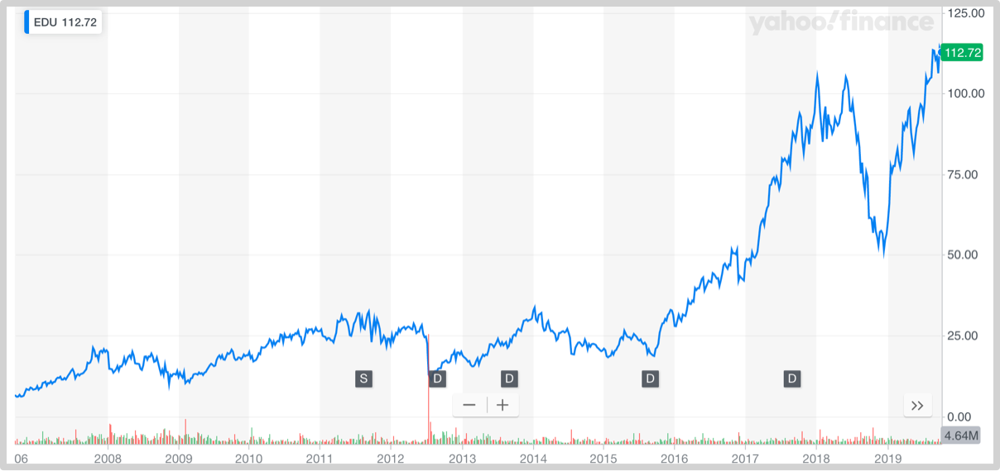

在不计算分拆不计算分红的情况下，过去的 13 年里，新东方股票为投资者创造了高达 *26.2%* 的年化复合回报率！也就是说，那些上市之后第一时间就套现的人，在奋斗 13 年之后会发现自己的成绩不会这么好的 —— 尽管在这过程中新东方股价有起起伏伏，经历了若干次的 “暴跌”…… 26.2% 的这个成绩，甚至比沃伦·巴菲特还强一点点，话说，到最后，有几个人真的能跑赢沃伦·巴菲特呢？

从这个角度望过去，我的前老板俞敏洪就是这样一个楷模，他做到了把一个每一个终点当作新的起点，而后继续走下去…… 哪怕遇到下一个终点，对他来说，那再一次是另一个新的起点。在过去的 13 年时间里，包括再往前的 6 年左右，我都见过无数的人从各个你能想到的所有角度批评过他，可事实上，从这个角度望过去，那些曾经批评他的人几乎都一无是处。

等这个阶段终于 “熬” 过去，你终于迎来了下一个阶段，**再一次收获** —— 这一次，你冲进了星辰大海。也许你会意外，虽然这里的大风大浪比你当年在小溪时、在大江大河时所想象得更为厉害，但，一路走过来的你却事实上很平静。一路走过来的我就很意外。然而，很快就发现这才是正常的。你若是像我一样天天看到的都是那些其实是在小溪里驾船行驶的人每时每刻都好像是在经历大海里的暴风骤雨一样反应激烈，你没办法不平静。

到了这个阶段，很可能有一样东西让你无法平静 —— 那就是你依然尚未找到值得你持续努力的目标。想象一下，你已然拥有了很多财富，却尚未找到人生的意义，那有多可怕？我个人最大的幸运在于，即便是在我的鸡蛋清都没准备好的情况下，我就已经有了值得终身去做的事情：学习与成长 —— 事实上，很多记者在采访我的时候都用奇怪的眼神向直白地我表达过他们的难以置信。然而，请你理解一个清楚地了解自己天份原本不佳的人通过长期持续的学习获得不断进步之时他所能感受到的那种激动和幸福。

许多年前，我就发现一个简单的道理：

> **教是最好的学习方法。**

于是，我喜欢做教育，迄今为止，我已经 “一不小心” 从事了二十年的教育工作 —— 教人考试，教人写作，教人创业，教人投资…… 教育，就是我至死都能做，且极其乐于做的事情，了不起换个领域继续教下去，因为反正我要继续学下去，就这么简单。根据我的体会，**找到值得自己终生去做的事情，是一个人最好的护身符。**现在的李笑来，经常在网络上给几千人（将来人数会更多）讲课 —— 早上起来讲十分钟课，李笑来很幸福。人做的事越大，麻烦越大，可是，对李笑来来说，没有什么烦恼是讲十分钟课不能化解干净的。

## 第四部分 客观客观更加客观

投资成功的关键在于要做到全方位客观 —— 对自己客观，对自己和外界的认识客观，对一切都要全方位地客观 —— 任何一次没做到足够客观，都会增加 *γ* 值。

### 4.1 我们就是非常不靠谱

多年以来，全球所有心理学家们的研究结果通常会令我们非常绝望。在过去的几十年时间里，来自世界各地的调查研究均向我们展现同一个结果：作为人类，我们的决策质量总是非常差，就是因为我们从里到外彻头彻尾地不靠谱……

2002 年获得诺贝尔经济学奖的[丹尼尔·卡尼曼](https://en.wikipedia.org/wiki/Daniel_Kahneman)和他的合作伙伴[阿莫斯•特沃斯基](https://en.wikipedia.org/wiki/Amos_Tversky)很早就发现人们极度厌恶损失 —— 之前就提到过好几次，人们损失一块钱的痛苦远远大于赚到一块钱的欢乐，乃至于人们甚至仅因为说话方式的不同就做出实际上完全没必要的所谓选择。也就是说，针对同一件事情，只因为说法的不同，就会导致人们会做出要或者不要的选择。比如，被测试者会收到一笔钱，例如 50 英镑，然后这些测试者被告知他们必须进行选择：

> * 收益框架：你可以保留这 50 英镑中的 20 英镑。
>* 损失框架：你将会失去这 50 英镑中的 30 英镑。

其实，这两个选项是一样的，因为无论哪一个选项，被测试者最终都一样，收到的都是 20 英镑。结果呢？结果因为第二个选项是损失框架，所以，同样的情形用损失框架描述的时候，被测试者更可能被引发损失厌恶情绪。

关键在于这里：他们的这种 “凭空产生” 的情绪会使得下一步的决策受到影响。班纳德图·马蒂诺（*Benedetto De Martino*）在[一篇论文](https://www.ncbi.nlm.nih.gov/pubmed/?term=De Martino B[Author]&cauthor=true&cauthor_uid=16888142)里描述了他与合作者们共同设计的一项实验。上面刚刚提到的，就是被测试者们所做的第一个 “选择”。

这个实验聪明的地方在于，实验设计者并没有打算就此结束，他们想要观察更进一步的影响和结果。于是，他们设计了下一个选项：

> 无论研究人员究竟是用哪一种语言框架向被测试者描述选项，即，无论是用收益框架描述，还是用损失框架去描述，被测试者都要进行下一个选择，那就是他们要不要用那些钱去参加一个损失概率明显大于收益概率的赌博……

并且，为了更为客观，得到更为准确的结果，实验设计者们向被测试者尽量详细地解释了各种选项，包括框架效应的存在，包括赌博输赢的概率等等……

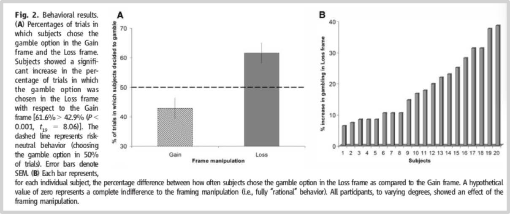

然而，研究者们发现，那详尽的解释好像没有任何用处，大多数人还是会被框架效应所影响，也就是说，最终，在实质上同样的两个选项之中，虽然经过详细解释，还是有更多的人选择了收益框架 —— 并且比例也没有什么太大的变化。

更为严重的是下一个结果。无论是选择了收益框架的人，还是选择了损失框架的人，都有一部分选择了下一步，即，用那些钱参与明显更可能输掉的赌博。只不过，选择了收益框架的人群中，选择下一步去赌博的仅占 43%，即，低于一半；但，选择损失框架的人群中，选择下一步去赌博的人占了 62%，多于一半…… 这就有点严重了，一个 “凭空产生的选择” 以及一个 “因此凭空产生的情绪”，会导致很多人竟然不惜去参与明显更可能输掉的赌博！

原来会有这么多人只因为害怕而去冒险！—— 换言之，原来很多人之所以肯于冒险，根本就不是出于勇敢！并且，他们害怕的东西其实并不存在……

还没有结束......

最有趣的是实验之后的访谈。被测试者大多都会承认自己的决策依据前后并不一致，尤其尴尬的地方还在于，这些被测试者面对测试结果的时候，心里明明记得自己在进行决策之前听过对各个选项的想尽解释，然后又刚刚经历了自己的清醒而又糊涂的决策、过程和结果，所以大多数人都觉得自己有些莫名其妙，他们的解释大致是相同的：虽然我知道，但我就是控制不住自己…… 这太可怕了 —— 明明知道怎么回事儿，却就是控制不住自己。

这个实验的结果，令我们这些严肃投资者目瞪口呆！何止是目瞪口呆啊，是心惊胆颤吧？甚至干脆是魂飞魄散，犹如惊弓之鸟一般…… 为什么，因为我们可是拿着自己的钱在做事啊，而且不是 20 英镑而已，不仅拿着今天手里有的钱，还拿着自己相当长一段的未来时间以及那一段未来时间里能够赚到的钱去做事啊；不仅要做事，还要做成事，我们想的可不是作死啊！你说，拿着自己的钱，拿着自己的未来，眼看着正确的目标…… 可在走向目标的过程中却出现，“我全都知道，可就是没办法控制自己，控制不住自己走向灭亡，控制不住自己去选择走向灭亡”，还有比这个更可怕的事情嘛？这完全是个鬼故事啊！吓死人的鬼故事。历史上，所有的鬼故事都是一样的，不管是什么样的文化，东方还是西方，不管是什么样的年代，古代还是现代，都是一样的，所有鬼故事的核心，一句话就能概括：那就是故事里的主角，基于种种原因，眼睁睁地看着自己走向灭亡，全程清醒，却又无可奈何，就是控制不住自己……

这个实验精彩的地方还没结束呢。在被测试者经历各种决策的过程中，研究人员还同时监测了被测试者的大脑活跃情况，使用了功能性磁共振成像技术，即，所谓的 [fMRI](https://en.wikipedia.org/wiki/Functional_magnetic_resonance_imaging)；然后看到了惊人的现象。

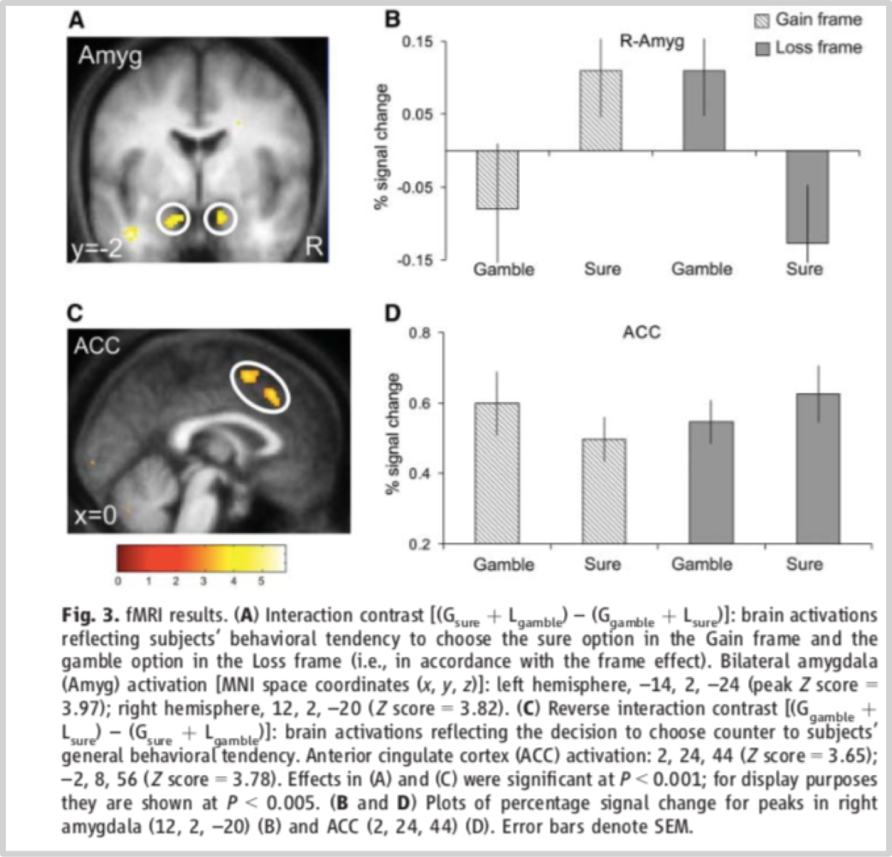

这张图基本上揭示了 “我就是控制不住自己” 这种见了鬼的现象究竟源自于什么东西。

从实验的结果来看，当被测试者没有能够抵制住损失厌恶的时候，他们的杏仁核处于激烈激活的状态。杏仁核是什么东西？我们的大脑里这个杏仁核是边缘系统的皮质下中枢，有调节内脏活动和产生情绪的功能。会引发应急反应，进而让动物能夠挺身而出或是逃避危险。杏仁核体积非常小，但它对情绪反应十分重要，尤其是恐惧。

你回忆一下自己有过深刻恐惧的时刻，就会发现当恐惧发生的时候，你的害怕不仅体现在情绪上还体现在生理上，悲切生理反应非常严重。你会感觉到自己的心脏被提了起来，会感觉自己的胃空空的，很难受，会冒汗。你的大脑一片空白，因为血液都被充到其它地方去了，被小脑占用了，于是，你的大脑皮层正处于缺血缺氧状态。这个杏仁核的应急反应，就是那个最终左右被测试者选择的东西；这个杏仁核的应激反应，就是被测试者口中 “我明明知道自己该怎么办，可我就是控制不住” 的那个东西。

还有更令人绝望的呢！更令人绝望的是，我们都有死不悔改的倾向，当自己被证明错误的时候，反倒会变得更加顽固…… 读到这里的时候，我猜所有人都会有一个闪念，“难不成我也是这样的吗？” —— 我替你回答吧，你是，你就是！因为我们所有人实际上都这样，只不过程度轻重不同而已。

弗兰西斯·培根的观察是：

> 只要人们持有一种见解，不管是被植入的还是真心认同的，他们就会想尽一切办法使用一切可用的手段去维护它……

当这种见解被证明为错误的时候呢？ [纳西姆·塔勒布](https://en.wikipedia.org/wiki/Nassim_Nicholas_Taleb)的观察是：

> 他们绝不反思，绝不深入研究，他们的尴尬与难堪将使他们用各种理由去继续维护他们的观点；即便是认错，也只是停留在向人解释自己为什么出错上，而不是改正错误之后在正确的方向上继续前行……

丹尼尔·克洛斯贝在他的《行为投资者》中引用了两个例子，一个是关于塑料袋争议的，一个是关于枪支管制争议的：

> * 制作纸袋比制作塑料袋耗费更多的时间，前者是后者的 3 倍；即便是在大量宣传之后，其实也只有 24% 的人使用纸袋，与此同时，事实上有 67% 的人重复使用塑料袋；纸袋生产比塑料袋生产产生的空气污染多 70%；回收纸袋比回收塑料袋耗费的能量多 91%……
> * 98% 的罪犯使用的是偷来的枪支；每年超过 10 万人用枪支成功保护了自己的安全；90% 的情况下枪主在保护自己的时候并没有真的开枪；从 1980 年到现在，每年不小心被水淹死的人都比死于枪支的人更多；每年死于餐刀的人数竟然十倍于死于枪支 —— 餐刀才是更为方便的凶器……

不管你属于哪一派，不管你是支持使用纸袋的还是支持使用塑料袋的，也不管你是支持枪支管制的还是反对枪支管制的，这都不重要 —— 在这里重要的是，你能观察到的，各自对立的两派之间争斗的激烈程度。如若仔细观察，最终你会惊讶于那些争论的激烈程度本质上与事实全然无关，大家好像完全不在乎事实，大家在乎的是自己的输赢。事实和数字本身并不能改变人们的立场。赢了，继续打，输了，坚决不认，还要继续打…… 到最后，不小心看到了事实，会被事实打败吗？不会，他们会继续寻找其它能够支持自己的事实。

这种被挫败之后信念却越发强烈的现象，在心理学上有个专门的名词，叫做 “[逆火效应](https://rationalwiki.org/wiki/Backfire_effect)”。研究者们对其研究之后的发现更令人绝望 —— 这种逆火效应在 “打败他们的证据略显含糊“ 的时候尤为强烈。比如，那些笃信世界末日的狂热团体成员，在经历了 2000 年其实平安度过的事实之后，并不会这么想：“哦，原来我们错了，世界末日可能并不存在”；他们真正在想的恰恰相反，他们会说，“谁说世界末日一定要那么准确地降临在 2000 年？” 或者暗自嘀咕，“也许是我们不足够虔诚才导致命运不够准确……” 

这种逆火效应，以及它那愈挫愈强的属性，在投资领域更为明显。那些对未来做出了不准确预测的人是最明显的例子。错就错了呗，预测总是错的更多…… 但是，当事实已经证明他们的确错了的时候，由于投资世界的不确定性普遍存在，他们不仅不会认输，还会发爆发逆火，“你们等着吧！早晚会证明我才是正确的！”

我们不靠谱的地方太多了，自从 1972 年前后[丹尼尔·卡尼曼](https://en.wikipedia.org/wiki/Daniel_Kahneman)和他的合作伙伴[阿莫斯•特沃斯基](https://en.wikipedia.org/wiki/Amos_Tversky)开始探究行为经济学领域以来，不仅有行为经济学，后来还有行为金融学，以及行为投资学…… 科学家们已经分门别类地甄别了超过 137 个普遍的心理偏差（至 2019 年；这其中的大部分都可以在 [Wikipedia 上的一个列表](https://en.wikipedia.org/wiki/List_of_cognitive_biases)中见到），相信以后还会发现更多。过度自信会让我们出错，维护自我脸面会让我们出错，谈话方式会让我们出错，情绪激动会让我们出错，休息不足会让我们出错，体内糖分减少会让我们出错，甚至连阳光明媚都会导致我们更容易出错；不仅如此，我们对风险的认知永远对不上号；我们对收益的认知总是非常扭曲；手中信息太少我们会出错，手中信息太多我们更会出错…… 而这个列表事实上可以没完没了。 更为糟糕的是，在明明知道道理的情况下，我们还 “就是控制不住自己”，在明明已经被证明错了的情况下，我们还可能爆发逆火 —— 你说我们到底有多不靠谱？

### 4.2 绝对不要与自己为敌

随着越来越多的证据表明我们就是那么不靠谱，有一句古老的箴言成了绝大多数人的信条：

> 你是你自己最坏的敌人。

**压根就不要相信这句话！**因为这句话仅仅符合一半都不到的真相，它对我们任何人都没有任何实际上的指导意义。千万不要整天想着什么 “战胜自己” —— 把自己当作敌人，整天想着自己是个要被战胜的家伙，肯定不会幸福的；这样的人就算有一天走到终点，也不会开心，会累死…… 想想那些真的拿这句话指导自己的人罢，也难怪他们总是随便到达哪个终点之后就再也不愿意继续前行了。

我个人最喜欢的是[柏拉图](https://en.wikipedia.org/wiki/Plato)在两千多年以前讲过的那个[双轮战车寓言](https://en.wikipedia.org/wiki/Chariot_Allegory)。在那个连解剖人体会被当作巫术的时代，柏拉图当然无法知道两千年之后人们所拥有的常识：人类大脑的三层结构，从里至外，分别有个通俗的称呼：鳄鱼大脑、猴子大脑和人类大脑。

简单讲，最里层的部分，所谓的鳄鱼大脑，负责所谓的直觉；中间的部分，所谓的猴子大脑，负责情绪的处理；而最外的那一层，人类大脑，负责理智，诸如推理之类。可以毫不夸张地讲，整个人类文明都建立在人类的大脑皮层之上 —— 就是最外面的那一层 —— 人类与其他哺乳动物最不一样的地方，就是人类拥有格外发达的大脑皮层……

在上一节的实验之中，当实验者向被测试者讲解各个选项的时候，被测试者所用来去理解的，是最外面那层人类大脑；一旦开始行动之时，厌恶损失的情绪被触发，这时触发行动的其实是猴子大脑 —— 而只要看到损失就觉得它是不好的，这是直觉，不一定正确的直觉（因为尚未被人类大脑处理），就是鳄鱼大脑在发挥作用。那些被测试者在访谈里所说的，“我就是忍不住”，本质上来看，就是因为猴子大脑比人类大脑更触发了行动。再进一步，鳄鱼大脑总是能比猴子大脑更早触发行动，所以，每次需要 “马上决策” 的时候，总是猴子先出手，甚至鳄鱼先出手，等人类反应过来的时候，该做的都已经做完了…… 这就是为什么日常生活中我们会发现，最有效的 “冷静” 方法是闭上眼睛什么都不做，过一会再说。

柏拉图在两千多年前想出来的类比竟然与两千多年后的科学家们的解刨结果相当一致，你对比一下就知道了：

| 大脑结构 | 形象称呼 | 柏拉图的双轮战车类比 |
| -------- | -------- | -------------------- |
| 大脑皮层 | 人类大脑 | 车夫                 |
| 内皮层   | 猴子大脑 | 白马                 |
| 脑干     | 鳄鱼大脑 | 黑马                 |

相对于 “人类、猴子、鳄鱼” 的说法，我更喜欢柏拉图的战车比喻 —— 因为车夫、白马、黑马、战车是一个能够统一的组合。我们的身体就好像是那辆战车，我们脑子里住着三个自我，一位车夫，一匹白马，和另外一匹黑马。他们三个不应该是相互的敌人，也不应该是相互的仇人，他们之间的关系最好是，也只能是，**合作关系**。他们三个之间相互合作的越紧密，那战车就越有效率；否则的话，战车就毫无用处。

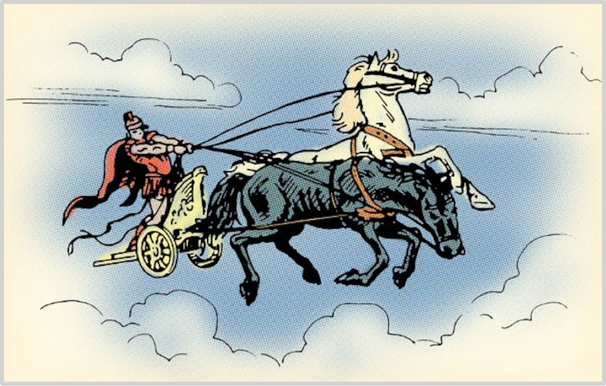

最初的时候，黑马是最强大的 —— 因为从基因上来看，它的年龄最大，它拥有一些最基本、最快速的反应，使我们有能力在整个凶险的世界里生存。鳄鱼没有白马也没有车夫，只靠一匹黑马在地球上生存了那么久 —— 反正比人类更久。领地里冲进来一个动物，不是同类，但比自己小，怎么办？没有思考，没有情绪，上去吃掉它！是同类，同性，但比自己小，怎么办？没有思考，没有情绪，打出去！是同类，异性，怎么办？没有思考，没有情绪，该交配就交配。是同类，同性，但比自己大，怎么办？没有思考，没有情绪，逃跑…… 以上皆不是，怎么办？僵在那里一动不动，同样没有思考，没有情绪……

白马是年龄较小的，所以力道相对差一点，可它能处理更多的情况。情绪可以帮助我们判断甚至预判好与坏，会根据结果让我们高兴或者沮丧，以便学习和记忆，以便下一次更快地做出恰当的反应。最基本的情绪，无论是高兴、沮丧、恐惧、恶心、生气和惊讶，都可以看作是学习之后的快捷方式 —— 某一类的情况就会触发某一种特定的情绪，而这种特定的情绪会触发特定的直觉，而后产生具体的行动，或者干脆直接产生行动。

你可以这样理解这个过程：遇到某种情况，因为黑马能处理的并不多，所以，它能处理时候它就直接处理，它处理不了的时候，就交由白马来处理；而白马处理过后，再与黑马一起触发战车的动作。

不能把黑马或者白马当作敌人。不能向那些 “聪明人” 所说的那样，“我要剔除所有情绪” —— 事实上，若是没有白马存在，车夫根本长不大，就只能永远是黑马独自说了算了…… 而情绪，即，白马，是决策能力的基础，无数研究证明，若是一个人的某种情绪功能受损，那么他的决策能力就会随之受损。更为重要的是，一切的情绪，都是最佳、最直接的沟通手段，而人，也正是因此才是社交动物；反过来，也正是因为社交的刚需才发展出更为完善的情绪功能。

所谓的冷静，其实可以这样定义：

> 不管什么事情，都需要三个角色分别处理一次，而后交由车夫决定。

也就是说，在三个角色分别处理完之前，不要采取任何行动。这个非常简单直接粗暴有效的策略，会改变整个战车的性能。很快，车夫就会意识到，有些时候，黑马的反应是不正确的，白马的反应也可能是不正确的；并且，经过沟通与交流之后，白马有可能听从车夫的意见，经过反复沟通之后，黑马也能建立新的正确直觉…… 

车夫最初是最弱小的。并且，只有在冷静的情况下，他才可能参与工作，才有可能积累经验，才有可能不断成长。在车夫不断成长的过程中，无论白马还是黑马，都经历过了无数次的纠正和协调，所以，最终他们都和原来不一样了。当人们用各种故事告诉你 “要相信直觉” 的时候，你现在明白了，虽然看起来都是战车，你的黑马和高手的黑马很可能全然不同，高手可以相信他们的直觉，你却并不一定，是吧？

定投践行群里的人早已经体会过这个神奇的过程。

在开始定投之前，他们的黑马和外面所有人的黑马一样，看到价格下跌就想跑…… 至于为什么，还没来得及想，甚至还没来得及怕，就已经开跑了。这个直觉引发的情绪是白马的恐惧和沮丧，俩马都没来得及合计呢，战车早已呼啸而去…… 而那车夫，甚至都有可能并不知道真正发生了什么。

看过书、听过课，又经过反复思考与讨论之后，践行群里的战车陆续发生了惊人的变化。

同样是价格下跌了，黑马还是想跑，白马还是恐惧，可车夫想了想，对白马说，不对啊，你不应该害怕或者沮丧，你应该高兴才对啊！因为这样的情况对你是有利的，你可以买到更便宜的筹码了！于是，白马发现自己原来的反应错了，所以它就纠正了自己的反应，看到价格下跌，白马不再沮丧，反倒高兴…… 几次沟通之后，黑马也明白了这个道理，于是，黑马的反应发生了截然相反的变化 —— 也是啊， 白马那么高兴，我跑什么么！而每一次的沟通成功，车夫都会变得更为强大，白马与黑马之间更为协调，三个角色相处其乐融融……

再然后，遇到了同样的情形，群里的战车和群外的战车全然不同了！

你得平静地接受这个事实：

> 你的脑子里有三个你，分别是车夫、白马和黑马。

更关键的地方在于，这三个你之间，必须相互是朋友，而非仇人或者敌人，车夫整天要做的事情就是在不断学习的同时不断地与黑马白马反复沟通，帮助他们建立新的、正确的直觉和情绪，以便那战车，就是整个的你，总是能够发挥自如。

切记：

> 一定要好好做自己的朋友，一定要对自己要有足够的耐心。

至于三个角色之间启动良好关系的方法论实在是太简单了：我们三个先折腾一会，至于车么，就是你的身体，先别动 —— 5 分钟之后再行动，永远有效。别笑，这么简单的方法竟然会使你在交易市场上极大降低你的 *γ* 值。

### 4.3 长期教育与镜像效应

关于教育，我最欢的是这个类比：

> 教育就像一幅眼镜。在戴上眼镜之前和戴上眼镜之后，你其实身处的是同一个世界，但是，戴上眼镜之后你却可以看得更清楚更准确。在受教育之前和受教育之后，你所身处的依然是同一个世界，可是，戴着教育的镜片，你就是可以把同样的世界看的更清楚更准确……

多年来，我有搜集类比的爱好。虽然这个类比的出处因为年代久远已经找不到了，但，它就是我最喜欢的类比，没有之一。关于教育的结果，还有另外一个格外精准的类比，是我自己的，我把它称作 “镜像效应”（Mirror Effect）：

> 镜子里的世界和镜子外的世界，看起来是一模一样的，可事实上，每一个点都是反过来的……

你看，明明同样是价格下跌，镜子外的世界里，所有的黑马都一样，抬腿就跑，所有的白马都一样，边跑边恐惧，边恐惧边沮丧，至于车夫么，当然因此身不由己…… 镜子里的世界呢？黑马竟然不为所动，白马竟然欢天喜地，至于车夫么，悠然自得……

在投资领域，随处可见惊人的镜像效应。比如，全球都一样，几乎所有的股市，都被法律要求，必需在显眼处放置风险警告，大致如下：

> 投资有风险！决策需谨慎！

当然，与之相关的故事，并且还是千真万确的真实故事一直在口口相传：牛顿炒股血亏，丘吉尔炒股惨败，一群诺贝尔得主炒股输得天崩地裂…… 当然，还有很多身边的见识和传闻：某某某炒股失败最后都跳楼了！

根据 JP 摩根的统计，从 1980 年以来，市场上超过 40% 的股票都曾经遭遇毁灭性打击，即，股价蒸发 70% 以上…… 看起来是真的太危险了！然而，沃顿商学院的金融教授[杰瑞米·西格尔](https://en.wikipedia.org/wiki/Jeremy_Siegel)的[数据](https://knowledge.wharton.upenn.edu/article/jeremy-siegel-on-why-stocks-are-and-will-remain-the-best-bet/)却告诉了我们一个截然相反的故事：

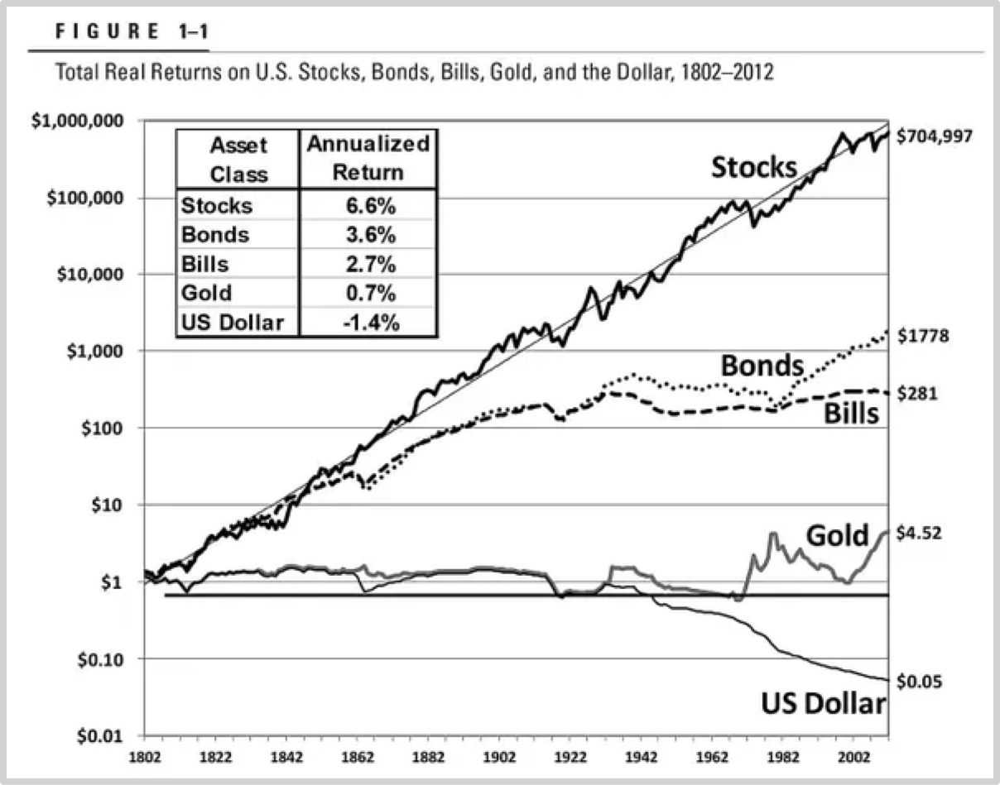

杰瑞米·西格尔把历史数据统计了一下，发现的结果是：从 1802 年到 2012 年的 210 年时间里，从任何一个时间点开始截出 **10** 年，在 *80%* 以上的情况下，现金都是股票的手下败将；进而，如果从任何一个时间点开始截出 **2**0 年的话，那么股票从来都没有输过、现金从来就没有赢过。从实际数据来看，人们普遍以为安全的黄金同样是表现惨烈 —— 与大多数人的直觉相违背的是，人们以为最危险的股票，长期来看表现最好，210 年间，年化复合回报率高达 6.6% —— 至于人们总是觉得可以落袋为安的现金呢？竟然是负数， *-1.4%*！看着这些事实和数据，你再想想，到底哪儿的风险更大？股票市场内？还是股票市场外？

> 对了，因为这个 “发现”，杰瑞米·西格尔教授干脆写了本书，叫做 [Stocks for the Long Run: The Definitive Guide to Financial Market Returns & Long-Term Investment Strategies](https://www.amazon.com/gp/product/B00GWSXX26/ref=dbs_a_def_rwt_hsch_vapi_tkin_p1_i0)，到 2014 年的时候已经是第五版了。

定投策略采用者的 *α* 是在开始行动之前的谨慎选择过程中产生的，一旦行动开始，α 就已经确定了，而后顶多通过不犯错去降低 *γ*。 杰瑞米·西格尔的结论最令人震惊的意义就是：

> 绝大多数人从一开始就选错了！

不仅选错，且自信满满地选错！这又是一个教育产生镜像效应的惊人例子。明明是同样的东西，人们就是会被分为截然相反的两派，并且，越是错得离谱的越是振振有词地固执…… 这种惊人的现象是如何形成的呢？关键点在于何处呢？

其实，一句话就可以说清楚：

> **对长期的认知就是那面镜子**，总是生成惊人镜像效应的那面镜子。

几乎所有最惊人的镜像效应，几乎都是因为人们对长期的认知不同造成的。这是永恒的事实：绝大多数人全然没有长期观念，只能看到想到眼前的一切…… 或者这么说可能你会更容易理解：这世界上的绝大多数 “战车”，永远都是黑马最强大，白马总是随着黑马奔跑，至于车夫么，从来就没有哪怕一点点的成长。

你可以把 “长期” 这个词想象成一个墨镜，用它过滤掉那些对长期无效的光，就好像戴个墨镜能过滤掉紫外线那样。然后你就会自然而然地、不由自主地更多启用宏观观察能力，就好像司机开车的时候要带偏光墨镜，这样的话，不仅能过滤掉对眼睛伤害最大的紫外线，还可以让那些刺眼的光偏离你的瞳孔……

带上 “长期” 这幅墨镜，再去看看你之前常看的财经媒体，不论是互联网上的文章，还是电视里的谈话节目 —— 仿佛是突然之间，你发现自己变了！你看到的都是之前其实看不到的，想到的都是与之前相反的。

节目里有人在讨论市场有效性，两派都很激动，甚至都快吵了起来…… 换在过去，你很可能会在那里苦恼：你怎么竟然会觉得双方说的都有道理呢？！可是，戴着长期偏光墨镜镜片的你突然明白了，其实这根本就没有什么可争论的，事实很清楚：

> * 长期来看，市场是倾向于相当有效的，放眼越远的长期越是如此；
> * 可是在任何一个单独的时刻，市场总是极端无效的……

然后你就突然开始对 “市场有效性” 这个概念产生了不一样的喜欢。希望短期市场有效的人越多越好，因为只有这样你才有相对优势 —— 若是市场总是彻底有效，整个市场就没有存在的必要了，因为价格总是与价值相等，于是人们干脆不用交易了…… 所以，市场正是因为它时时刻刻总是无效，所以才有存在的意义，所以才有我们这样的人可以把握的机会 —— 最幸福的是，因为你总是戴着 “长期” 这副墨镜，所以你发现，你只需要用时间等待市场终将展现的长期之后的有效性……

一旦你想尽一切办法启用长期观念，最终你会发现 “宏观观察的不同” 和 “宏观观察的简单”，然后你会惊讶于这样一个事实：

> 越重要的问题越容易解决，最重要的问题解决起来最简单 —— 可是人们偏偏要把所有的智慧都用在那些既复杂又无关紧要的地方……

在第二章第三节中，我们看过定投策略采用者是如何选择投资标的的，他们只不过是通过几个 “大概大概” 做出了因为简单只能模糊的选择，然而，他们在未来的收益却在更为确定的同时也更可能更大。市场上的绝大多数其他人呢？他们耗费了大量的时间精力以及他们超乎寻常的聪明才智，干什么去了呢？他们希望通过眼下可以动用的一切数据（包括历史数据），获得一个最精确的结论 —— 最终，他们的成功概率会很高吗？历史反复证明这么做总是徒劳无益。

上个世纪九十年代初，大量的精英离开了中国 —— 三十年之后，当他们再回首往事的时候，他们事实上的感受如何呢？很多人的感觉是自己生命中最好的时光里，被掏空了一大块。为什么呢？因为在这三十年间，中国是全球发展最快的地区，水涨自然船高，很多当初相对比较差的人在三十年后各方面的状况都比当初选择离开中国的精英们更好，这让那些既在当初领先又事实上算计更精的人如何面对？更令人难以接受的是，那些当初没离开的人并不是因为不想离开，更多是因为没能力离开…… 为什么会这样呢？

最佳的解释之中有一个是这样的：他们在这么做的同时，由于把所有注意力都放在了当下，所以基本上必定会忽视一些在未来发挥重要作用的显而易见的事实。有个著名的实验，叫做 “[看不见的黑猩猩](https://www.youtube.com/watch?v=IGQmdoK_ZfY)”。在舞台上，有两组人相互传球，你的任务是计数，看看穿着白衣服的那一组人总计传了多少次球：

视频看完之后，也许你能数对，白衣一组总计传球 16 次…… 可是，整个过程中，你可能压根就没有注意到有一只黑猩猩缓慢地走过舞台，它就那样大摇大摆穿过舞台，并且还在舞台正中停了一会儿，拍了好几下自己的胸脯！

有些人可能在此之前听说过这个实验，所以在刻意的情况下，既数对了传球次数，又看到了大猩猩 —— 可是，他们全然没有注意到，不知道什么时候开始，舞台后侧的幕布从红色变成了橙色？

事实上，由于我们的大脑就是这样运作的 —— 这几乎没有什么靠谱的解决方案。要么你全神贯注在当下，要么你全神贯注在未来。反正，那是镜子内外的两个世界，总是处处截然相反。当然，杰瑞米·西格尔的研究告诉我们，在赚钱这件事儿上，只关注未来显然是更划算的。

若是你还能清楚地记得当前章节之前的内容，你会发现很多镜像效应的例子，并且，几乎每一次都一样，那使得一切看起来一模一样可事实上截然相反的镜子，都是 “长期”。建议你在重新阅读本书的时候，在笔记本里刻意做一个列表，罗列所有在阅读过程中所提到的有镜像效应。并且，在此之后的许多年里，你还要不断补充这个列表，在这个过程中，你就会发现，那墨镜很可能慢慢变成了 “隐形墨镜”…… 最终，你甚至干脆不需要墨镜了，因为那功能早已内建在你的瞳孔之中。

投资教育的必要性和价值就在这里。你的车夫需要成长，你的黑马白马都需要调教，最终，更好的他们会带你进入一个镜像世界，在那里，无论什么看起来都和外面是一样的，可事实上呢？很可能全都截然相反 —— 可问题在于，那才更可能是客观世界真实的样子 —— 投资的秘诀就在于，对客观世界要有百分之百客观的认知，与此同时，还要对自己有百分之百的客观认知。真的很难。但，说它很难，应该也只不过是当下看起来很难；可也并不是做不到 —— 放眼长期，应该并不难。

### 4.4 知道做到之间的距离

**知道**是一回事儿，**做到**是另外一回事儿。知道与做到之间总是有一个超乎所有人想象的距离。

回想一下自己在小学学习写字的情况就知道了，总是有这样的字存在 —— 它们总是被你天然写错。比如，武侯的 “侯”，会被你自然而然地写成气候的 “候”，那一小竖就是会被你不由自主地加上去，即便是你在被纠正若干次之后也依然如此…… 直到很久之后，直到很多次纠正错误之后，你才能做到 “永不出错”。

即便是很简单的知识，也经常如此难搞，需要很长时间才不出错；那么，那些相对复杂一点的知识呢？当然更是如此。

逻辑就是最明显的例子。[Beyond Feelings: A Guide to Critical Thinking](https://www.amazon.com/Beyond-Feelings-Guide-Critical-Thinking/dp/0078038189/)，是我个人的逻辑启蒙书籍 —— 现在已经是第 9 版了。某个阴天的上午，我冲进图书馆，搜索 *Thinking*，在众多结果中发现了一个我前所未知的搭配，*Critical Thinking*，而后我选了一本再版次数最多的，就是这一本 —— 因为这本书当时已经是第 3 版。为什么要冲进图书馆搜索 *Thinking* 呢？因为在那前一天我非常痛苦，有两个人在相互激烈争论，结果我痛苦地发现，自己竟然觉得两个人说的都对！首先这不可能，其次这说明我完全不会思考 —— 起码，我思考的方法有问题。而那时候我已经差不多 25 岁。

尽管在本科毕业之前，已经在各处学习过一些逻辑，尽管自己长期以来误以为自己是逻辑足够严谨的人，可是，依然在多年之后发现自己与一无所知的差别很小很小。因为诉求非常清楚，读书的过程欢乐多于痛苦。全书读完，觉得自己已经焕然一新！可那只不过是错觉，因为没有多久我就发现，自己还是那么经常地掉进各种已知逻辑陷阱 —— 也难怪，几乎每一个常见的逻辑陷阱都有无数的变体。于是，自然而然地，这本书成了我这一生中重复阅读次数最多的书籍。然而，镜像效应总是无所不在，这样的一本我反复阅读次数最多，且对我人生影响巨大的书籍，在另外一些人眼里竟然是[垃圾](https://www.amazon.com/gp/customer-reviews/R3S1K0E2LMJE8V/ref=cm_cr_dp_d_rvw_ttl?ie=UTF8&ASIN=0078038189) ……

反复读了很多遍这本书就可以了吗？并没有。几年后，我到新东方教书，有一段时间教 GMAT 的作文和逻辑部分。那期间的感受就是，“亏得几年前对自己有过相对苛刻的逻辑训练” —— 可是依然吃力。GMAT 的考题的问法常常是这样的：

> 以下 ABCDE 五个选项之中的哪一个如果是对的，那么作者的观点会遭到严重削弱？

现在回头看，我自己一生中最宝贵的两段自我教育经历，一次发生在反复阅读 *Beyond Feelings* 的过程当中，另外一次发生在于新东方教授作文与逻辑的过程当中 —— 而这期间的长期自我逻辑训练，对自己其后通过长期获得财富有着不可或缺的关键性作用。

之前我们提到过：

> 科学家们已经分门别类地甄别了超过 137 个普遍的心理偏差（至 2019 年），相信以后还会发现更多……

我在践行群的在线课堂上长期反复给小伙伴们讲这些心理偏差形成的原因，产生的效果，避免它们的可行建议，以及最近刚刚发生的有关的案例，等等等等。可是，会马上生效吗？不会。几乎所有人都一样 —— 至少我就是如此 —— 每隔一段时间就发现，自己在明明早已经知道的情况下，还是再一次掉进了同样的陷阱……

知道与做到之间的距离那么长，还有另外一个更为隐秘的原因：

> **之前决策的时候，必然缺乏的是之后的丰富经验。**

在计算机领域中有个专门的术语，叫做**前置引用**（或称过早引用，[Forward Reference](https://en.wikipedia.org/wiki/Forward_declaration#Forward_reference)），它通常会引发编译器报错，因为按照编程的规矩，任何变量都需要在声明之后才能引用。可是，生活、学习、工作之中，前置引用无所不在。“初恋时我们不懂爱情”，就是最佳的例子。

“少壮不努力，老大徒伤悲”，也许是另外一个最为普遍的 “等人们发现镜像效应的时候已经太晚” 的例子。事后来看，无论是谁都能理解，可在那么小的时候，大多数人自然而然地无法体会知识的真实重要程度，于是，他们的决策基于 “缺乏见多识广的独立思考”，或者也可以称为 “坐井观天的独立思考”。等到很长的时间已经过去，他们才有机会做基于更多的见识的独立思考 —— 你可能注意到了，其实绝大多数人都是能独立思考的，只不过见识不同 —— 这时候他们会发现或者起码部分体会知识的真实重要程度，于是，他们都后悔了，没有一个不后悔的！

人生之中，所有真正重要的活动都属于这种： 

> “无论如何都要开始做、同时也只能边做边学”。

比如，恋爱、结婚、做父母，再比如出生。做好这些事情，用学校里的方法论就是不够用的 —— 学校里的知识没有前置引用，都是一步一步来的，学会了这个，再学会基于这个的那个，学完这些之后再学基于这个和那个的另外一些…… 这就是为什么学校里的生活总是被称之为无怨无悔，然而，真实生活却处处存在遗憾的原因，因为走着走着你就 “发现”，之前的决策是错误的…… 因为走着走着，你就 “发现” 了新的、通常也是更好的决策依据。

做投资更是如此 —— 那些之前已经作出的决策不可能基于后来更好的决策依据，所以，不仅仅是悔之晚矣，更惨烈的常常是，出师未捷身先死。

这是定投策略的一个隐秘的好处：

> 它为采用者提供了一个很长的时间去学习、观察、实践、以及修正 —— 至少两个大周期的时间，足够任何人走完知道与做到之间那长长的距离……

由于定投策略采用者只有一招一式，反正就是买买买，其它的动作都没必要，所以，在开始之后的很长很长时间里，他们有足够的时间去增长自己在这个领域里的各种见识 —— 主要通过观察他人犯错误 —— 于是，他们最有可能真正走完从知道到做到之间那别人根本无法走完的距离。等到两个大周期过后，见识已经足够了，这时再做出的任何决策，都有数量足够多、质量足够高的决策依据，无悔。

在投资领域里，尤其是对长期持有者来说，有一个现象值得重视：

> **越是早期的错误所造成的长期代价越高** —— 因为在长期之后，那些代价会被无限放大……

并且，早期的错误持续的越久，长期之后的代价就越不可想象。可以用一个简单的近似计算来说明这个问题：

> 98% 30 ≈ 54.55% 

定投策略采用者的幸福之处在于，他们一上来就做对了，并且在接下来的两个大周期之内，只要照做，那就等同于绝对不会做错…… 在不出错的整个过程中他们在做的事情只有两个：首先是持续增强自己的场外赚钱能力；更为重要的是第二个：反复接受投资教育，耐心走完从知道到做到之间的距离……

### 4.5 主动与被动之间的边界

之前我们提到过：

> 投资的秘诀就在于，对客观世界要有百分之百客观的认知，与此同时，还要对自己有百分之百的客观认知。

也就是说，成功的投资者要客观认清自己和现实 —— 事实上，还有更为隐秘却又更为重要的地方需要客观认清，**自己与现实的边界**。

我们的身体并不是我们自己与现实的边界 —— 我们确实能在我们身体范围之外做出一些主动的改变。

我们可能扩展我们的身体，比如，使用交通工具，我们延展了我们的腿；使用移动物联网设备，我们延展了我们的神经；事实上，任何一种工具，当我们能够熟练使用之后，都可以事实上成为我们身体的一部分…… 我们也确实可以影响我们身体之外的一部分世界。比如你要使用自己的信任和尊重换来他人的信任和尊重，比如作为父母你用自己的行动成为孩子的楷模，再比如，在投资领域里你可以用长期不作为换来了长期高额回报……

但，通过我们自身以及自身行为能够影响的现实总归有一个边界，在这个边界之内，我们可以通过努力不断进取，但是，在这个边界之外，我们事实上就是无能为力。

如若不能清醒地意识到这个边界的存在，那么，一个人将始终生活在混乱之中，痛苦不堪。

最明显的例子发生在父母教育孩子的过程当中。如果家长们的努力聚焦在把自己变成更好的自己，那么，他们是在自身的边界之内努力，这很好。可是，绝大多数情况下，你会发现家长们的努力总是用在自身边界之外，也就是他们实际上无能为力的地方。不要以为小孩子傻，他们脑子里就好像有个特殊的雷达一样，凭直觉就可以分清家长是否在说一套做一套，如果家长自己言行不一，那么孩子就会很痛苦，尤其是在他们当然更搞不懂边界的情况下。家长一直在入侵，自己又没有防御能力…… 绝大多数孩子的扭曲反应都是这么产生的，于是孩子很痛苦，与之相对的，这些孩子的家长更痛苦，恰恰是因为他们在自己明明无能为力领域拼命努力，导致的结果当然是屡战屡败、屡败屡战，愈战愈挫、愈挫愈勇，直至双方都筋疲力尽无计可施。

当然，更普遍的例子发生在投资领域之中。投资者真的要参与到经营之中吗？也许罢。可是，几乎可以肯定的是，二级市场中的交易者是不应该参与到经营之中的 —— 事实上，“完全无需参与经营” 恰恰是在这里做投资的最大好处。

然而，事实上几乎每一家上市公司的经营者们每天都会收到大量股票投资者来信 —— email 出现之后数量更多，若是开通即时通讯工具，那就得再加上若干个量级 —— 他们整天对被投资公司指手画脚，真心真意地出谋划策，到最后常常会很生气，甚至能实实在在地生气到茶不思饭不想的地步。这些人对自己正在边界之外徒劳的事实全然不知。他们不知道在那边界之外，自己的所有努力都毫无用处；若是有的话，只能全都是负面效果。他们也永远不会理解，因为他们根本不可能有能力自己作出一个有效的商业模型最终获得大众的投资。如果他们竟然真的做出来了，他们才会知道，外面那么多人想要影响自己是多么可怕的事情，自己若是那么容易就被外界左右了又是多么更为可怕的事情。甚至可以这么说：一个可以被二级市场左右的公司，是绝对不值得投资的。

让我们再次回顾你的收益公式：

> **p = δ + α - γ**

等式左边的 p (performance) 是你最终的投资业绩，等式右边的的 δ (Delta) 是你选择了与整个市场波动百分之百相符的 β (beta) 等于 1 的投资标的；对定投策略采用者来说，α (alpha) 取决于定投开始之前的谨慎选择；而 γ (gamma) 是因为你自己犯错所以没有赚到的部分。

之前已经有过若干次例证，只要你什么都不做，那么你就不会出错，那么你的 γ 值就是零，那么你的 p 就会被最大化。可惜的是，你就是永远都有想要做点什么的冲动，并且时时刻刻都有想要通过做点什么改变点什么的冲动 —— 这没办法，你是人 —— 人类的大脑是为了在险恶的环境中生存而设计的，在过去漫长的若干万年时间里，“面对眼前的危险马上做点什么” 才是优势策略，“面对眼前的危险却无动于衷” 的那些人早就死光了，没有后代。所以说，我们的大脑至今都如此，天然只能理解眼前的风险，无法理解长期的收益 —— 就好像我们在第四章第三节里所看到的那样，不管 210 年间的数据如何，绝大多数人仍然相信现金才是真正安全的一样。

但是，如果，你投资了 MSCI World 指数产品，或者 S&P 500 指数产品，你有什么可做的呢？你做什么可以影响它呢？你无法改变世界的发展方向、发展进程和发展速度；同样，你也无法改变任何一个国家或地区的发展方向、发展进程和发展速度…… 同样的道理，你无法改变的还有某个行业或者某些行业，甚至某个公司或者某些公司，无论你是否持有它们的股票 —— 事实上，除了改变你自己之外，你几乎什么都改变不了 —— 越早认清这个现实越好。

地球上的绝大多数基金，都是为了追求 α 或者追求更高的 α 而成立的。虽然有明显的成功例子，但事实上成功者寥寥 —— 并且还不能排除他们之中也有运气的加持。比如沃伦·巴菲特，也有显而易见的运气因素：他身在美国，除了美国是过去的 55 年里全球发展最快的地区之外，还有另外一个因素，美国的法治环境相对最稳定，私有财产相对最有保障。你不妨可以想象一下，沃伦·巴菲特要是竟然出生在韩国的话，现在大概是什么样子？那里是总统和财阀入狱率全球最高的地方。

创造 α 到底有多难呢？有人开玩笑说，你把股票扔进一个屋子，放一只猴子进去，过一会，把那些猴子在上面撒了尿的股票挑出来形成一个投资组合，最终的结果也能跑赢那些主动基金的基金经理…… 很不幸，这个玩笑说中了！

根据[华尔街日报](https://www.wsj.com/articles/indexes-beat-stock-pickers-even-over-15-years-1492039859)（2017 年 4 月 13 日）的统计，截至 2016 年 12 月 31 日，按 15 年的表现来看，总计有 *95.4%* 的中型基金落后于 S&P MidCap 400，*93.2%* 的小型基金落后于 S&P SmallCap 600，*92.2%* 的大型基金落后于 S&P 500……

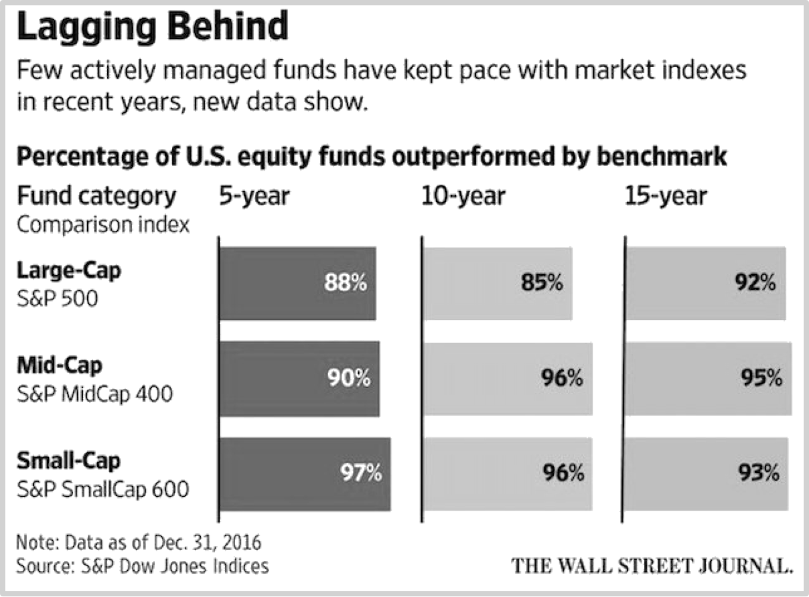

全都是 *92%* 以上！也就是说，连 “徒劳无益的情况十有八九” 这种说法都是低估了！于是，以下的资金流向就不足为怪了。

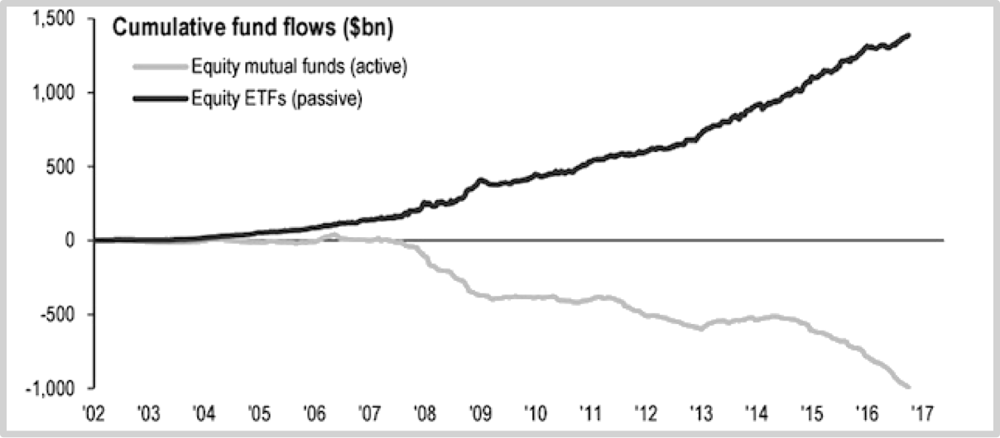

过去的若干年来，全球范围内都一样，被动管理型基金的资金流入量在连年上升；与之相对的，是主动管理型基金的资金连年持续流出。所以说，钱是聪明的，它会自动流向可以让它增值的地方。钱的聪明不仅如此，它也会自动从那些只会用钱消费的人手里流到那些竟然会用钱投资的人手里。

著名神父尼布尔的《宁静祷文》（*The Serenity Prayer*）事实上就是一个对于边界的深刻思考：

> O God and Heavenly Father, Grant to us the serenity of mind to accept that which cannot be changed; courage to change that which can be changed, and wisdom to know the one from the other, through Jesus Christ our Lord, Amen.
>
> > 神啊！
> >
> > 请赐予我宁静，好让我能接受，我无法改变的事情；
> >
> > 请赐予我勇气，好让我能改变，我能去改变的事情；
> >
> > 请赐予我睿智，好让我能区别，以上这两者的不同……
>
> —— 译者：洪宋弦

**边界思考**，**长期视角**，**宏观观察**，这三个概念组合在一起甚至可以改变一个人的性格。我和我的学生都有这样的感受 —— 虽然人们说性格决定命运，但我更倾向于认为性格这东西不是天生的，性格这东西只不过是黑马白马和车夫不同时期不同能力不同协调程度的综合表现而已。

比如，对这些概念的深入思考，使得我难以愤怒 —— 没有什么事情值得我像年轻的时候那样出离愤怒了。转而，我开始琢磨一个现象：

> **为什么在无论多差的环境里都总是有人可以脱颖而出呢？**

对李笑来来说，定投策略的选择与实施，以及其后能够详尽阐述的能力，就是从自己向自己提出这个问题开始的。启用长期的视角，可以让你得到很多与之前截然相反的结论；宏观观察可以让你做出很多在长期之后结果更佳的选择；对边界的清楚认知可以让你摆脱很多的纠缠，轻松地避开几乎所有最终事实上徒劳无益的努力。我没有必要抱怨环境差了；我也不想去抱怨社会不公平了 —— 它跟市场一样，只有从长期视角出发来看才可能近似公平，可每时每刻，它总是不公平的；最为关键的是，我愈发平静地接受自己总是被低估的情况 —— 跟市场里的价值一样，被高估的时光总是很短暂，甚至干脆可以被称为泡沫，不是吗？

客观很重要。不仅对这个世界客观，还对自己更要客观，更要对自我边界尤为小心翼翼地客观。进而，长期保持客观更为重要。这就是投资的秘密，当然，它就是个公开的秘密。

## 总结

定投策略很简单，它只不过是 “谨慎选择长期持有” 的进一步改良，此后再无任何改良必要。哪怕你无法严格做到定期定量投入也无所谓，只要做到原本就应该做到的长期持有即可。

你的最终成绩可以用这个公式计算：

> **p = δ + α - γ**

作为定投策略采用者，*δ* 处于你的自我边界之外，你对它事实上无能为力；谨慎选择的过程将是你创造 *α* 的地方；能够降低的 *γ* 值来自于你的自我管理；对边界的认知和反应同时影响你的 *α* 和 *γ* ……

你的投资要做到坚决不离场，投入你的钱，也投入你的时间，做时间的朋友；你自己要在场外通过逐步升级你的个人商业模式不断提高你的赚钱能力；无论你做什么都要学会做好销售；你要走过知道与做到之间那最远的距离，要做自己的朋友而不是敌人；你要分清边界，并且总是要做好自己应该做的那一部分…… 定投是最优美的长期行为艺术，它就能让你的每一份每一秒都算数。

成功没有秘密，有的都是公开的秘密。成功者无非是把大家都知道的正确事情用大家都知道的正确方法都**做到**了而已。

定投策略的实施，说它能够改变一个人的命运，丝毫没有任何夸张的成分。

1979 - 2015 这 36 年间，中国实施计划生育政策。在 1979 年正处于生育年龄的人们现在大约 70 岁左右 —— 这些人正处在一个特有的叫做 “晚年孤独” 的状态。他们已经退休很久了，10 年或者 10 年以上。他们唯一的子女正处于最忙碌的状态，因为这些子女也刚刚成为父母。由于时代的发展，越来越多的家庭并不在同一个城市生活，也就是说，这些老人中的大多数并没有子女的陪伴。没有事做，没有人陪伴…… 

有一个尴尬的事实：

> 他们年轻的时候万万没想到自己竟然可以活这么久……

十多年前退休的时候，他们并未意识到这一代人很可能轻松活到 100 岁 —— 直到现在，这些七十岁左右的老人的父母们也差不多 100 岁左右了，他们这才发现自己的 “晚年” 竟然这么长！这些晚年孤独的老人们到底吃了什么亏呢？因为他们没想到自己竟然可以活这么久，所以他们过早放弃了继续成长，在很久之前就错误地把一个新的起点当作了自己的终点。

讲到投资的时候，绝大多数人一看 20 年、30 年之后的复利计算，就觉得那跟自己没有任何关系了！可实际上，这一代人可以用来投资的有效时间远远超出他们自己的想象，平均来看实际上是至少有 45 年 —— 很显然，别说这一代了，上一代人就估计错了，大错特错！

100 岁是什么概念？活到 100 岁的意思说，自己的曾孙都已经长大成人并且可以开始投资了…… 之前我们讨论的两个大周期，是指经济周期。然而，四代同堂的意思是说，到那时候你已经完整经历了四代人的成长 —— 可以同样理解为完整经历了 4 个大周期…… 说实话，既然已经想到了，就应该认真琢磨一下这个事实，同时也要认真考虑应该如何面对这个事实。

所以，其实定投改变的不仅仅是你一个人的命运，是与你有关的几代人的命运 —— 并且还是你可以亲眼目睹的改变。的确很重要。

-----

全书完

<strong>李笑来</strong>

2019 年 10 月于北京

-----

## 附录

## 1. 关于 BOX

> **风险警告**
>
> 定投策略本身是客观上正确的，而定投标的的选择无论如何都没有办法剔除主观判断 —— 所以，定投标的选择是投资者自己的事情，是要用自己今后长期的钱和时间去负责的事情。请慎重选择。
>
> 这一节的内容重点在于李笑来是为什么选择 BTC、EOS、XIN，即，BOX，作为一个定投的投资组合 —— 这里必然掺杂李笑来的一些主观判断；至于你选择怎样的投资组合，要靠你自己对客观世界的理解。
>
> **作者利益关联公示**
>
> * 李笑来是比特币的长期持有者（自 2011 年 5 月）
> * 李笑来是 EOS 发行公司 BlockOne 的天使投资人（2017 年 5 月）
> * 李笑来是 Mixin Network 项目的天使投资人（2017 年 10 月）

-----

 [BOX](https://b.watch)是 **B**tc + e**O**s + **X**in 的缩写，而 [BOX](https://b.watch) 本身，又恰好是中文 “盒子” 的意思。又由于 [BOX](https://b.watch) 是李笑来设计的 ETF 产品，所以江湖戏称 “韭菜盒子”，而 “定投 [BOX](https://b.watch)”，被人们戏称 “总吃韭菜盒子”。

 [BOX](https://b.watch)的申购与赎回，在网站 b.watch 上进行：https://b.watch

### 1.1. BOX 细则

BOX，很简单，就是**锚定“一揽子主流区块链资产投资标的”的区块链凭证**（Token）。它的成分如下：

> * 1 BTC
> * 1500 EOS
> * 8 XIN
>
> ------
>
> = 10,000 BOX

也就是说，想要换取 1 [BOX](https://b.watch) 的话，你要是用 0.0001 BTC + 0.15 EOS + 0.0008 XIN。

> * 你可以用相应数量的 BTC+EOS+XIN 直接换取 [BOX](https://b.watch)；
> * 你还可以在满足一定条件的情况下，缴回 [BOX](https://b.watch)，赎回相应的 BTC+EOS+XIN；
> * 你还可以用 USDT 在二级市场上直接买卖 [BOX](https://b.watch)……

用 [BOX](https://b.watch) 赎回 BTC+EOS+XIN 的条件如下：

> * 你的 [BOX](https://b.watch) 市场价格总计已经超出 100,000 美金，赎回手续费 1%；
> * 或者你可以直接在二级市场上卖掉，手续费是双向各 1‰；
> * 或你在定投的时候给自己设定了最早赎回时间（比如，你自己设定了三年后）…… 

 [BOX](https://b.watch)是一个 ETF 基金产品 —— 只不过，这个基金与你之前见过的基金不一样，[BOX](https://b.watch)不收管理费，或者换种说法，它的管理费为零。为什么呢？因为设计者李笑来不想赚这个管理费。而李笑来本人也在定投 [BOX](https://b.watch)。

 [BOX](https://b.watch)是百分之百公开透明的。 [BOX](https://b.watch)的持仓地址公开透明、随时可查 —— 因为所有的记录都在 Mixin 的公链之上，查询地址请参阅 bwatch 说明。“韭菜盒子里”究竟有多少个 BTC+EOS+XIN，与之对应的，有多少 [BOX](https://b.watch) Token 在外流通，尚有多少个 [BOX](https://b.watch) Token 在“冷冻仓”（含未发行的和将来已回收的数量）等等，都是公开透明可查的。所以， [BOX](https://b.watch)无法随意增发，也无法随意增加流通量。又由于如此， [BOX](https://b.watch)若是被任何其它交易所上架的时候，用户可以通过核对来确认该交易所有没有 “随意增发流通量” —— 关于这一点为什么很关键，新手们需要花一点时间去学习之后理解。

### 1.2. BOX 的优势

 [BOX](https://b.watch)的成分选择与配置，遵循以下几个原则。

### 1.2.1. 投资区块链资产就要投资主流资产

在新一轮的趋势中，区块链主流资产将不成比例地被重视。经过 2017～2018 的大牛和大熊，市场已经被教育，对新币种的 “盲目乐观” 和 “盲目期待” 已经被彻底戳破，那种随便写写白皮书就募资的项目已经被证明为“不堪一击”…… 

在新一轮中，可能大涨的，要么是主流资产，要么是传销资产 —— 不碰传销资产不是因为它不赚钱，恰恰相反，它短期内可能很赚钱，但，它不可能长期，所以，不是我们定投者的选择。定投者是要穿越不止一个牛熊的，所以，只能选择长期标的，于是，在 “要么主流资产、要么传销资产” 中，我们只能选择 “主流资产”。

### 1.2.2. 符合区块链技术发展的内在逻辑

经过多年，准确地讲是迄今为止的八年；经过多年的观察、投资、实践与思考，我认为区块链技术在改变世界的过程中有一个发展路线：

> 可信账簿（BTC）→ 可信代码平台（ETH/EOS）→ 可信执行环境（Mixin）→ 可信硬件（？）……

事实上，这也是我个人过往的投资路径。比特币之后，我当年所投资后来被关闭的云币成为了地球上第一个上架交易以太坊（ETH）的交易所，其后，我又天使投资了 EOS，而 Mixin 也是我天使投资的。投资成功的核心在于 “投资行为契合发展规律”，让趋势成为自己的朋友为自己的投资不断发力，而不是使趋势成为只讲车敌人或者是阻力。

现在这个 [BOX](https://b.watch) 的成分选择就是与区块链技术发展的内在逻辑所契合的。

这里要说明的是，为什么在 ETH 和 EOS 之间选择了 EOS？虽然在可信代码阶段，ETH 是先于 EOS 出现的，但它们俩之间的区别，就好像是 DOS 和 WINDOWS 之间的区别 —— EOS 是多线程的。并且，EOS 的技术方，即，BlockOne 公司，是目前区块链世界里资金实力最为雄厚的公司，所以，选它更靠谱一些，长期来看，成功概率更高。

当我们的定投标的从某个单一项目（比如比特币）转换成一系列标的（比如 [BOX](https://b.watch)）的时候，除了有效地稀释了机会成本之外，我们还等同于把自己的赌注从 “放到某个项目上” 转变成了 “放到整个行业发展上”，这是降低风险到极致的靠谱方法论。

### 1.2.3. 成分比例的考虑

现在（2019.7）Bitcoin Dominance 在区块链资产总市值中占比 63%。这个比例虽然短期内可能继续拉升，但，长期来看，它还会随着区块链技术的发展普及和应用逐步降低。不是比特币不发展了，是它发展的同时，其它资产也会发展，但长期来看，其它资产可能发展速度超过比特币。所以，给比特币 50% 的权重，从放眼长期的角度来看，是合理的。

剩下的一半，大抵上以 4:1 的权重配比方式配置给了 EOS 和 XIN。这是因为我个人认为 XIN 的发展速度不会差，甚至可能很快。

**注意**：5:4:1 是启动时美元市值的比例，随着时间的推移，这个比例无法固定。事实上固定的是成分构成：

> 10,000 BOX = 1 BTC + 1,500 EOS + 8 XIN

外界对 [Mixin](https://mixin.one) 的主要误解在于，人们认为 Mixin 是个聊天软件而已。事实上，Mixin Messenger 才是聊天软件，或者说，社交软件；而 Mixin Network 是一个公链，Mixin Messenger 是 Mixin Network 的第一个 Dapp。市面上的绝大多数公链（甚至包括 2019 年 7 月的 [EOS](https://eos.io)）仍然是没有什么像样的 Dapp 的 —— 最普遍的所谓 Dapp 只不过是骰子游戏而已。

Mixin Network 在技术路线上走了个不一样的路径。

别的公链都是**自下而上**（Buttom Up）的方向：先开发好公链，然后在开发公链上的 Dapp —— 所谓的 “打造生态”。

Mixin Network 的做法**是自上而下**（Top Down）：先做一个非常好用的 Dapp（即，Mixin Messenger），而后逐步深入完成底层公链的开发。所以，Mixin Messenger 很早就被发布出来（2017.12），一年多以后（2019.2）Mixin Network 公链正式上线稳定运行。至于像 “骰子游戏” 之类的所谓 Dapp，在 Mixin Network 中只不过是可以跑在 Mixin Messenger 中的一个机器人而已。而 Ocean.One 则是跑在 Mixin Network 中的一个去中心化自治治理交易所，也是区块链行业中的技术先锋。更多的应用正在路上，比如，我设计的这个 [BOX](https://b.watch) 以及它的交易所 [b.watch](https://b.watch)，没有 Mixin Network 这种公链，是根本做不出来的 —— 与之类似的所谓公链，不是没试过，是干脆不可用。也正因为如此，在我的设计中，XIN 在 [BOX](https://b.watch) 中的占比事实上略高。

总结起来，其实只有一句话， [BOX](https://b.watch)是你无论如何都亏不了的 ETF 产品 —— 因为如果它亏了，只不过是因为区块链这个行业被证明为不行，这事儿怪不了我，也怪不了你。但是，**只要区块链行业好， [BOX](https://b.watch)就必然好** —— 而区块链行业正在起飞，所以，大概率上我们会赢。就这么简单。

## 2. 关于 b.watch

[b.watch](https://b.watch) 是 [BOX](https://b.watch) 申购、赎回与交易的场所。

目前 [b.watch](https://b.watch) 的未来可能收益来自于两方面：

> 1. [BOX](https://b.watch) 赎回时所需缴纳的 1% 手续费；
> 2. [BOX](https://b.watch) 在二级市场上交易的，BOX/USDT 交易对的双向千分之一手续费，即，总计交易额的 2‰；

这些收入的 50% 将定期发放给 [BOX](https://b.watch) 持有者 —— 刚开始，这个收入看起来并不多，经年累月， [BOX](https://b.watch)和 [b.watch](https://b.watch) 的发展会非常惊人。

日后还有可能产生的收入是：

> * EOS 节点收益
> * XIN 节点收益

作为节点，需要一定的储备，在时机成熟的时候，[b.watch](https://b.watch) 会启动节点收益计划；在超级节点产生收益之时，除去成本之外，剩余的节点收益，将 100% 分发给 [BOX](https://b.watch) 持有者。

在这种分配设置的计划之下，[b.watch](https://b.watch) 的企业价值基本上在于 “赎回手续费的 5‰ 和 交易手续费的 1‰”。未来七年，[b.watch](https://b.watch) 的企业价值中的 100% 都将会在笑来课堂里分配，即，按照一定的规则分发 [b.watch](https://b.watch) 股份，例如：

> * [BOX](https://b.watch) 的持有时间长度
> * [BOX](https://b.watch) 定投任务的完成程度
> * 笑来课堂的销售业绩

## 3. 关于笑来定投课堂

**笑来定投课堂**，是李笑来的区块链教育产品。

在区块链世界里生存了八年之后，李笑来这有很强烈的欲望把自己的生存经验和智慧传播出去 —— 相信你能理解。

只不过，你没想到的是，李笑来更想做的，是在传播靠谱投资知识的同时，陪很多人一起身体力行地赚到钱 —— 历史上鲜有机会可以像笑来定投课堂这样，通过知识传递带着学员赚到钱…… 幸运的是，区块链行业的突起和迅猛发展，给了我们这样独一无二的，甚至可以说是前无古人后无来者的机会。

笑来定投课堂除了是李笑来自己知识变现的场所，更重要地，笑来定投课堂是所有学员的 “**场外赚钱通道**”。李笑来负责制造超值内容，而学员呢？除了学习、吸收与践行之外，只要他们愿意，他们还可以通过销售笑来定投课堂而赚到比特币 —— 对，不仅是赚到钱，还是赚到比特币，因为笑来定投课堂只接受比特币支付。

除了销售笑来定投课堂赚比特币之外，那些能够完成自己定制的定投计划的人，即，真正在践行在笑来定投课堂习得的投资知识的人，有个额外的福利：

> * 有资格获得 [b.watch](https://b.watch) 这个地球上第一个链上区块链 ETF 交易所的股份，不仅与 [BOX](https://b.watch) 共同成长，还能与 [b.watch](https://b.watch) 共同成长。

总而言之，笑来定投课堂就是学员跟李笑来共同成长的地方 —— **少废话、多赚钱，这很实在。**

于此同时，我自己也定投 [BOX](https://b.watch)，长期持有 [BOX](https://b.watch) —— 这叫**以身作则**。定投对大多数人来说，唯一靠谱的投资策略，但，它总是说起来容易做起来难 —— 没做过的人、没做成的人，甚至都没办法知道它究竟难在哪里。而且，最为关键的是，有同道相互陪伴非常重要 —— 没有人忍受得了太久的孤独。

笑来定投课堂的不同之处在于，讲课的人，李笑来，过去的十多年里都坚持一个基本的原则：

> **永远只说、只写、只讲已经做到的事情。**

而 [BOX](https://b.watch) 也是李笑来做到之后才说、做到之后继续改进的产品。不是仅靠拍脑门就开始做的事情。

笑来定投课堂是李笑来向大家分享投资理念的地方。不要以为知识与认知是可以零成本简单传递的 —— 还是那句话：

> 知道、学到、想到，都没用 —— 尤其是在投资这种以跨越阶层为目标的行动中。
>
> 到最后，**只有做到才算数。**

所以，知识与认知，只有在践行中才会发挥价值。然而，践行本身，又需要知识与认知指导。

投资教育很重要。别说投资了，就连最基本的赚钱，都是父母干脆不会，学校从来不教，只能靠自己蹒跚摸索的本事。并且，整个社会都在这方面给每一代人乱洗脑。

**赚钱不丢人，赚不到干净钱才丢人。**

所以，在我看来，认真学习投资对每个人来说是必须的，实在想不出什么理由不去认真学习投资。

-----

本书的版权协议为 [CC-BY-NC-ND license](https://creativecommons.org/licenses/by-nc-nd/3.0/deed.zh)。

